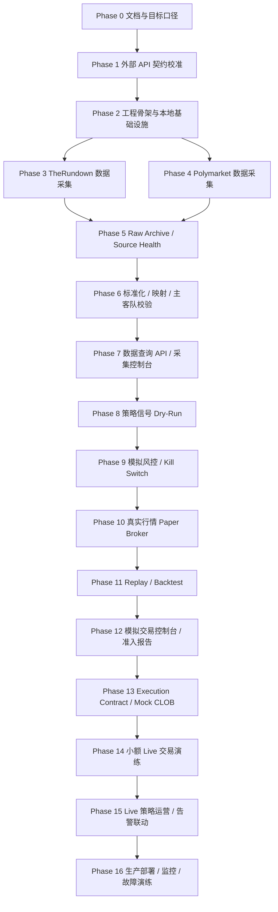

# quantSys

Polymarket / TheRundown 延迟信号交易系统。

当前系统定版为：**TheRundown V2 作为外部赔率数据源，Polymarket CLOB 作为唯一真实执行 venue，系统通过归一化、市场映射、lead-lag/edge 判断、风控、纸面撮合和最终 Polymarket 执行形成闭环**。

本项目不实现双边无风险套利，不把 TheRundown 当作下单 venue，不在当前版本接入第二执行 venue。

## 1. 定版架构

| 领域 | 定版 |
|---|---|
| 系统类型 | 单用户、单执行 venue、事件驱动延迟信号系统 |
| 当前数据源 | TheRundown V2 |
| 当前执行 venue | Polymarket CLOB |
| 首轮市场范围 | full-game moneyline |
| 后端主路径 | Rust workspace |
| 控制面 API | Rust Axum |
| 离线分析 | Python scripts，不进入 live path |
| 前端 | React + Vite + TypeScript |
| 消息总线 | Redpanda，使用 Kafka protocol |
| 事务库 | PostgreSQL 16 + TimescaleDB extension |
| 高频分析库 | ClickHouse |
| 热缓存 | Redis |
| 原始归档 | S3-compatible object storage；本地 MinIO |
| 本地部署 | Docker Compose |
| 云服务器部署 | Ubuntu 24.04 LTS + systemd + Nginx/Caddy + 原生 Rust binaries；数据服务可用云托管或独立 VM |
| Docker 部署 | Docker Engine + Compose v2；支持本地、单机 production、多机 app/data profile |
| Kubernetes 部署 | 高频扩展 profile；不是首发阻塞项 |
| Polymarket 签名 | deposit wallet / `POLY_1271` |
| P0 live order | marketable limit + FAK |

## 2. 开发顺序原则

后续开发按功能闭环推进，而不是按技术层堆模块。每一阶段只能依赖已经完成的功能，不能调用后面阶段尚未实现的能力。

规则：

1. Foundation 先完成 API 契约、工程骨架和本地基础设施。
2. 数据采集先闭环：外部源 -> raw archive -> normalized quote -> mapping -> 数据 API/控制台。
3. 实盘模拟再闭环：真实行情 -> dry-run signal -> risk -> paper broker -> replay/report -> 模拟控制台。
4. 真实量化交易最后闭环：mock execution -> 小额 live -> live operations -> production hardening。
5. 前端页面只能展示已存在的后端 API；未实现服务不在 UI 中接真实入口。
6. Live trading 不得绕过 paper、risk、geoblock、heartbeat、audit。
7. P0 不实现 spread/total live、第二执行 venue、多外部赔率源、Kubernetes、legacy wallet。

## 3. 功能依赖顺序

`docs/3_development_phases.md` 是总索引；每个阶段的完整交付要求已经拆到 `docs/development-phases/` 下的独立文件。

## 4. 阶段文件

| 阶段组 | 阶段 | 文件 | 当前状态 |
|---|---|---|---|
| Foundation | Phase 0 | [文档审计与目标口径收敛](docs/development-phases/phase-00-project-audit.md) | Done |
| Foundation | Phase 1 | [外部 API 契约校准](docs/development-phases/phase-01-external-api-contract.md) | Ready |
| Foundation | Phase 2 | [工程骨架与本地基础设施](docs/development-phases/phase-02-foundation-infra.md) | Blocked by Phase 1 |
| 数据采集 | Phase 3 | [TheRundown 数据采集](docs/development-phases/phase-03-therundown-ingestion.md) | Blocked |
| 数据采集 | Phase 4 | [Polymarket 数据采集](docs/development-phases/phase-04-polymarket-ingestion.md) | Blocked |
| 数据采集 | Phase 5 | [Raw Archive、采集健康与限流控制](docs/development-phases/phase-05-raw-archive-health.md) | Blocked |
| 数据采集 | Phase 6 | [标准化、赛事映射与主客队校验](docs/development-phases/phase-06-normalization-mapping.md) | Blocked |
| 数据采集 | Phase 7 | [数据查询 API、采集控制台与数据质量报告](docs/development-phases/phase-07-data-api-console.md) | Blocked |
| 实盘模拟 | Phase 8 | [策略信号 Dry-Run](docs/development-phases/phase-08-signal-dry-run.md) | Blocked |
| 实盘模拟 | Phase 9 | [模拟风控、Kill Switch 与审计](docs/development-phases/phase-09-simulation-risk.md) | Blocked |
| 实盘模拟 | Phase 10 | [真实行情驱动 Paper Broker](docs/development-phases/phase-10-paper-broker.md) | Blocked |
| 实盘模拟 | Phase 11 | [Replay / Backtest 与策略报告](docs/development-phases/phase-11-replay-backtest.md) | Blocked |
| 实盘模拟 | Phase 12 | [模拟交易控制台与 Paper 准入报告](docs/development-phases/phase-12-simulation-console.md) | Blocked |
| 真实量化交易 | Phase 13 | [Execution Contract、Signer 与 Mock CLOB](docs/development-phases/phase-13-execution-contract-mock.md) | Blocked |
| 真实量化交易 | Phase 14 | [小额 Live 交易演练](docs/development-phases/phase-14-live-small-order.md) | Blocked |
| 真实量化交易 | Phase 15 | [Live 策略运营、额度扩大与告警联动](docs/development-phases/phase-15-live-operations.md) | Blocked |
| 真实量化交易 | Phase 16 | [生产部署、监控、压测与故障演练](docs/development-phases/phase-16-production-deployment.md) | Blocked |
| 扩展 | Phase 17+ | [后续扩展阶段](docs/development-phases/future-extensions.md) | Later |

## 5. 当前开发进度

| 状态 | 含义 |
|---|---|
| Done | 已完成并验证 |
| Ready | 前置条件满足，可以开始 |
| Blocked | 缺少前置条件 |
| Later | 当前版本不实现 |

当前下一步是 Phase 1：外部 API 契约校准。它完成后，才能进入 Phase 2 工程骨架和后续数据采集实现。

## 6. 文档索引

| 文档 | 用途 |
|---|---|
| [文档收敛记录](docs/0_project_audit.md) | 当前保留文档、已删除旧文档和权威入口 |
| [外部 API 契约校准 Spike](docs/1_external_api_contract_spike.md) | TheRundown / Polymarket 官方契约、fixture、contract test 和 live 前置门槛 |
| [目标架构文档](docs/2_architecture_target.md) | 目标架构、服务边界、模块边界、数据面/控制面方向 |
| [功能化开发阶段总索引](docs/3_development_phases.md) | Foundation、数据采集、实盘模拟、真实量化交易的阶段入口 |
| [风险与验证计划](docs/4_risk_and_validation_plan.md) | 风险清单、测试矩阵、压测、故障演练和 live 准入门槛 |
| [部署要求](docs/5_deployment_requirements.md) | 云服务器、Docker Compose、监控、备份、恢复和生产门禁要求 |
| [接口文档](docs/interface-document.md) | 外部接口、REST/WS、gRPC、事件 schema |
| [阶段文件目录](docs/development-phases/phase-01-external-api-contract.md) | 每个开发阶段的独立执行文件 |

## 7. 开发验收硬门槛

1. 每个功能合并前必须有对应单元测试或集成验证。
2. 涉及策略、风控、执行的变更必须跑 replay regression。
3. Live execution 之前必须完成 paper trading、risk engine、geoblock probe、heartbeat、audit。
4. 任何 secret 不得进入日志、前端、普通数据库字段或 fixture。
5. TheRundown 非实时层级时系统必须自动降级，禁止 live 主信号。
