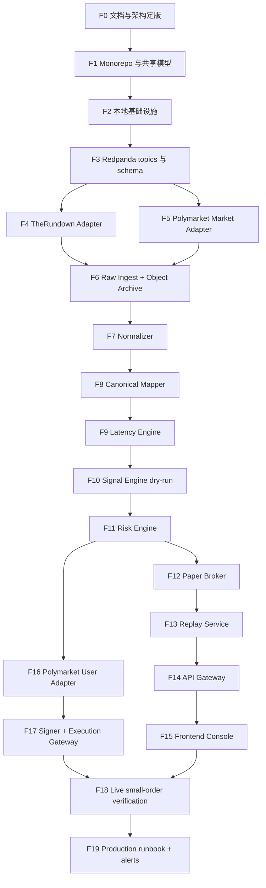

# quantSys

Polymarket / TheRundown 延迟信号交易系统。

当前系统定版为：**TheRundown V2 作为外部赔率数据源，Polymarket CLOB 作为唯一真实执行 venue，系统通过归一化、市场映射、lead-lag/edge 判断、风控、纸面撮合和最终 Polymarket 执行形成闭环**。

本项目不实现双边无风险套利，不把 TheRundown 当作下单 venue，不在当前版本接入第二执行 venue。

## 1. 定版架构

| 领域 | 定版 |
|---|---|
| 系统类型 | 单用户、单执行 venue、事件驱动延迟信号系统 |
| 当前数据源 | TheRundown V2 |
| 当前执行 venue | Polymarket CLOB |
| 首轮市场范围 | full-game moneyline |
| 后端主路径 | Rust workspace |
| 控制面 API | Rust Axum |
| 离线分析 | Python scripts，不进入 live path |
| 前端 | React + Vite + TypeScript |
| 消息总线 | Redpanda，使用 Kafka protocol |
| 事务库 | PostgreSQL 16 + TimescaleDB extension |
| 高频分析库 | ClickHouse |
| 热缓存 | Redis |
| 原始归档 | S3-compatible object storage；本地 MinIO |
| 本地部署 | Docker Compose |
| 云服务器部署 | Ubuntu 24.04 LTS + systemd + Nginx/Caddy + 原生 Rust binaries；数据服务可用云托管或独立 VM |
| Docker 部署 | Docker Engine + Compose v2；支持本地、单机 production、多机 app/data profile |
| Kubernetes 部署 | 高频扩展 profile；不是首发阻塞项 |
| Polymarket 签名 | deposit wallet / `POLY_1271` |
| P0 live order | marketable limit + FAK |

## 2. 开发顺序原则

后续开发严格按依赖顺序推进。每一阶段只能依赖已经完成的功能，不能调用后面阶段尚未实现的模块。

规则：

1. 先定义共享模型和基础设施，再实现业务服务。
2. 先 raw 数据接入，再 normalizer，再 mapper，再 latency，再 signal。
3. 先 paper trading 闭环，再 live execution。
4. 前端页面只能展示已存在的后端 API；未实现服务不在 UI 中接真实入口。
5. Live trading 不得绕过 paper、risk、geoblock、heartbeat、audit。
6. P0 不实现 spread/total live、第二执行 venue、多外部赔率源、Kubernetes、legacy wallet。

## 3. 功能依赖顺序

## 4. 阶段交付逻辑

| 阶段 | 功能 | 只能依赖 | 交付物 | 不允许使用 |
|---|---|---|---|---|
| F0 | 文档与架构定版 | 原始研究报告 | `docs/*.md`、本 README | 代码实现假设 |
| F1 | Monorepo 与共享模型 | F0 | Rust workspace、domain model、config、telemetry skeleton | 外部 API、数据库 |
| F2 | 本地基础设施 | F1 | Docker Compose、Redpanda、PostgreSQL、ClickHouse、Redis、MinIO | 业务服务 |
| F3 | Topic 与 schema | F2 | Redpanda topic init、event schema、DLQ schema | adapter 真实数据 |
| F4 | TheRundown Adapter | F3 | REST bootstrap、V2 WS、tier/limit probe、raw event | normalizer、mapper |
| F5 | Polymarket Market Adapter | F3 | Gamma/CLOB market discovery、market WS raw event | signal、risk、execution |
| F6 | Raw Ingest + Archive | F4、F5 | raw topic 持久化、message hash、MinIO archive | normalized quote |
| F7 | Normalizer | F6 | `NormalizedQuote`、odds conversion、quality flags、ClickHouse write、Redis latest | mapper、signal |
| F8 | Canonical Mapper | F7 | event/market mapping、confidence、manual override | signal 下单 |
| F9 | Latency Engine | F8 | source age、offset、lead-lag sample | order intent |
| F10 | Signal Engine dry-run | F9 | signal event、reject reason、edge 计算 | live order |
| F11 | Risk Engine | F10 | policy evaluation、kill switch、limits、risk decision | execution gateway |
| F12 | Paper Broker | F11 | paper order、paper fill、PnL、slippage model | live execution |
| F13 | Replay Service | F12 | replay job、fixed fixture regression、report | live execution |
| F14 | API Gateway | F13 | REST/WS for system/source/market/signal/paper/replay/risk | frontend-only mock 数据 |
| F15 | Frontend Console | F14 | Overview、Market、Strategy、Paper、Replay、Audit、Alert | 未实现 API |
| F16 | Polymarket User Adapter | F11 | user WS order/fill sync、order state raw events | signed order submit |
| F17 | Signer + Execution Gateway | F16 | `POLY_1271` signer、pretrade、FAK submit、cancel、heartbeat、audit | 未通过风控的 intent |
| F18 | Live small-order verification | F17、F15 | 小额下单/撤单/对账演练报告 | 自动扩大 size |
| F19 | Production Runbook + Alerts | F18 | runbook、alerts、backup/restore、云服务器原生部署、Docker Compose 部署、release checklist | 无审计 live 恢复 |

## 5. 当前开发进度

状态定义：

| 状态 | 含义 |
|---|---|
| Done | 已完成并验证 |
| In Progress | 正在实现 |
| Ready | 前置条件满足，可以开始 |
| Blocked | 缺少前置条件 |
| Later | 当前版本不实现 |

进度标识：已完成用 `✅`，进行中用 `[-]`，未完成留空。

| 完成 | ID | 功能 | 状态 | 进度 | 当前产出 | 下一步验收 |
|---|---|---|---|---:|---|---|
| ✅ | F0 | 文档与架构定版 | Done | 100% | `docs/production-ready-engineering-spec.md`、`docs/architecture-design.md`、`docs/technical-solution.md`、本 README 等 | 文档无二选一架构、README 有顺序表 |
|  | F1 | Monorepo 与共享模型 | Ready | 0% | 无代码 | Rust workspace 可编译，domain model 单测通过 |
|  | F2 | 本地基础设施 | Blocked | 0% | 等待 F1 | `docker compose up` 启动 Redpanda/PostgreSQL/ClickHouse/Redis/MinIO |
|  | F3 | Topic 与 schema | Blocked | 0% | 等待 F2 | topic init 脚本可重复执行，schema snapshot 通过 |
|  | F4 | TheRundown Adapter | Blocked | 0% | 等待 F3 | fixture + sandbox key 下 raw event 入 Redpanda |
|  | F5 | Polymarket Market Adapter | Blocked | 0% | 等待 F3 | market WS fixture 和 live public WS raw event 入 Redpanda |
|  | F6 | Raw Ingest + Archive | Blocked | 0% | 等待 F4/F5 | raw payload 可按 hash 在 MinIO 找回 |
|  | F7 | Normalizer | Blocked | 0% | 等待 F6 | TheRundown/Polymarket fixture 转 `NormalizedQuote` |
|  | F8 | Canonical Mapper | Blocked | 0% | 等待 F7 | full-game moneyline mapping confidence 可计算 |
|  | F9 | Latency Engine | Blocked | 0% | 等待 F8 | 输出 source age、offset、lead-lag sample |
|  | F10 | Signal Engine dry-run | Blocked | 0% | 等待 F9 | 只生成 signal/reject，不生成 live order |
|  | F11 | Risk Engine | Blocked | 0% | 等待 F10 | policy tests 覆盖 kill switch、stale、edge、depth、rate |
|  | F12 | Paper Broker | Blocked | 0% | 等待 F11 | paper order/fill/PnL 可复现 |
|  | F13 | Replay Service | Blocked | 0% | 等待 F12 | 固定 replay fixture 结果稳定 |
|  | F14 | API Gateway | Blocked | 0% | 等待 F13 | REST/WS 聚合真实服务状态 |
|  | F15 | Frontend Console | Blocked | 0% | 等待 F14 | 页面只使用已实现 API |
|  | F16 | Polymarket User Adapter | Blocked | 0% | 等待 F11 | user WS order/fill 状态可入库 |
|  | F17 | Signer + Execution Gateway | Blocked | 0% | 等待 F16 | mock CLOB 下单/撤单/heartbeat 全链路通过 |
|  | F18 | Live small-order verification | Blocked | 0% | 等待 F17/F15 | 小额 live 演练记录完整 |
|  | F19 | Production Runbook + Alerts | Blocked | 0% | 等待 F18 | 云服务器原生部署和 Docker Compose 部署均可执行，故障演练和恢复步骤可执行 |
|  | X1 | Spread/total live 支持 | Later | 0% | 当前不实现 | full-game moneyline 稳定后单独设计 |
|  | X2 | 第二执行 venue | Later | 0% | 当前不实现 | 单独核验条款、接口和风控 |
|  | X3 | 多外部赔率源 | Later | 0% | 当前不实现 | 单独核验数据授权和延迟 |
|  | X4 | Kubernetes | Later | 0% | 当前不实现 | 当前首发必须完成云服务器原生部署与 Docker Compose 部署；Kubernetes 作为高频扩展 profile |
|  | X5 | Legacy Proxy/Safe wallet | Later | 0% | 当前不实现 | 当前签名定版为 deposit wallet / `POLY_1271` |

## 6. 文档索引

| 文档 | 用途 |
|---|---|
| [Production-Ready 工程开发规格](docs/production-ready-engineering-spec.md) | 当前主规格，覆盖生产级目标、架构、部署、性能、数据库、接口、风控、执行、观测、测试和任务拆分 |
| [业务流程与功能清单](docs/business-flow-and-function-list.md) | 业务状态机、主流程、功能边界 |
| [架构设计文档](docs/architecture-design.md) | 总体架构、部署、技术选型 |
| [模块关系文档](docs/module-relationship.md) | 模块职责、依赖矩阵、事件关系 |
| [数据架构文档](docs/data-architecture.md) | canonical 模型、topic、冷热分层 |
| [接口文档](docs/interface-document.md) | 外部接口、REST/WS、gRPC、事件 schema |
| [数据库设计文档](docs/database-design.md) | PostgreSQL、ClickHouse、Redis key |
| [技术方案文档](docs/technical-solution.md) | 技术栈、阶段路线、测试、上线门槛 |
| [原始研究报告](docs/deep-research-report.md) | 仅作研究输入和溯源，不作为最终架构口径 |

## 7. 开发验收硬门槛

1. 每个功能合并前必须有对应单元测试或集成验证。
2. 涉及策略、风控、执行的变更必须跑 replay regression。
3. Live execution 之前必须完成 paper trading、risk engine、geoblock probe、heartbeat、audit。
4. 任何 secret 不得进入日志、前端、普通数据库字段或 fixture。
5. TheRundown 非实时层级时系统必须自动降级，禁止 live 主信号。
