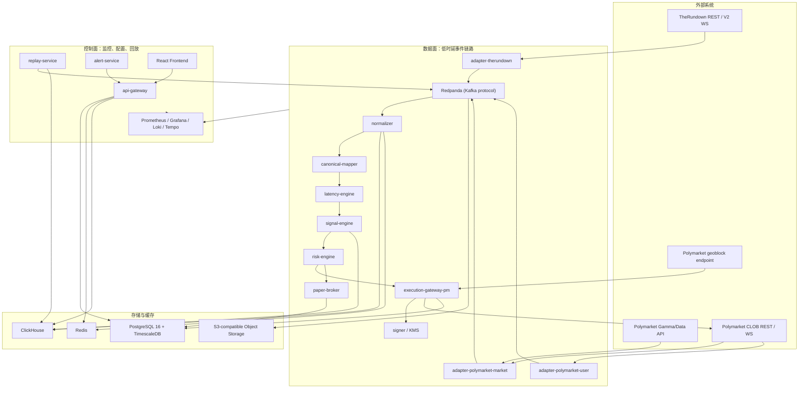
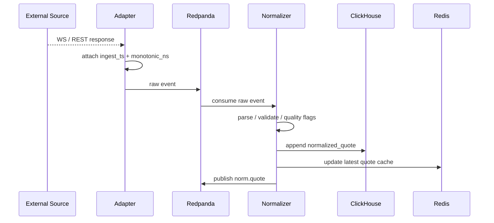
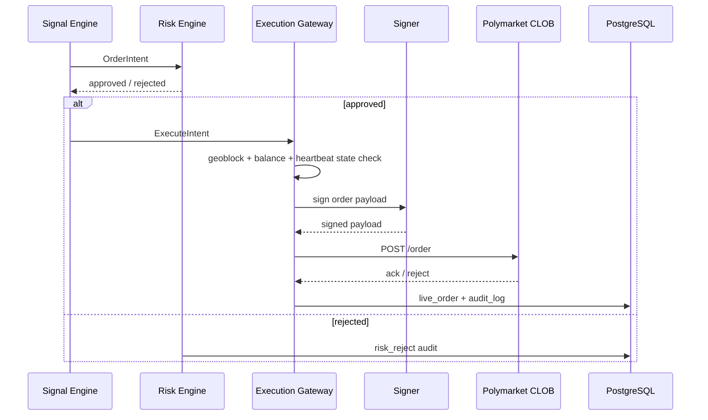

# Polymarket / TheRundown 延迟信号系统架构设计文档

核验日期：2026-05-14  
来源文档：`docs/deep-research-report.md`

## 0. 架构定版决策

本文件以下内容按当前系统版本统一定版，不再保留二选一架构：

| 领域 | 定版 |
|---|---|
| 系统范围 | 单用户、单执行 venue、事件驱动延迟信号交易系统 |
| 执行 venue | 仅 Polymarket CLOB；TheRundown 不进入执行抽象 |
| 数据源 | P0 仅 TheRundown V2；P0 仅实现 full-game moneyline 主路径，spread/total 在模型中保留但不作为首轮闭环依赖 |
| 后端主路径 | Rust，控制面 API 使用 Axum |
| 离线研究 | Python 仅用于脚本、回放分析和参数报告，不进入 live path |
| 前端 | React + Vite + TypeScript |
| 消息总线 | Redpanda，使用 Kafka protocol；文档中的 Kafka 均指协议兼容层，不另行部署 Apache Kafka |
| 事务库 | PostgreSQL 16 + TimescaleDB extension |
| 分析库 | ClickHouse |
| 热缓存 | Redis |
| 原始归档 | S3-compatible object storage；本地开发使用 MinIO，生产使用 S3 兼容服务 |
| 部署 | 开发环境 Docker Compose；生产环境双节点 Docker Compose + systemd；Kubernetes 不进入当前开发计划 |
| 钱包签名 | P0 仅实现 deposit wallet / `POLY_1271`；legacy Proxy/Safe 不进入当前闭环 |
| 订单类型 | P0 live 只使用 marketable limit + FAK，不挂长期 GTC 订单 |

## 1. 架构目标

系统目标是建立一个单用户、可长期运行、可回放、可审计的 Polymarket 延迟信号交易系统。架构不追求一开始就多租户或多 venue，而是优先解决五件事：

1. 稳定接入 TheRundown 与 Polymarket 实时/准实时数据。
2. 把不同源的赛事、盘口、价格、时间戳归一到 canonical 模型。
3. 通过 lead-lag 和 executable edge 生成可解释信号。
4. 用风险引擎和执行网关隔离 live trading 风险。
5. 让所有行情、信号、订单、拒绝原因和配置变更可回放、可审计。

## 2. 已修正的外部约束

| 领域 | 结论 | 架构处理 |
|---|---|---|
| TheRundown 角色 | 数据源，不是执行 venue | 只实现 `SourceAdapter`，不实现订单接口 |
| TheRundown WebSocket | V2 主消息为 `market_price`，单条代表一个 sportsbook/participant/market 的价格变化 | Normalizer 按扁平 price update 处理 |
| TheRundown 认证 | REST 生产固定使用 `X-TheRundown-Key`，WS 使用 query `key` | Adapter 只在 WS URL 中使用 query key，REST 不使用 query key |
| TheRundown 实时性 | Ultra 及以上自助层级才默认 real-time + WebSocket，Free/Starter/Pro 有固定延迟且无 WS | SourceState 必须记录 tier、delay、ws_access |
| Polymarket 角色 | CLOB 为执行 venue，Gamma/Data/CLOB read 为发现和行情 | 交易仅进 Execution Gateway |
| Polymarket 新用户签名 | P0 固定按 deposit wallet / `POLY_1271` 设计 | Signer 模块只实现当前签名路径 |
| Polymarket geoblock | 下单前必须检查，受限 IP 会拒单 | geoblock 是 live trading 硬闸门 |
| Polymarket WSS | market channel 不鉴权，user channel 鉴权；market 用 asset IDs，user 用 condition IDs | 两个 adapter 分开部署 |

## 3. 总体架构



## 4. 分层设计

### 4.1 外部接入层

| 服务 | 上游 | 职责 | 关键设计 |
|---|---|---|---|
| `adapter-therundown` | TheRundown REST/WS | sports/events bootstrap、markets delta、V2 WS 接入 | 按 tier 和 ws access 自动选择 WS 或 delta poll |
| `adapter-polymarket-market` | Polymarket Gamma/CLOB/Market WS | 市场发现、订单簿、价格变化、best bid/ask | market WS 使用 asset IDs；ping 每 10 秒 |
| `adapter-polymarket-user` | Polymarket User WS/REST | 订单、成交、撤单状态 | user WS 用 L2 API creds，按 condition ID 订阅 |
| `geoblock-probe` | Polymarket geoblock endpoint | 地域可交易性检查 | 结果写入 `source_state`，失败触发 live 禁用 |

### 4.2 数据面核心层

| 服务 | 职责 | 状态依赖 | 输出 |
|---|---|---|---|
| `normalizer` | 原始消息解析、概率归一化、质量标记 | Redis hot state、schema registry | `norm.quote`、ClickHouse |
| `canonical-mapper` | event/market/participant/line/side 对齐 | PostgreSQL mapping 表、人工修正规则 | `canonical.market.update` |
| `latency-engine` | source offset、source age、lead-lag 统计 | Chrony/NTP、source heartbeat | `latency.sample` |
| `signal-engine` | edge、深度、阈值、信号生成 | Redis quote cache、strategy config | `signal.event`、`order.intent` |
| `risk-engine` | 交易前风控、额度、频率、熔断 | Redis counters、PostgreSQL orders | approve/reject |
| `execution-gateway-pm` | 下单、撤单、查单、heartbeat、签名协调 | KMS/signer、geoblock、CLOB creds | `order.execution` |
| `paper-broker` | 纸面撮合、延迟注入、PnL | 历史 quote、策略参数 | paper orders/fills |

### 4.3 控制面

| 服务 | 职责 | 说明 |
|---|---|---|
| `api-gateway` | 对前端提供 REST/WS，聚合服务状态 | 不参与高频交易判定 |
| `replay-service` | 按时间窗、topic offset、参数版本回放 | 输出可比较的 replay report |
| `alert-service` | 订阅健康、风控、执行、数据质量事件 | 告警要带 trace_id 和 runbook |
| `frontend` | 单用户监控与操作 | 支持 kill switch、策略启停、参数版本 |

## 5. 关键链路

### 5.1 数据接入链路



### 5.2 执行链路



## 6. 技术选型

| 层 | 定版选型 | 原因 |
|---|---|---|
| 低时延服务 | Rust | 稳定延迟、类型安全、并发可靠 |
| 控制面 API | Rust Axum | 与后端主路径统一，避免引入第二套服务运行时 |
| 研究与回放报告 | Python | 回测、分析、参数搜索生态成熟，但不进入 live path |
| 前端 | React + Vite + TypeScript | 控制台和图表生态成熟 |
| 消息总线 | Redpanda | Kafka protocol 兼容，单节点/小集群运维简单 |
| 事务与配置 | PostgreSQL 16 + TimescaleDB | 订单、配置、审计、低频时序 |
| 高频分析 | ClickHouse | append、聚合、TTL、压缩能力强 |
| 热状态 | Redis | latest quote、幂等、限流、熔断计数 |
| 原始归档 | S3-compatible object storage | 原始 payload 和 replay dataset 冷存储 |
| 可观测性 | OpenTelemetry + Prometheus + Grafana + Loki/Tempo | trace/log/metric 一体化 |

## 7. 部署架构

### 7.1 开发环境

开发环境用 Docker Compose，目标是一键启动基础依赖与本地服务：

```text
docker-compose
├─ redpanda
├─ postgres
├─ clickhouse
├─ redis
├─ api-gateway
├─ adapter mocks
└─ frontend
```

### 7.2 生产部署

生产部署定版为“双节点 Docker Compose + systemd + 数据备份恢复演练”。Kubernetes 不进入当前开发计划。

| 环境 | 定版部署方式 | 说明 |
|---|---|---|
| 本地开发 | Docker Compose 单机 | 启动 Redpanda、PostgreSQL、ClickHouse、Redis、MinIO、服务 mock |
| Paper / 回放 | Docker Compose 单机增强 | 用真实依赖压测和回放，不启用 live execution |
| 生产 | 双节点 Docker Compose + systemd | 主节点跑交易链路，备节点保留恢复能力；数据库和对象归档按 runbook 恢复 |

生产部署必须做到：

1. 执行网关与签名器在受限网络内。
2. 数据面与控制面进程隔离。
3. PostgreSQL 每日备份，ClickHouse 分区和对象归档可恢复。
4. 出站访问 allowlist 仅包含 TheRundown、Polymarket 与必要监控端点。
5. 前端管理口只能通过 VPN / Zero Trust / IP allowlist 访问。

## 8. 非功能目标

| 类别 | 目标 |
|---|---|
| 延迟 | adapter ingest 到 normalized publish p95 < 50ms；Signal 到 Execution Gateway p95 < 20ms，具体以部署地实测校正 |
| 吞吐 | P0 支持 1k msg/s，P1 支持 10k msg/s，100k msg/s 作为压测目标 |
| 可用性 | 数据采集 99.5% 以上；live execution 以安全优先，异常时主动降级 |
| 可追溯 | 每个信号、订单、拒绝原因都可由 `trace_id` 回溯到原始消息 |
| 安全 | 私钥不进入策略服务、日志、前端、普通配置快照 |
| 合规 | geoblock、套餐能力、数据使用范围进入状态机和审计 |

## 9. 架构风险与缓解

| 风险 | 说明 | 缓解 |
|---|---|---|
| 数据非实时 | TheRundown 订阅层级不够 | 自动检测 `X-Data-Delay-Seconds` / `X-Websocket-Access` 并降级 |
| 误映射 | 体育队名、盘口、line、period 对齐错误 | mapping confidence、人工确认、P0 只交易高置信映射 |
| Polymarket 不可交易 | geoblock、账户、余额、allowance、heartbeat | 每日预检 + 每单预检 + 熔断 |
| 过度复杂 | Rust + 多存储增加工程成本 | 先实现接口骨架和单路径闭环，再扩展容量 |
| 假阳性 edge | sportsbook 临时 off-board、延迟、噪声 | quality flags、0.0001 sentinel、source freshness、paper 必经 |
| 回放偏差 | replay 与 live 路径不一致 | 复用同一 normalizer/signal/risk 逻辑 |

## 10. 参考来源

- [Polymarket API Introduction](https://docs.polymarket.com/api-reference/introduction)
- [Polymarket Authentication](https://docs.polymarket.com/api-reference/authentication)
- [Polymarket Rate Limits](https://docs.polymarket.com/api-reference/rate-limits)
- [Polymarket WebSocket Overview](https://docs.polymarket.com/market-data/websocket/overview)
- [Polymarket Geographic Restrictions](https://docs.polymarket.com/api-reference/geoblock)
- [TheRundown Authentication](https://docs.therundown.io/authentication)
- [TheRundown Rate Limits](https://docs.therundown.io/rate-limits)
- [TheRundown WebSocket Streaming](https://docs.therundown.io/guides/websocket-streaming)
