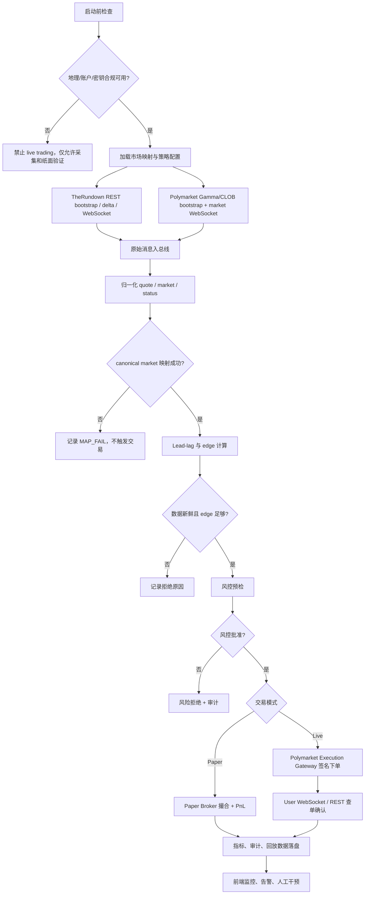
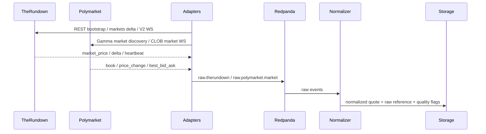
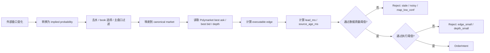
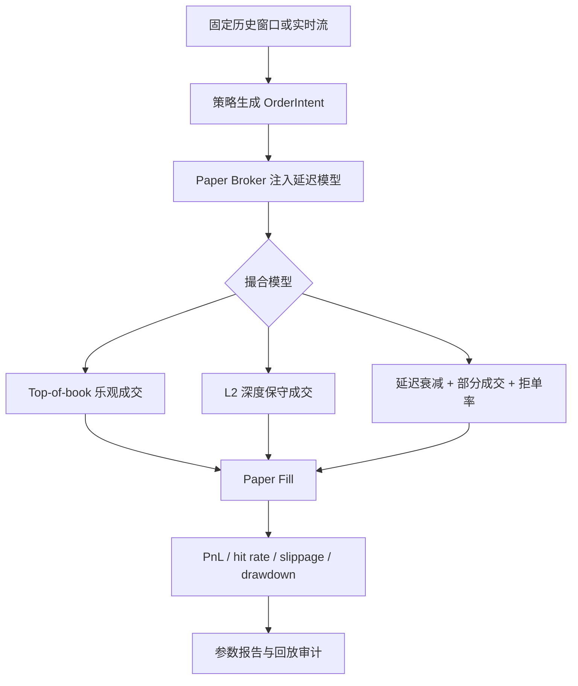
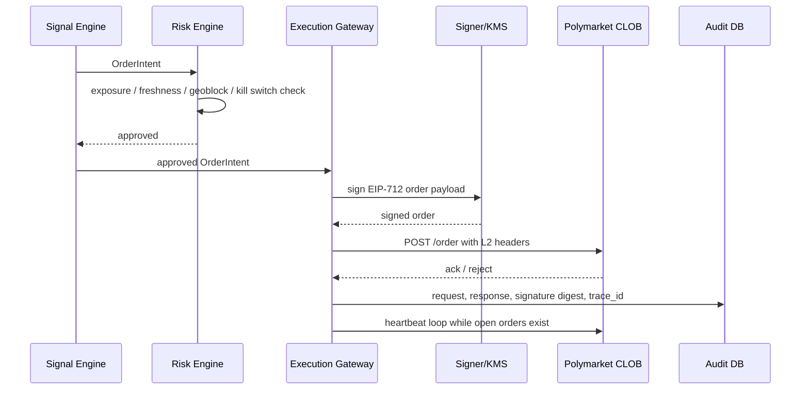
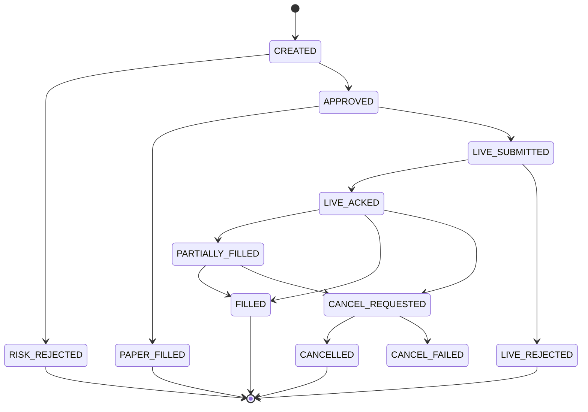

# Polymarket / TheRundown 延迟信号系统业务流程与功能清单

核验日期：2026-05-14  
来源文档：`docs/deep-research-report.md`

## 0. 当前系统定版

| 领域 | 定版 |
|---|---|
| 业务定义 | TheRundown 领先赔率信号驱动 Polymarket 执行，不定义为双边无风险套利 |
| 当前数据源 | TheRundown V2 |
| 当前执行 venue | Polymarket CLOB |
| 首轮可交易市场 | full-game moneyline；spread/total 只保留数据模型，不作为首轮执行依赖 |
| 运行模式顺序 | `RESEARCH_ONLY` -> `PAPER_ONLY` -> `LIVE_READY` -> `LIVE_ENABLED` |
| Live 订单方式 | marketable limit + FAK；P0 不挂长期 GTC 订单 |
| 实时条件 | TheRundown 必须具备 real-time + WebSocket access；否则只能运行研究和纸面 |
| 风控原则 | 任何 geoblock、heartbeat、限流、mapping 低置信、source stale 均优先拒单 |

## 1. 定位修正

本系统不应被定义为“两边同时交易的无风险套利系统”。当前已指定的外部平台中，Polymarket 是唯一执行 venue，TheRundown 是体育赔率与盘口数据源，不是可公开下单的交易 venue。因此业务定位应修正为：

> 基于 TheRundown 等外部赔率源的领先变化，识别 Polymarket CLOB 上尚未充分反应的价格窗口，在严格风控、纸面验证和合规约束下执行 Polymarket 订单的单用户延迟信号交易系统。

该定位有三个直接影响：

| 原报告倾向 | 修正后口径 | 业务影响 |
|---|---|---|
| “套利”容易暗示双边锁定利润 | “延迟信号驱动执行” | 收益来自统计 edge，不承诺无风险 |
| TheRundown 被描述为外部 live 盘口源 | 定版为当前唯一外部赔率源 | 非 Ultra/Super/Mega/Max/Enterprise 层级时不能作为 live 主信号 |
| Polymarket 执行路径泛化 | 明确只在 Polymarket 下单 | 订单、持仓、风控、合规模型围绕 Polymarket 设计 |

## 2. 业务角色

| 角色 | 说明 | 主要动作 |
|---|---|---|
| 单用户 / 操盘人 | 系统唯一管理者 | 配置策略、查看监控、启动纸面回放、控制 live trading |
| 数据源 | TheRundown V2、Polymarket market/user WS | 提供赔率、盘口、订单簿、订单状态 |
| 策略系统 | Lead-lag、edge、风控与执行模块 | 生成信号、拒绝坏信号、发送订单意图 |
| 执行 venue | Polymarket CLOB | 接收签名订单、撤单、订单心跳、成交状态 |
| 审计与回放系统 | 数据、信号、订单、错误的可追溯层 | 重放历史、解释交易、支持故障恢复 |

## 3. 端到端主流程

## 4. 关键业务流程

### 4.1 启动前检查

启动前检查是 live trading 的硬闸门。任何一项失败，系统只能进入 `RESEARCH_ONLY` 或 `PAPER_ONLY`。

| 检查项 | 通过条件 | 失败处理 |
|---|---|---|
| Polymarket geoblock | `blocked=false` | 禁止新开 live order |
| Polymarket API 凭证 | L1/L2 凭证可用，签名器可工作 | 禁止 live order，告警 |
| 订单心跳 | heartbeat 任务已启动并可更新 `heartbeat_id` | 禁止挂单或立即撤单 |
| TheRundown 实时能力 | 响应头或配置确认 WebSocket access / real-time | 非实时层级降级为研究/纸面 |
| 时钟偏移 | 主机 NTP 偏移、source offset 低于阈值 | 降级或暂停策略 |
| 市场映射 | 目标市场存在高置信度 mapping | 未映射市场不交易 |

### 4.2 数据接入流程

业务规则：

1. TheRundown V2 WebSocket 消息按 `market_price` 处理，heartbeat 只用于连接健康与时钟估计。
2. Polymarket market channel 按 token `asset_id` 订阅，user channel 按 condition ID 订阅。
3. 所有原始消息先入总线或对象归档，再解析；解析失败进入 DLQ。
4. WebSocket 断线后先重连，再用 REST snapshot 或 delta 补洞。

### 4.3 信号生成流程

信号不能只看价差，必须同时满足：

| 阈值层 | 业务含义 | 示例指标 |
|---|---|---|
| 数据有效性 | 这条数据是否可信 | source freshness、heartbeat、out-of-order、0.0001 off-board |
| 映射有效性 | 两边是否真是同一市场语义 | sport、event、team、market type、line、side |
| 统计有效性 | 外部源是否真的领先 | lead_ms 分位数、历史命中率、事件类型稳定性 |
| 执行有效性 | Polymarket 是否能成交且净 edge 为正 | best ask/bid、depth、tick、fee、slippage |
| 风险有效性 | 本次下单是否在账户和策略约束内 | 单市场敞口、日亏损、订单频率、kill switch |

### 4.4 纸面交易流程

Paper Trading 是 live trading 前的必经阶段，而不是附属功能。

纸面阶段验收标准：

| 维度 | 最低要求 |
|---|---|
| 可复现 | 同一回放数据、同一参数版本输出一致 |
| 可解释 | 每个拒绝、信号、订单、成交都有原因码和 trace |
| 可压测 | P0 覆盖 1k msg/s，P1 覆盖 10k msg/s；100k msg/s 不进入当前开发依赖 |
| 可降级 | TheRundown 非实时层级时仍可采集、回放、研究 |
| 可对账 | Paper order、paper fill、PnL 能和行情快照关联 |

### 4.5 Live Trading 流程

Live Trading 必须遵守：

1. 策略服务不直接持有私钥。
2. 新 API 用户按 deposit wallet / `POLY_1271` 设计 funder 与 signature type。
3. geoblock 检查失败时，全局禁用新开仓，不实现任何规避逻辑。
4. heartbeat 中断、连续拒单、限流、账户余额异常时进入 `EXECUTION_DEGRADED`。

## 5. 状态机

### 5.1 系统模式

| 状态 | 说明 | 可执行动作 |
|---|---|---|
| `RESEARCH_ONLY` | 只采集、查询、分析 | REST/WS 接入、落库、离线分析 |
| `PAPER_ONLY` | 可实时纸面撮合 | 全部策略逻辑、Paper Broker、回放 |
| `LIVE_READY` | live trading 预检通过但未开交易 | 小额演练、手动启停 |
| `LIVE_ENABLED` | 允许真实下单 | 执行 approved order intent |
| `EXECUTION_DEGRADED` | 执行层异常 | 停止新单、撤单、对账 |
| `KILL_SWITCHED` | 人工或自动全局停机 | 只允许撤单、查询、审计 |

### 5.2 OrderIntent 状态

## 6. 功能清单

### 6.1 P0：生产骨架必需功能

| 功能 | 说明 | 验收标准 |
|---|---|---|
| 外部源配置管理 | TheRundown key、过滤器、订阅层级、source mode | 配置变更可审计、可回滚 |
| Polymarket market discovery | Gamma/CLOB 市场发现、token/condition ID 缓存 | 可定位目标市场和 token |
| TheRundown V2 接入 | REST bootstrap、markets delta、V2 WS `market_price` | 支持 header auth、query auth 仅测试使用 |
| Polymarket market WS | `book`、`price_change`、`best_bid_ask` | 订阅、心跳、重连、补快照 |
| Polymarket user WS | 订单和成交状态 | 用 L2 凭证订阅，状态可落库 |
| Raw event bus | 原始消息持久化、DLQ、回放 | 断点可追溯 |
| Normalizer | 概率、盘口、时间戳、质量标记 | 输出统一 `NormalizedQuote` |
| Canonical Mapper | event/market/side/line 对齐 | 每个 mapping 有 confidence |
| Lead-lag Engine | lead_ms、source_age、edge 计算 | 固定样本可复现 |
| Risk Engine | 额度、频率、stale、kill switch | 拒绝原因结构化 |
| Paper Broker | 三层撮合模型 | 可生成 paper fill 和 PnL |
| Execution Gateway | Polymarket 下单、撤单、查单、heartbeat | 私钥隔离、完整审计 |
| Control API | REST + WS 给前端使用 | 带 trace_id 与统一错误 |
| 审计日志 | 配置、信号、订单、异常 | 可按 trace 检索 |
| 基础前端 | 总览、市场监控、策略控制、订单、告警 | 单用户可操作 |

### 6.2 P1：上线稳定性功能

| 功能 | 说明 | 验收标准 |
|---|---|---|
| Replay Center | 用 Redpanda/ClickHouse 数据重放策略 | 支持倍率、参数版本、结果对比 |
| 参数版本管理 | 策略配置、风控配置版本化 | live 变更需二次确认 |
| 自动降级 | 非实时数据源、WS 不可用、限流 | 自动切 `PAPER_ONLY` 或 `RESEARCH_ONLY` |
| 告警中心 | source、lag、风险、执行、磁盘、backlog | 告警有级别和 runbook |
| 对账任务 | live order、user WS、REST、DB 一致性 | 定时输出差异 |
| 容量压测 | 1k/10k/100k msg/s | 输出 p50/p95/p99 和 backlog 恢复 |
| 备份恢复 | PostgreSQL、ClickHouse、对象归档 | 可演练恢复 |
| 安全配置 | SOPS/Vault/KMS、mTLS、最小权限 | secret 不进日志和前端 |

### 6.3 P2：当前不实现的扩展功能

| 功能 | 说明 |
|---|---|
| 第二执行 venue 抽象 | 当前只保留文档边界，不写可运行实现，不实现伪双边套利 |
| 多外部赔率源 | 当前不接入；新增 Pinnacle、Betfair 等需要单独核验条款与接口 |
| 自动市场发现 | 从 Polymarket sports market 和 TheRundown event 自动生成 mapping 候选 |
| 策略组合 | 多套 lead-lag 参数并行 paper，live 只启用少量稳定策略 |
| Co-location 优化 | 当前不做；生产部署先按合规地域和稳定性选择 |

## 7. 异常流程

| 异常 | 触发条件 | 自动处理 | 人工动作 |
|---|---|---|---|
| TheRundown WS stale | 60 秒无 heartbeat 或连续断线 | 重连 + REST snapshot 补洞 | 查看 key/tier/网络 |
| TheRundown 429 | burst 或 datapoint 耗尽 | 按 `Retry-After` 退避，减少过滤范围 | 升级套餐或缩小范围 |
| TheRundown off-board | price 为 `0.0001` sentinel | 标记 `off_board`，不触发信号 | 确认 sportsbook 状态 |
| Polymarket WS 断线 | ping/pong 失败或订阅关闭 | 重连并重新订阅资产 | 检查 token/condition 是否有效 |
| Polymarket geoblock | `blocked=true` | 禁止新开 live order | 更换合法运营安排，不规避限制 |
| Polymarket heartbeat lost | heartbeat 失败或过期 | 停止新单，尝试撤单并对账 | 人工确认恢复 |
| 限流 | CLOB/Gamma/Data 触发限流 | 本地令牌桶、退避、降级查询 | 调整策略频率 |
| Mapping 置信度低 | 队名/盘口/line 不一致 | 不交易，进入待确认 | 人工修正映射规则 |
| Kill switch | 人工点击或硬阈值触发 | 停新单、撤单、审计 | 人工复盘后恢复 |

## 8. 成功指标

| 类别 | 指标 |
|---|---|
| 数据 | TheRundown/Polymarket 消息延迟 p50/p95/p99、丢包率、DLQ 率 |
| 映射 | canonical mapping 覆盖率、人工修正率、误映射率 |
| 信号 | signal count、reject ratio、hit rate、edge decay curve |
| 纸面 | paper PnL、slippage、max drawdown、fill ratio |
| 实盘 | order ack latency、fill ratio、reject ratio、PnL attribution |
| 风控 | kill switch 触发次数、熔断恢复时间、违规下单数为 0 |
| 运维 | backlog、CPU、内存、磁盘、恢复时间、备份成功率 |

## 9. 参考来源

- [Polymarket API Introduction](https://docs.polymarket.com/api-reference/introduction)
- [Polymarket Authentication](https://docs.polymarket.com/api-reference/authentication)
- [Polymarket WebSocket Overview](https://docs.polymarket.com/market-data/websocket/overview)
- [Polymarket Geographic Restrictions](https://docs.polymarket.com/api-reference/geoblock)
- [TheRundown Authentication](https://docs.therundown.io/authentication)
- [TheRundown Rate Limits](https://docs.therundown.io/rate-limits)
- [TheRundown WebSocket Streaming](https://docs.therundown.io/guides/websocket-streaming)
- [TheRundown V1 to V2 Migration Guide](https://docs.therundown.io/guides/v1-to-v2-migration)
