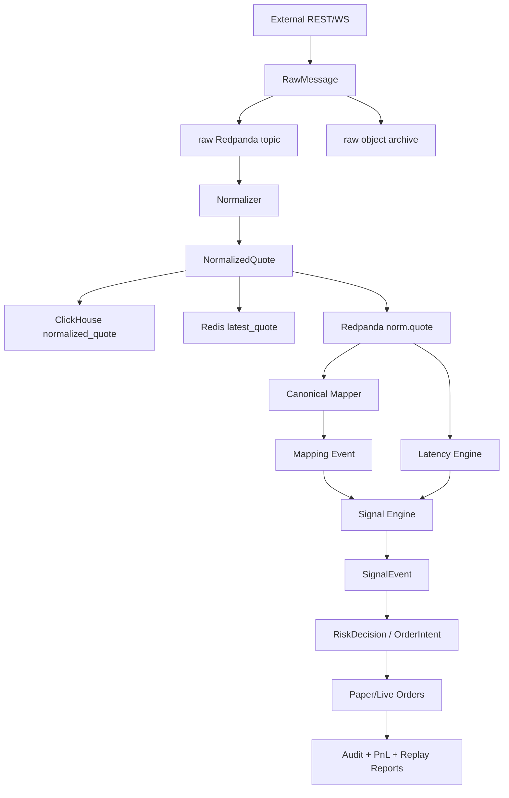

# Polymarket / TheRundown 延迟信号系统数据架构文档

核验日期：2026-05-14  
来源文档：`docs/deep-research-report.md`

## 0. 数据架构定版

| 领域 | 定版 |
|---|---|
| 事件总线 | Redpanda；所有 Kafka 表述均表示 Kafka protocol/topic 语义 |
| 事务库 | PostgreSQL 16 + TimescaleDB extension |
| 高频库 | ClickHouse |
| 热状态 | Redis |
| 冷归档 | S3-compatible object storage；本地 MinIO，生产 S3 兼容服务 |
| P0 市场模型 | full-game moneyline 完整闭环；spread/total 字段保留但不阻塞 P0 |
| Topic 保留 | raw 14 天、norm 14 天、signal 30 天、order/risk 90 天、DLQ 30 天 |
| ClickHouse 保留 | quote/latency 90 天、signal 180 天、execution 365 天 |
| Object 保留 | raw archive 365 天 |

## 1. 数据架构目标

数据架构要解决的不是“把所有上游字段存下来”，而是让策略、风控、回放和审计共享同一组可解释事实：

1. 哪个外部事件、盘口、参与方、side 对应哪个 Polymarket market/token。
2. 上游价格在什么时候产生、系统在什么时候收到、被归一化时质量如何。
3. Polymarket 当时可成交价格和深度是多少。
4. 信号、风控、订单是否能从最终结果追溯到原始消息。

## 2. 数据域

| 数据域 | 主体 | 存储 | 说明 |
|---|---|---|---|
| Source Metadata | source、subscription、tier、health | PostgreSQL、Redis | TheRundown tier、Polymarket geoblock、WS 状态 |
| Raw Events | 原始 REST/WS 消息 | Redpanda、S3-compatible object storage | 不可变，用于审计和重放 |
| Canonical Mapping | event、market、participant、line、side | PostgreSQL、Redis | 人工可修正，必须版本化 |
| Normalized Quotes | 统一价格/盘口/时间戳 | ClickHouse、Redpanda、Redis latest | 策略主输入 |
| Latency Samples | offset、age、lead/lag | ClickHouse、Redis | 信号和监控共用 |
| Signals | 候选信号、拒绝原因、edge | Redpanda、ClickHouse、PostgreSQL 摘要 | 可解释策略输出 |
| Orders | paper/live order、fill、execution report | PostgreSQL、Redpanda | 事务与对账核心 |
| Audit | 配置、风险、执行、异常 | PostgreSQL、对象归档 | 合规与故障定位 |

## 3. Canonical 标识体系

### 3.1 Canonical Event

`canonical_event_id` 用 UUID，语义是“同一场真实赛事或事件”。生成规则：

1. 优先按 TheRundown event ID 与 Polymarket market metadata 的赛事信息匹配。
2. 辅助使用 sport、league、home team、away team、scheduled start。
3. 任何模糊匹配都必须记录 `mapping_confidence` 和 `match_features`。
4. 低于阈值的 event 不进入 live trading。

### 3.2 Canonical Market Key

固定格式：

```text
<sport>:<league>:<event_slug>:<period>:<market_type>:<line_or_na>:<side>
```

示例：

```text
nba:nba:lakers_vs_celtics:full_game:moneyline:na:home
nba:nba:lakers_vs_celtics:full_game:spread:-3.5:away
nba:nba:lakers_vs_celtics:full_game:total:235.5:over
```

Polymarket yes/no 二元市场要映射成清晰 outcome：

| Polymarket | Canonical |
|---|---|
| `YES` token | 对应事件命题为真 |
| `NO` token | 对应事件命题为假 |
| `best_ask` | 买入该 outcome 的可执行概率 |
| `best_bid` | 卖出该 outcome 的可执行概率 |

## 4. 归一化模型

### 4.1 `NormalizedQuote`

```json
{
  "schema_version": 1,
  "trace_id": "uuid",
  "source": "therundown",
  "source_channel": "v2_ws_markets",
  "provider_event_id": "string",
  "provider_market_id": "string",
  "provider_instrument_id": "string",
  "canonical_event_id": "uuid|null",
  "canonical_market_key": "string|null",
  "market_type": "moneyline|spread|total|binary_yesno",
  "period": "full_game|first_half|unknown",
  "side": "home|away|over|under|yes|no",
  "line_value": "decimal|null",
  "price_raw": "string",
  "price_norm_prob": "decimal|null",
  "best_bid": "decimal|null",
  "best_ask": "decimal|null",
  "size": "decimal|null",
  "book_or_affiliate_id": "string|null",
  "provider_ts": "timestamp|null",
  "provider_ts_type": "updated_at|server_time|exchange_ts|none",
  "ingest_ts": "timestamp",
  "ingest_mono_ns": 0,
  "cursor_or_seq": "string|null",
  "message_hash": "sha256",
  "raw_ref": "topic:partition:offset or object key",
  "quality_flags": ["ok"]
}
```

### 4.2 `quality_flags`

| Flag | 含义 | 交易处理 |
|---|---|---|
| `stale` | source age 超过阈值 | 不交易 |
| `out_of_order` | provider_ts 或 seq 回退 | 不交易或只记分析 |
| `replayed` | 来自 replay job | 禁止 live |
| `off_board` | TheRundown 价格为 `0.0001` sentinel | 不交易 |
| `mapping_low_confidence` | mapping 分数低 | 不交易 |
| `missing_provider_ts` | 上游未给时间戳 | 只能用 ingest_ts 分析 |
| `book_filtered` | 不在允许 sportsbook 列表 | 不交易 |
| `line_mismatch` | line 与 canonical 不一致 | 不交易 |
| `schema_unknown` | 未识别字段或消息类型 | 进 DLQ 或降级 |

## 5. 价格归一化

### 5.1 American Odds 到概率

TheRundown sportsbook odds 常见为 American odds。转换：

```text
odds > 0: implied_prob = 100 / (odds + 100)
odds < 0: implied_prob = abs(odds) / (abs(odds) + 100)
```

同一 sportsbook 的 moneyline、spread、total 需要去水：

```text
no_vig_prob_i = implied_prob_i / sum(implied_prob_all_sides)
```

注意事项：

1. `0.0001` 代表 off-board，不是低概率。
2. 同一 event 下要区分 full game、period、team props、player props。
3. TheRundown 的 `affiliate_id` 是 sportsbook 维度，策略可配置白名单和权重。

### 5.2 Polymarket 概率

Polymarket CLOB 中 price 位于 0 到 1，可近似视为 outcome probability，但交易使用可执行价：

| 动作 | 概率字段 |
|---|---|
| 买 YES | YES token `best_ask` |
| 卖 YES | YES token `best_bid` |
| 买 NO | NO token `best_ask` |
| 卖 NO | NO token `best_bid` |

策略不能用 mid price 直接决定下单，必须使用 best ask/bid、深度、tick、费用和滑点模型。

## 6. 时间模型

每条数据至少保留三类时间：

| 时间 | 来源 | 用途 |
|---|---|---|
| `provider_ts` | 上游 payload，例如 `updated_at`、server time、exchange ts | 估算上游更新时间 |
| `ingest_ts` | 本机 wall-clock | 监控、审计、人类可读 |
| `ingest_mono_ns` | 本机 monotonic clock | 同机内延迟排序和精确耗时 |

时间修正规则：

1. 主机层使用 Chrony + 多 NTP 上游。
2. Polymarket 定时调用 `/time` 估算 server offset。
3. TheRundown V2 heartbeat 的 `now` 只辅助估算 feed 时钟，不替代具体 price update 的 `updated_at`。
4. `lead_ms` 要标注计算方式，例如 `provider_ts_adjusted` 或 `ingest_delta`。

## 7. 数据流



## 8. Redpanda Topic

| Topic | Key | Producer | Consumers | Retention |
|---|---|---|---|---|
| `raw.therundown` | `provider_event_id` | `adapter-therundown` | normalizer、replay | 14 天 |
| `raw.polymarket.market` | `asset_id` | `adapter-polymarket-market` | normalizer、replay | 14 天 |
| `raw.polymarket.user` | `venue_order_id` | `adapter-polymarket-user` | order sync、audit | 90 天 |
| `norm.quote` | `canonical_market_key` | normalizer | mapper、latency、signal | 14 天 |
| `canonical.market.update` | `canonical_market_key` | mapper | signal、frontend | 30 天 |
| `latency.sample` | `canonical_market_key` | latency-engine | signal、alert、frontend | 30 天 |
| `signal.event` | `strategy_id` | signal-engine | risk、frontend、ClickHouse | 30 天 |
| `order.intent` | `strategy_id` | signal-engine | risk、paper/live | 90 天 |
| `order.approved` | `strategy_id` | risk-engine | paper/live | 90 天 |
| `order.execution` | `venue_order_id` | execution/user adapter | order sync、audit | 1 年 |
| `risk.alert` | `market_key` | risk-engine | alert/frontend | 1 年 |
| `dlq.raw` | `message_hash` | normalizer | operator/replay | 30 天 |

## 9. 冷热分层

| 层级 | 数据 | 存储 | 访问模式 |
|---|---|---|---|
| 热 | latest quote、source health、risk counters、idempotency keys | Redis | 毫秒级读写 |
| 温 | normalized quote、latency、signal、最近订单 | ClickHouse、PostgreSQL | 查询、监控、回放 |
| 冷 | raw payload、历史 replay dataset、审计附件 | S3-compatible object storage | 低频恢复和追溯 |

固定保留策略：

| 数据 | 默认保留 | 理由 |
|---|---:|---|
| Redpanda raw | 14 天 | 故障补洞和短期回放 |
| ClickHouse quote | 90 天 | 参数研究和监控 |
| PostgreSQL order/audit | 1 年以上 | 对账和审计 |
| Object raw archive | 365 天 | 成本与合规折中 |
| Redis hot state | TTL 1 分钟到 24 小时 | 根据用途区分 |

## 10. 数据质量与血缘

每个最终 `OrderIntent` 必须能回溯到：

```text
OrderIntent
  -> SignalEvent
  -> NormalizedQuote external
  -> NormalizedQuote polymarket
  -> RawMessage references
  -> SourceState / StrategyConfig version
  -> RiskDecision
```

`trace_id` 传播规则：

1. adapter 为每条 raw event 生成或继承 `trace_id`。
2. normalizer 产生的多条 normalized quote 继承 raw `trace_id`，并额外带 `parent_message_hash`。
3. signal 可聚合多个 quote，使用新的 `trace_id`，并保存 `input_trace_ids`。
4. order/audit 保存 signal trace 和 execution trace。

## 11. 容量估算

假设平均 normalized record 约 250B，raw record 约 800B，ClickHouse 压缩比约 4:1，对象归档压缩比约 3:1：

| 规模 | 消息速率 | 日行数 | ClickHouse/日 | Raw archive/日 | 30 天 CH |
|---|---:|---:|---:|---:|---:|
| 小型 | 1k msg/s | 86.4M | 约 5.4GB | 约 23GB | 约 162GB |
| 中型 | 10k msg/s | 864M | 约 54GB | 约 230GB | 约 1.62TB |
| 大型 | 100k msg/s | 8.64B | 约 540GB | 约 2.3TB | 约 16.2TB |

P0 固定按 1k msg/s 设计和验收，P1 固定按 10k msg/s 设计和验收；100k msg/s 不进入当前开发依赖。

## 12. 参考来源

- [TheRundown V1 to V2 Migration Guide](https://docs.therundown.io/guides/v1-to-v2-migration)
- [TheRundown WebSocket Streaming](https://docs.therundown.io/guides/websocket-streaming)
- [TheRundown Rate Limits](https://docs.therundown.io/rate-limits)
- [Polymarket WebSocket Overview](https://docs.polymarket.com/market-data/websocket/overview)
- [Polymarket Post a New Order](https://docs.polymarket.com/api-reference/trade/post-a-new-order)
