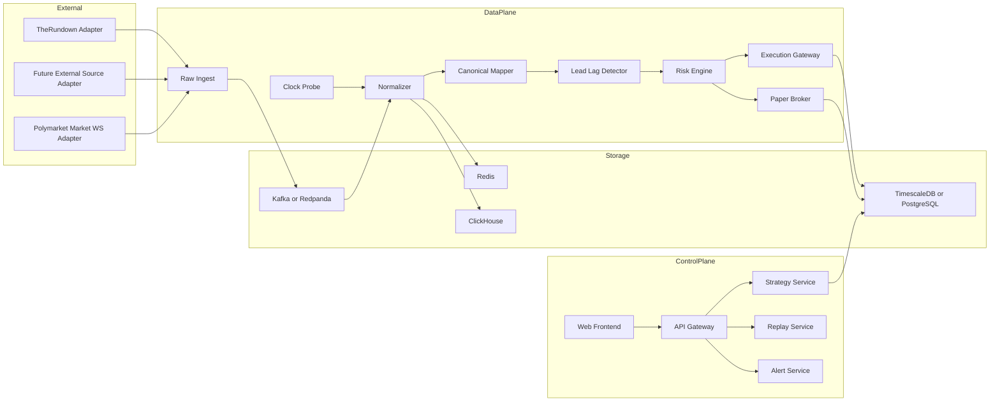
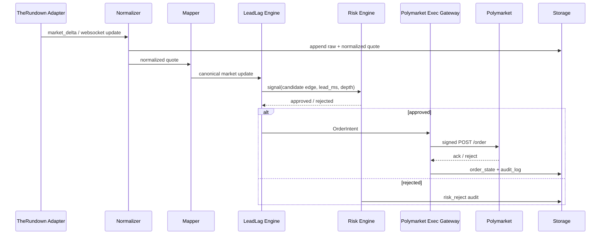
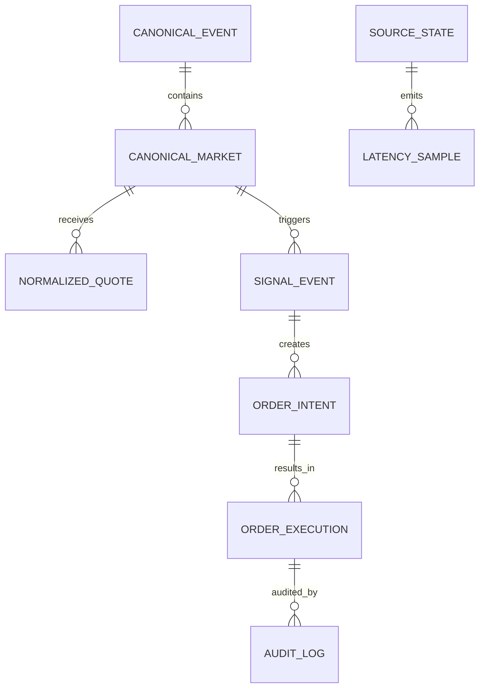
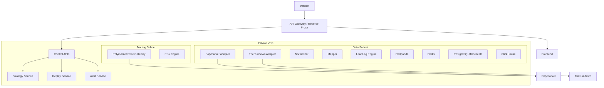

# Polymarket 与 TheRundown 延迟套利系统工程方案文档

> 定版说明：本文件是原始深度研究输入，保留用于溯源，不再作为当前架构的最终口径。当前统一架构、开发顺序和进度看板以仓库根目录 `README.md` 以及 `docs/architecture-design.md`、`docs/technical-solution.md` 等定版文档为准。

## 执行摘要

本方案以你给出的业务前提为核心重构：**不是做一个试验性 MVP，而是做一个可长期运行、可扩展、围绕微小 edge 高频吃单的单用户生产系统**。系统核心逻辑是：持续接入外部 live 盘口数据源，以 TheRundown 作为首个外部赔率/盘口信号输入；以 Polymarket 作为当前已指定的**真实执行 venue**；通过严格的时间同步、盘口归一化、lead-lag 检测、Paper Trading 验证和风控执行，把“外部盘口先动、Polymarket 后动”的窗口转化为可执行策略。Polymarket 官方公开了以 CLOB 为中心的交易、价格、订单和 WebSocket 文档；TheRundown 官方公开了面向体育赛事与赔率数据的 REST 与市场更新 WebSocket 文档，并明确区分不同订阅层级下的延迟与 WebSocket 可用性。citeturn41view0turn40view0turn30view0turn32search0

需要先明确一个工程事实：**在当前已指定的两方中，Polymarket 是执行 venue，TheRundown 是数据/赔率源，而不是公开的下单 venue**。因此，本方案的“套利系统”在第一性设计上应是一套“**外部盘口领先信号驱动的 Polymarket 执行系统**”，而不是把两边都设计成交易所撮合接入。若未来你增加第二执行 venue，系统可以直接在现有抽象层上扩展，不需要推翻重构。这个边界十分重要，因为它决定了接口抽象、数据库模型、Paper Trading 的撮合逻辑，以及合规与故障恢复策略。citeturn41view0turn30view0

本方案建议采用**单租户、低时延、事件驱动、控制面与数据面分离**的架构。控制面负责前端、策略配置、权限、回放与审计；数据面负责适配器、归一化、时钟探测、策略判定、风控与执行。技术栈建议采用 **Rust + Python + TypeScript**：Rust 负责低时延适配器、归一化、执行与风控；Python 负责研究、回测与参数搜索；React + TypeScript 负责前端监控与控制台。存储建议采用 **Kafka/Redpanda + ClickHouse + TimescaleDB/PostgreSQL + Redis** 的组合，以同时满足高吞吐消息回放、时序查询、事务状态存储和热缓存需要。

下表列出当前报告中必须显式标注的“未指定”项。这些项并不会阻止系统设计和编码，但会影响参数、容量、阈值和上线前验收口径。

| 项目 | 当前状态 | 设计处理方式 |
|---|---|---|
| 目标交易对 / 市场 | 未指定 | 系统按“多 sport、多 market type、多 canonical market key”设计 |
| 资金规模 | 未指定 | 容量与风控按 1k / 10k / 100k msg/s 三档估算 |
| 目标延迟阈值 | 未指定 | 策略参数化，默认只提供阈值框架，不写死 |
| 目标收益率 | 未指定 | 以净 edge、成交率、PnL 分解和夏普/回撤作为验收 |
| 第二执行 venue / 经纪商 | 未指定 | 抽象保留 `ExecutionVenueAdapter`，当前只落地 Polymarket |
| 具体并发规模 | 未指定 | 采用三档容量估算与可横向扩展 topic 设计 |
| 服务器部署地域 | 未指定 | 需在上线前以时延探测结果和合规要求最终确定 |
| TheRundown 订阅套餐 | 未指定 | 若不是实时层级，则系统必须自动降级为“采集/研究模式” |

## 接口基线与外部约束

Polymarket 官方开发文档明确公开了 API 参考、认证方式、速率限制、地理限制、WebSocket、订单、价格、市场和桥接等文档；TheRundown 官方则公开了 V2/V1 的赛事、市场、赔率、delta 与 WebSocket 文档，并把不同套餐的延迟与 WebSocket 能力写得很清楚。以下内容优先基于官方开发文档、官方产品页与官方条款；凡是本轮没有逐页复核到的精确 path 或返回字段，一律标注为“未指定”，避免把不确定信息写成既定事实。citeturn22search9turn41view0turn30view0turn32search0turn32search2

| 平台 | 官方公开接口族 | 已核验到的关键 REST / WSS | 认证方式 | 速率或套餐限制 | 时间戳/延迟字段 | 商用/抓取说明 |
|---|---|---|---|---|---|---|
| Polymarket | Gamma / Data / CLOB / WebSocket / Bridge / Relayer / Sports 等官方文档分组 | `GET /markets`、`GET /time`、`POST /order`、`DELETE /order`、`POST /heartbeats`、`wss://ws-subscriptions-clob.polymarket.com/ws/market`、`wss://ws-subscriptions-clob.polymarket.com/ws/user`；其余公开分组在文档导航公开，但本轮未逐页复核的精确 path 标注未指定 | 读接口文档中存在免鉴权部分；交易接口采用 L2 API Key/Secret/Passphrase；API Key 的创建/派生依赖签名流程 | 官方文档公开按 API 域与部分写接口分层限速；`/order`、`/cancel` 等有 burst 与 sustained 限制 | `GET /time` 提供服务器时间；市场 WebSocket 文档公开了 orderbook/价格更新消息；更细时间字段因具体消息类型不同而异 | 文档明确面向 builder / market maker / automated trading；但对未文档化抓取与再分发范围，公开资料未指定，需受官方条款约束 citeturn41view0turn40view0turn37view0turn20search0 |
| TheRundown | V2 Sports / Events / Markets / Reference / WebSocket；V1 Legacy 仍公开 | 已核验到 `GET /api/v2/sports`、`GET /api/v2/sports/{sportID}/events/{date}`、`GET /api/v2/delta`、`GET /api/v2/markets/delta`、`GET /api/v2/affiliates`、`wss://therundown.io/api/v2/ws/markets?key=...`、`wss://therundown.io/api/v1/ws?key=...`；其余组存在公开文档导航，但本轮未逐页复核到精确 path | API key；WebSocket 已核验到 query `key` 方式；REST 的 header/query 细节在当前已核验材料中未完整枚举 | 套餐差异直接决定延迟与 WebSocket 可用性；Free/Starter/Pro 为延迟档，Ultra 及以上才是实时和 WebSocket 默认能力 | V2 WS heartbeat 中含 `now`；delta 与 price 更新公开 `updated_at`、delta id 等字段 | 这是订阅式 API 产品；商用范围应以合同和条款为准；公开资料未授权对未文档化接口任意抓取 citeturn30view0turn32search0turn32search2 |

Polymarket 官方文档明确说明 API 参考按不同域划分，交易相关接口使用 L2 头鉴权，速率限制为分域、分端点控制；同时官方提供地理限制与 geoblock 查询文档。对于你的系统，这意味着执行模块必须把 **签名、重试、限流、地理限制校验与 heartbeat 保活** 当成核心路径，而不是边缘补丁。citeturn41view0turn40view0turn34view0turn37view0

TheRundown 官方更关键的事实有两点。第一，WebSocket 是正式公开能力，支持按 affiliate、sport、event、market 过滤，且有 heartbeat；第二，**实时性是付费层级能力，不同套餐存在明显固定延迟差异**。如果你购买的不是实时套餐，这个系统就只能作为研究或弱信号系统，不能作为严肃的 live latency strategy 主信号源。citeturn30view0turn32search0

下面给出本方案中最关键的两类外部消息示例。它们不是要直接复制到生产，而是用来定义你的适配器与归一化边界。

**Polymarket 市场 WebSocket 订阅示例**

```json
{
  "assets_ids": ["<token_id_1>", "<token_id_2>"],
  "type": "market",
  "custom_feature_enabled": true
}
```

**TheRundown V2 市场 WebSocket 心跳/更新示例**

```json
{
  "meta": { "type": "heartbeat" },
  "data": { "now": "2026-05-14T03:15:22Z" }
}
```

```json
{
  "meta": { "type": "market_delta" },
  "data": {
    "event_id": "09bfa53f8484a63e584398545c035932",
    "market_id": "3",
    "affiliate_id": "19",
    "participant_id": "1001",
    "line": "235.5",
    "price": "-110",
    "previous_price": "-105",
    "updated_at": "2026-05-14T03:15:21Z"
  }
}
```

TheRundown 官方文档已核验到 heartbeat 频率、过滤参数、客户端消息队列容量、V2/V1 WebSocket 路径和 delta 语义；Polymarket 官方已核验到订单、认证、速率限制、heartbeat 和 geoblock 文档。对某些返回字段的完整枚举，如果本轮未逐页复核，则本方案不会强行杜撰，而是在内部接口模型中预留冗余字段做兼容。citeturn30view0turn41view0turn40view0turn34view0turn37view0

错误处理方面，外部接口至少要统一映射以下状态：

| 平台 | 已核验错误/限制语义 | 内部统一错误码 |
|---|---|---|
| Polymarket | `401` 鉴权失败、`429` 限流、`425` matching engine restart、`503` 暂停或限制模式、heartbeat 断开导致订单保护失效 | `PM_AUTH_FAILED`、`PM_RATE_LIMITED`、`PM_ENGINE_RESTART`、`PM_VENUE_UNAVAILABLE`、`PM_HEARTBEAT_LOST` |
| TheRundown | `401` key 无效、`429` burst 或 datapoint 耗尽、历史增量 cursor 过期、WebSocket 掉线或消息堆积 | `TR_AUTH_FAILED`、`TR_RATE_LIMITED`、`TR_CURSOR_STALE`、`TR_WS_DROPPED` |

Polymarket 的地理限制与 TheRundown 的订阅条款都必须被编码进系统策略状态机。前者关系到是否允许真实下单，后者关系到数据使用边界、套餐合规和实时能力边界。citeturn34view0turn20search2turn32search2

## 模块化系统设计与前后端接口契约

本系统推荐设计成**单租户、双平面、消息驱动**架构。控制面只处理前端操作、策略配置、权限、监控和回放；数据面只处理高频行情、归一化、时间校准、策略判定、风控与执行。这样做的主要原因，是你的核心目标不是通用产品功能，而是围绕极小 edge 的低时延吞吐与稳定执行。



部署单元建议如下：

| 部署单元 | 主要职责 | 对外协议 | 鉴权方式 |
|---|---|---|---|
| `adapter-therundown` | REST bootstrap、delta poll、WS stream、原始消息写 Kafka | TheRundown REST/WSS；Kafka | API key，出站 allowlist |
| `adapter-polymarket-market` | 订阅 market WS、写原始行情 | Polymarket WSS；Kafka | 公共订阅或按文档要求 |
| `normalizer` | 解析原始消息、归一化字段、写 CH/Redis/Kafka | Kafka、Redis、ClickHouse | mTLS + service token |
| `mapper` | 事件/盘口映射、生成 canonical key | Kafka、Redis、PostgreSQL | mTLS |
| `latency-engine` | 时钟偏移估算、lag 采样、窗口统计 | Kafka、Redis、ClickHouse | mTLS |
| `signal-engine` | lead-lag 判定、触发策略信号 | Kafka、Redis | mTLS |
| `risk-engine` | 风险规则、全局熔断、额度控制 | gRPC/HTTP、Redis、PostgreSQL | mTLS |
| `execution-gateway-pm` | Polymarket 签名、下单、撤单、查单、心跳 | Polymarket REST/WSS；内部 gRPC | KMS/HSM + service auth |
| `paper-broker` | 纸面撮合、滑点模型、PnL | Kafka、PostgreSQL | mTLS |
| `api-gateway` | 前端 REST/WS 汇总、会话、权限 | HTTP/WS | 单用户 JWT + WebAuthn/TOTP |
| `frontend` | 监控与控制台 | HTTPS | 浏览器会话 |

内部模块 API 契约推荐采用**控制面 HTTP/WS、数据面 Kafka + gRPC**。原因很简单：控制面追求清晰和可调试，数据面追求低开销、异步与可回放。

下面给出控制面的核心 HTTP API 规范。所有路径采用 `/api/v1/...`，所有响应统一包裹 `trace_id` 和 `error` 字段。

| 路径 | 方法 | 说明 | 请求要点 | 响应要点 | 鉴权 |
|---|---|---|---|---|---|
| `/api/v1/system/health` | GET | 系统总健康状态 | 无 | 各服务状态、时钟偏移、队列积压 | JWT |
| `/api/v1/system/topology` | GET | 当前部署与依赖拓扑 | 无 | 服务版本、实例、连接状态 | JWT |
| `/api/v1/sources` | GET | 数据源配置与状态 | `source?` | 实时/延迟、WS 状态、最近 heartbeat | JWT |
| `/api/v1/markets` | GET | canonical 市场列表 | `sport`、`status`、`source` | 市场摘要、映射质量分 | JWT |
| `/api/v1/markets/{id}` | GET | 单市场详情 | 路径参数 | 盘口、事件映射、最新价、最新 lag | JWT |
| `/api/v1/strategies` | GET | 策略列表 | 无 | 规则、阈值、启停状态 | JWT |
| `/api/v1/strategies/{id}` | PATCH | 修改阈值/控制开关 | JSON patch | 策略新配置 | JWT + TOTP |
| `/api/v1/signals` | GET | 信号列表 | `market_id`、`status` | edge、lead_ms、触发原因 | JWT |
| `/api/v1/orders/live` | GET | 实盘订单列表 | `status`、`market_id` | 订单状态、关联信号、风控原因 | JWT |
| `/api/v1/orders/paper` | GET | 模拟订单列表 | `status`、`strategy_id` | 模拟成交、滑点、PnL | JWT |
| `/api/v1/risk/state` | GET | 风控状态 | 无 | 额度、熔断器、异常统计 | JWT |
| `/api/v1/risk/kill-switch` | POST | 启动全局停机开关 | `reason` | 新状态、传播结果 | JWT + TOTP |
| `/api/v1/replay/jobs` | POST | 创建回放任务 | 时间窗、市场、速度倍率 | job_id、状态 | JWT |
| `/api/v1/replay/jobs/{id}` | GET | 查询回放作业 | 路径参数 | 进度、错误、指标 | JWT |
| `/api/v1/audit/events` | GET | 审计检索 | 时间窗、类别、trace_id | 审计日志列表 | JWT |

控制面 WebSocket 只做前端推送，不做高频策略逻辑。建议路径如下：

| 路径 | 说明 | 推送频率 | 消息类型 |
|---|---|---|---|
| `/ws/telemetry` | 延迟、吞吐、健康状态 | 1 Hz 到 5 Hz | `source_health`、`lag_stats`、`topic_backlog` |
| `/ws/market/{canonical_market_key}` | 单市场监控 | 1 Hz 到 20 Hz | `quote_snapshot`、`signal_state`、`order_state` |
| `/ws/alerts` | 告警流 | 实时 | `risk_alert`、`source_alert`、`compliance_alert` |

统一响应 schema 推荐如下：

```json
{
  "trace_id": "9a1c7b19-6f0b-4f7d-bb31-0eb0d9f82e1d",
  "data": {},
  "error": null,
  "ts": "2026-05-14T03:15:22.183Z"
}
```

内部 gRPC 契约建议定义以下服务：`RiskService`、`ExecutionService`、`ReplayService`、`ClockService`。其中最关键的是 `ExecutionService`：

```proto
service ExecutionService {
  rpc EvaluateAndSend(OrderIntent) returns (OrderAck);
  rpc Cancel(OrderCancelRequest) returns (OrderCancelAck);
  rpc GetOrder(OrderQuery) returns (OrderState);
  rpc SendHeartbeat(HeartbeatRequest) returns (HeartbeatAck);
}
```

下面给出最重要的交易时序图，即“外部盘口更新触发真实执行”的链路。



错误处理策略必须制度化，而不是散落在代码里。推荐统一采用“四层错误分类”：

| 层级 | 典型错误 | 处理方式 |
|---|---|---|
| 外部接口层 | 401、429、连接拒绝、heartbeat 中断 | 指数退避、熔断计数、切换 REST poll、前端告警 |
| 数据层 | 反序列化失败、重复消息、cursor 失效 | 写死信队列、标记脏数据、自动重 bootstrap |
| 策略层 | 映射失败、edge 不稳定、源数据 stale | 直接丢弃、不下单、写原因码 |
| 执行层 | 签名失败、geoblock、订单拒绝、撤单失败 | 立刻熔断、撤单补偿、审计告警 |

## 数据层、数据库与实时采集设计

外部数据采集层必须做成**能力驱动的适配器体系**，而不是写死某个平台的专有流程。统一接口定义如下：

```rust
pub trait SourceAdapter {
    fn name(&self) -> &'static str;
    async fn bootstrap_snapshot(&self) -> Result<BootstrapResult, AdapterError>;
    async fn stream(&self) -> Result<(), AdapterError>;
    async fn poll_delta(&self, cursor: Option<String>) -> Result<DeltaBatch, AdapterError>;
    async fn normalize(&self, raw: RawMessage) -> Result<Vec<NormalizedQuote>, AdapterError>;
    async fn healthcheck(&self) -> HealthResult;
    fn capabilities(&self) -> AdapterCapabilities;
}
```

其中 `AdapterCapabilities` 至少包含：

```json
{
  "supports_websocket": true,
  "supports_delta_poll": true,
  "supports_snapshot_bootstrap": true,
  "supports_history": true,
  "is_executable_venue": false,
  "has_server_time_probe": false,
  "requires_paid_realtime_tier": true
}
```

归一化字段建议固定为下面这张表。重点不是还原上游原样，而是把之后策略、风控、数据库、回放都依赖的一组“最小完整事实”统一下来。

| 字段名 | 类型 | 说明 |
|---|---|---|
| `source` | `TEXT` | `therundown`、`polymarket` 等 |
| `source_channel` | `TEXT` | `v2_ws_markets`、`pm_market_ws`、`delta_poll` |
| `provider_event_id` | `TEXT` | 上游赛事 ID |
| `provider_market_id` | `TEXT` | 上游市场 ID |
| `provider_instrument_id` | `TEXT` | 盘口/参与方/line 唯一键 |
| `canonical_event_id` | `UUID` | 统一赛事 ID |
| `canonical_market_key` | `TEXT` | 如 `nba:lakers_vs_celtics:ml:home` |
| `market_type` | `TEXT` | `moneyline`、`spread`、`total`、`binary_yesno` |
| `side` | `TEXT` | `YES/NO/OVER/UNDER/BUY/SELL` |
| `line_value` | `NUMERIC(18,8)` | spread/total 的盘口值 |
| `price_raw` | `TEXT` | 原始价格，如 `-110` |
| `price_norm_prob` | `NUMERIC(18,8)` | 归一化概率 |
| `best_bid` | `NUMERIC(18,8)` | Polymarket 可成交买价 |
| `best_ask` | `NUMERIC(18,8)` | Polymarket 可成交卖价 |
| `size` | `NUMERIC(18,8)` | 顶层量或可用量 |
| `is_main_line` | `BOOLEAN` | 是否主盘口 |
| `book_or_affiliate_id` | `TEXT` | 外部 book ID 或 Polymarket source 侧标识 |
| `provider_ts` | `TIMESTAMPTZ` | 上游时间字段 |
| `provider_ts_type` | `TEXT` | `updated_at`、`server_time`、`exchange_ts` |
| `ingest_ts` | `TIMESTAMPTZ` | 到达时间 |
| `ingest_mono_ns` | `BIGINT` | 单机单调时钟 |
| `cursor_or_seq` | `TEXT` | delta id 或 sequence |
| `message_hash` | `TEXT` | 去重哈希 |
| `raw_ref` | `TEXT` | 指向 raw 对象存储或 topic offset |
| `quality_flags` | `JSONB` | stale、replayed、out_of_order 等 |

数据库建议采用 **PostgreSQL/TimescaleDB 处理事务状态和策略配置，ClickHouse 处理高吞吐时序与分析，Kafka/Redpanda 处理总线与回放，Redis 处理热状态和幂等**。原因是四类工作负载完全不同：订单和配置是事务型；行情与 lag 样本是高吞吐 append 型；回放依赖消息重放；策略判定依赖毫秒级热缓存。



推荐的 PostgreSQL/TimescaleDB 关键表如下：

```sql
CREATE TABLE canonical_event (
  canonical_event_id UUID PRIMARY KEY,
  sport TEXT NOT NULL,
  league TEXT,
  home_team TEXT,
  away_team TEXT,
  scheduled_start TIMESTAMPTZ,
  source_map JSONB NOT NULL,
  status TEXT NOT NULL,
  created_at TIMESTAMPTZ NOT NULL DEFAULT now(),
  updated_at TIMESTAMPTZ NOT NULL DEFAULT now()
);

CREATE TABLE canonical_market (
  canonical_market_key TEXT PRIMARY KEY,
  canonical_event_id UUID NOT NULL REFERENCES canonical_event(canonical_event_id),
  market_type TEXT NOT NULL,
  side_schema TEXT NOT NULL,
  line_value NUMERIC(18,8),
  polymarket_token_yes TEXT,
  polymarket_token_no TEXT,
  status TEXT NOT NULL,
  mapping_confidence NUMERIC(6,4) NOT NULL,
  created_at TIMESTAMPTZ NOT NULL DEFAULT now(),
  updated_at TIMESTAMPTZ NOT NULL DEFAULT now()
);

CREATE TABLE strategy_config (
  strategy_id UUID PRIMARY KEY,
  name TEXT NOT NULL,
  enabled BOOLEAN NOT NULL DEFAULT false,
  params JSONB NOT NULL,
  risk_limits JSONB NOT NULL,
  version INT NOT NULL DEFAULT 1,
  updated_at TIMESTAMPTZ NOT NULL DEFAULT now()
);

CREATE TABLE live_order (
  order_id UUID PRIMARY KEY,
  strategy_id UUID NOT NULL,
  canonical_market_key TEXT NOT NULL,
  venue TEXT NOT NULL,
  venue_order_id TEXT,
  side TEXT NOT NULL,
  price NUMERIC(18,8) NOT NULL,
  size NUMERIC(18,8) NOT NULL,
  status TEXT NOT NULL,
  signal_id UUID,
  request_payload JSONB NOT NULL,
  response_payload JSONB,
  created_at TIMESTAMPTZ NOT NULL DEFAULT now(),
  updated_at TIMESTAMPTZ NOT NULL DEFAULT now()
);

CREATE TABLE audit_log (
  audit_id BIGSERIAL PRIMARY KEY,
  trace_id UUID NOT NULL,
  category TEXT NOT NULL,
  severity TEXT NOT NULL,
  actor TEXT NOT NULL,
  payload JSONB NOT NULL,
  created_at TIMESTAMPTZ NOT NULL DEFAULT now()
);
CREATE INDEX idx_audit_created_at ON audit_log (created_at DESC);
CREATE INDEX idx_live_order_market_status ON live_order (canonical_market_key, status);
```

ClickHouse 建议存放高频 quote、lag sample、signal 事件。示例表如下：

```sql
CREATE TABLE normalized_quote
(
    source LowCardinality(String),
    source_channel LowCardinality(String),
    provider_event_id String,
    provider_market_id String,
    provider_instrument_id String,
    canonical_market_key String,
    market_type LowCardinality(String),
    side LowCardinality(String),
    line_value Decimal(18,8),
    price_norm_prob Decimal(18,8),
    best_bid Decimal(18,8),
    best_ask Decimal(18,8),
    size Decimal(18,8),
    provider_ts DateTime64(3, 'UTC'),
    ingest_ts DateTime64(3, 'UTC'),
    ingest_mono_ns Int64,
    cursor_or_seq String,
    message_hash String,
    quality_flags String
)
ENGINE = MergeTree
PARTITION BY toDate(ingest_ts)
ORDER BY (canonical_market_key, ingest_ts, source, provider_instrument_id)
TTL ingest_ts + INTERVAL 30 DAY DELETE;
```

Kafka/Redpanda topic 设计建议如下：

| Topic | Key | 保留 | 用途 |
|---|---|---|---|
| `raw.therundown` | `provider_event_id` | 7 天 | 原始消息、问题排查、重放 |
| `raw.polymarket.market` | `token_id` | 7 天 | Polymarket 行情原始流 |
| `norm.quote` | `canonical_market_key` | 14 天 | 归一化行情主总线 |
| `norm.status` | `canonical_market_key` | 14 天 | 赛事状态与 market 状态 |
| `latency.sample` | `canonical_market_key` | 30 天 | lag 样本分析 |
| `signal.event` | `strategy_id` | 30 天 | 信号审计与回放 |
| `order.intent` | `strategy_id` | 30 天 | 送单意图 |
| `order.execution` | `venue_order_id` | 90 天 | 执行结果 |
| `risk.alert` | `market_key` | 90 天 | 风险事件 |
| `dlq.*` | 视情况 | 30 天 | 死信队列 |

冷热分层建议如下：

| 层级 | 存储 | 保留策略 |
|---|---|---|
| 热数据 | Redis + 最近 24h ClickHouse 分区 | 毫秒级读写，供前端与策略热查询 |
| 温数据 | ClickHouse 30 天，Kafka 7–30 天 | 回放、调参与故障定位 |
| 冷数据 | 对象存储归档原始 gzip/parquet | 90 天到 1 年，视合规与成本而定 |

按你要求，下面给出三档容量估算。由于资金规模与市场覆盖未指定，以下仅按工程基线估算，假设平均归一化记录约 250B、原始记录约 800B、ClickHouse 压缩比约 4:1、对象归档压缩比约 3:1。

| 规模 | 消息速率 | 日归一化行数 | 归一化存储/日 | 原始存储/日 | 30 天 ClickHouse 量级 |
|---|---:|---:|---:|---:|---:|
| 小型 | 1k msg/s | 86.4M | 约 5.4 GB | 约 23 GB | 约 162 GB |
| 中型 | 10k msg/s | 864M | 约 54 GB | 约 230 GB | 约 1.62 TB |
| 大型 | 100k msg/s | 8.64B | 约 540 GB | 约 2.3 TB | 约 16.2 TB |

时间同步策略必须分三层实施。主机层使用 **Chrony + 多 NTP 上游**；重要节点监控 offset 和 jitter；若以后把目标压到更低，可扩展到 PTP。应用层对 Polymarket 定时探测 `GET /time`，把 venue 时间偏移写入 `source_state`；TheRundown WebSocket heartbeat 中的 `now` 用于估算 feed 侧时钟偏移。策略层所有时间都要同时保存 `provider_ts`、`ingest_ts` 和本机 `monotonic`。Polymarket 文档公开了 `/time` 与 heartbeat；TheRundown 文档公开了 heartbeat。citeturn37view0turn30view0

延迟测量日志统一采用 JSON 行格式：

```json
{
  "trace_id": "d02f1a64-c5df-47e5-b0e9-4e0fbf6b1eb7",
  "source": "therundown",
  "canonical_market_key": "nba:lakers_vs_celtics:ml:home",
  "provider_ts": "2026-05-14T03:15:21.000Z",
  "provider_ts_type": "updated_at",
  "ingest_ts": "2026-05-14T03:15:21.047Z",
  "ingest_mono_ns": 8451294412233,
  "server_offset_ms": -17.2,
  "network_age_ms": 47.0,
  "replayed": false,
  "out_of_order": false,
  "message_hash": "sha256:..."
}
```

重连、回放与去重建议采用以下规则：WebSocket 断开后先按指数退避重连；重连成功后若支持 delta，就按最后 cursor 补洞；若 delta 已失效，则强制 snapshot bootstrap；所有原始消息先写 Kafka 再解析；利用 `message_hash + provider_id + provider_ts + cursor_or_seq` 做幂等；出错消息进死信队列，不在主线程中做复杂补偿。

## 策略执行、撮合、交易接入与安全

你的核心策略不是传统做市，而是**基于外部盘口领先变动的被动/主动吃单**。因此执行层设计原则不是“订单管理尽量丰富”，而是“在尽量短的链路里完成：对齐、判断、风控、下单、状态确认、日志落盘”。在当前已指定输入里，真正的可执行接口一侧是 Polymarket；TheRundown 只作为信号源使用。citeturn41view0turn30view0

lead-lag 检测算法建议按下面的顺序实现：

1. 将 TheRundown 行情统一转换为 `market_type + side + line_value + implied_prob_no_vig`。
2. 将 Polymarket 行情统一转换为 `best_bid / best_ask / executable_prob / depth`。
3. 建立 canonical market 映射，把两边对齐到同一市场语义。
4. 计算 `edge_open`、`edge_close` 与 `lead_ms`。
5. 过滤 stale、低深度、突发噪声、重启窗口、疑似假阳性。
6. 通过风控额度检查后形成 `OrderIntent`。

伪代码如下：

```python
def on_external_quote(ext_quote):
    market = mapper.resolve(ext_quote)
    if not market:
        return Reject("MAP_FAIL")

    pm = pm_cache.get(market.canonical_market_key)
    if not pm or pm.is_stale():
        return Reject("PM_STALE")

    ext_prob = normalize_no_vig(ext_quote)
    pm_buy_prob = pm.best_ask
    pm_sell_prob = pm.best_bid
    lead_ms = lag_engine.estimate(ext_quote, pm)

    if lead_ms < cfg.min_lead_ms:
        return Reject("LEAD_TOO_SMALL")
    if pm.depth < cfg.min_depth:
        return Reject("DEPTH_TOO_SMALL")

    edge_buy = ext_prob - pm_buy_prob
    if edge_buy < cfg.min_edge:
        return Reject("EDGE_TOO_SMALL")

    intent = OrderIntent(
        strategy_id=cfg.strategy_id,
        canonical_market_key=market.canonical_market_key,
        side="BUY",
        price=pm.best_ask,
        size=sizing.compute(edge_buy, lead_ms, pm.depth),
        reason="EXT_LEADS_PM"
    )
    return risk_engine.evaluate(intent)
```

阈值层面，因你的目标交易对、资金规模、目标收益率和目标延迟阈值仍未指定，系统设计必须全部参数化。建议把阈值按“**数据有效性阈值、统计有效性阈值、执行阈值、风险阈值**”四层拆开，而不是合成一个 `min_edge`。

Paper Trading 必须是**一等公民模块**，而不是回测补丁。推荐接口如下：

| 路径 | 方法 | 说明 |
|---|---|---|
| `/api/v1/paper/config` | GET / PATCH | 读取或修改纸面撮合参数 |
| `/api/v1/paper/orders` | GET | 查询纸面订单与状态 |
| `/api/v1/paper/fills` | GET | 查询纸面成交 |
| `/api/v1/paper/replay` | POST | 基于历史 topic 启动纸面回放 |
| `/api/v1/paper/pnl` | GET | 获取纸面收益、滑点、手续费、命中率 |

Paper Broker 的撮合逻辑建议分三层：第一层是 **top-of-book 乐观成交**，用于研究上限；第二层是 **L2 深度保守成交**，用于主回测；第三层是 **延迟注入 + 部分成交 + 拒单率**，用于生产前验证。由于 TheRundown 不是执行 venue，该侧不能模拟真实订单簿队列，只能作为外部可观察价格基准，不应用它伪造“另一腿真实成交”。

滑点与手续费模型建议明确拆分：

- `venue_fee_model`：Polymarket 实际费用模型和返佣模型，具体值由你后续账户条件决定，当前参数项保留为可配置。
- `spread_cost_model`：吃单时至少承担一跳 spread 或部分 spread。
- `queue_slippage_model`：若你改成挂单再撤单，需要额外模拟排队。
- `latency_decay_model`：edge 随时间衰减，应按 `lead_ms` 分层回测。

Polymarket 执行网关建议暴露以下内部 gRPC / HTTP 接口：

| 接口 | 说明 |
|---|---|
| `POST /internal/v1/pm/orders` | 提交签名后的内部下单请求 |
| `DELETE /internal/v1/pm/orders/{id}` | 取消订单 |
| `GET /internal/v1/pm/orders/{id}` | 查询订单 |
| `POST /internal/v1/pm/heartbeat` | 保持订单保护心跳 |
| `GET /internal/v1/pm/account/state` | 查询账户与可用状态 |
| `POST /internal/v1/pm/pretrade-check` | geoblock、配置、余额、风险预检 |

安全设计必须把**签名与业务逻辑隔离**。Polymarket 官方文档明确公开了认证与 API key 派生流程，因此生产中不应让策略服务直接持有私钥，而应采用独立签名器或 KMS/HSM 封装。私钥、API secret 和 passphrase 不进入日志、不进入前端、不进入普通环境变量快照。citeturn40view0

建议的安全控制如下：

| 控制项 | 方案 |
|---|---|
| 私钥管理 | KMS/HSM 或至少硬件加密盘 + 仅执行网关可访问 |
| 服务鉴权 | 内部 mTLS + short-lived service token |
| 前端鉴权 | 单用户 JWT + WebAuthn/TOTP |
| 敏感配置 | SOPS / Vault / KMS 加密 |
| 审计记录 | 下单前行情快照、参数版本、风控结果、签名摘要、响应体、重试轨迹 |
| 网络 | 出站只允许 Polymarket 与 TheRundown；管理口仅内网 |
| 合规开关 | geoblock 检查失败立即全局禁用 live trading |

故障恢复与回滚策略必须流程化。若执行网关异常、Polymarket 返回连续拒单或 heartbeat 中断，系统应进入 `EXECUTION_DEGRADED` 状态：先停止新单，再尝试撤单，再校验未完成订单与持仓，再要求人工确认恢复。Polymarket 官方公开 geoblock、认证、heartbeat 和交易接口文档，因此这些检查必须放在上线前的每日预检中。citeturn34view0turn37view0turn40view0

合规方面，本系统至少要注意以下事实。Polymarket 存在地域限制与前端/交易可用性差异，且不应试图通过规避方式绕过。TheRundown 是订阅式有条款约束的数据产品；公开资料不足以支持“任意再分发或任意抓取”的结论。任何未来新增的第二执行 venue，都要单独审查条款、地理限制、市场操纵与自动化交易许可。citeturn34view0turn20search2turn20search0turn32search2

## 前端详细设计

前端不应被做成通用后台，而应是“**低干扰监控 + 快速决策校验 + 风险与异常管理界面**”。因为你是单用户，所以不需要复杂的组织、多租户、审批工作流；但需要非常强的实时可视化、审计可追溯和 kill switch 可操作性。推荐使用 React + TypeScript + TanStack Query + Zustand + ECharts/Lightweight Charts。

页面设计建议如下：

| 页面 | 主要用途 | 必备组件 |
|---|---|---|
| 系统总览 | 一屏看全局健康 | 源状态卡、topic backlog、时钟偏移、CPU/内存、风控状态 |
| 市场监控 | 看单市场盘口对齐与 lag | 双源价格图、lead-lag 直方图、深度/成交图、signal 条 |
| 策略控制 | 调整阈值与启停 | 参数表单、版本对比、回滚按钮、最近改动轨迹 |
| 订单面板 | 实盘/纸面订单状态 | 订单列表、订单详情侧边栏、撤单/禁用按钮 |
| 回放中心 | 历史回放与参数验证 | 时间窗选择器、倍率控制、指标表、导出 |
| 日志与审计 | 故障排查 | trace 检索、过滤器、原始消息查看、差异比对 |
| 告警中心 | 处理异常 | 分级告警列表、静音规则、关联 trace 与 runbook |
| 设置页 | 源配置、风控额度、部署信息 | 数据源开关、保留策略、账户信息占位 |

前端组件树建议如下：

```text
App
├─ AuthGate
├─ Layout
│  ├─ Sidebar
│  ├─ Topbar
│  └─ Content
│     ├─ OverviewPage
│     │  ├─ HealthSummaryCards
│     │  ├─ SourceHealthTable
│     │  ├─ LagDistributionChart
│     │  └─ RiskStatePanel
│     ├─ MarketMonitorPage
│     │  ├─ MarketSelector
│     │  ├─ QuoteAlignmentChart
│     │  ├─ OrderbookSnapshot
│     │  ├─ SignalTimeline
│     │  └─ OrderExecutionPanel
│     ├─ StrategyControlPage
│     │  ├─ StrategyTable
│     │  ├─ StrategyEditor
│     │  └─ ParameterDiffDrawer
│     ├─ OrderPanelPage
│     │  ├─ LiveOrderTable
│     │  ├─ PaperOrderTable
│     │  └─ OrderDetailDrawer
│     ├─ ReplayCenterPage
│     ├─ AuditLogPage
│     ├─ AlertCenterPage
│     └─ SettingsPage
```

前端与后端接口契约应坚持“高频只走 WebSocket，查询与修改走 REST”。建议如下：

| 前端用途 | 协议 | 路径 |
|---|---|---|
| 系统状态 | REST + WS | `/api/v1/system/health`、`/ws/telemetry` |
| 单市场监控 | REST + WS | `/api/v1/markets/{id}`、`/ws/market/{key}` |
| 策略配置 | REST | `/api/v1/strategies` |
| 订单查询 | REST + WS | `/api/v1/orders/live`、`/api/v1/orders/paper`、`/ws/market/{key}` |
| 回放 | REST | `/api/v1/replay/jobs` |
| 审计 | REST | `/api/v1/audit/events` |
| 告警 | REST + WS | `/api/v1/alerts`、`/ws/alerts` |

下面给出两个典型前端调用示例。

**查询市场详情**

```ts
export async function getMarketDetail(id: string) {
  const res = await fetch(`/api/v1/markets/${id}`, {
    headers: { Authorization: `Bearer ${token}` }
  });
  if (!res.ok) throw new Error(`HTTP ${res.status}`);
  return res.json();
}
```

**订阅市场监控 WebSocket**

```ts
const ws = new WebSocket(`wss://${location.host}/ws/market/${marketKey}`);
ws.onmessage = (ev) => {
  const msg = JSON.parse(ev.data);
  switch (msg.type) {
    case "quote_snapshot":
      updateQuote(msg.data);
      break;
    case "signal_state":
      updateSignal(msg.data);
      break;
    case "order_state":
      updateOrder(msg.data);
      break;
  }
};
```

可视化要求建议如下：

| 数据 | 图表类型 | 刷新频率 |
|---|---|---|
| Polymarket 与外部盘口概率对齐 | 双折线 + 阶梯图 | 250ms–1s 聚合刷新 |
| lead-lag 分布 | 直方图 + 分位数带 | 1–5s |
| 订单执行状态 | 散点时间线 | 实时 |
| backlog / 错误率 / 重连次数 | 时间序列折线 | 1s |
| 市场映射质量与错误分类 | 柱状图 / 饼图 | 5–30s |

前端性能目标建议设为：首屏时间 < 2 秒，主监控页在 1Hz 全局刷新和 20Hz 单市场更新下保持 60fps 交互，所有图表应支持虚拟滚动和局部渲染，避免把高频明细行直接灌入 DOM。

## 技术栈、部署、运维与高可用设计

后端语言建议采用 **Rust 为生产主路径，Python 负责研究和离线分析，TypeScript 负责前端**。如果只用一种语言，Go 会更快落地，但在你强调“性能、系统架构、微小 edge、高频吃单”的前提下，我仍更推荐 Rust 负责执行和行情路径。Python 保留在回测、研究、特征工程、参数优化最合适。

| 层 | 主选型 | 理由 | 替代方案 | 取舍 |
|---|---|---|---|---|
| 低时延适配器/执行 | Rust | 时延稳定、内存安全、并发控制强 | Go | Go 更快开发，但极限时延与内存控制略弱 |
| 研究/回放 | Python | 量化生态丰富 | Rust/Pandas-less | Python 更适合研究，线上路径不要承担 |
| 前端 | React + TypeScript | 生态成熟、图表组件丰富 | Vue | React 更易与现成监控组件结合 |
| 消息总线 | Redpanda | Kafka 兼容、运维简单 | Kafka | Kafka 更成熟，但更重 |
| 事务库 | PostgreSQL + TimescaleDB | 配置、订单、审计和时序都够用 | 纯 PostgreSQL | 若高频分析需求强，仍应加 ClickHouse |
| 分析库 | ClickHouse | 高频 append 与聚合强 | Druid / Pinot | ClickHouse 综合性最好 |
| 缓存 | Redis | 热状态、幂等、限流 | KeyDB | Redis 社区方案最稳 |
| 容器与调度 | Docker Compose 开发，Kubernetes 生产 | 开发简单、生产可扩展 | 单机 systemd | 单机更便宜，但故障域更大 |
| 监控 | Prometheus + Grafana | 标准可观测性栈 | VictoriaMetrics | 若规模大可替换 TSDB |
| 日志追踪 | OpenTelemetry + Loki/Tempo | 统一 trace/log/metric | ELK | ELK 成本更高 |

部署层建议区分两套方案，而不是默认上最复杂的一套。

| 方案 | 适用场景 | 成本 | 复杂度 | 可用性 |
|---|---|---:|---:|---:|
| 单机增强型 | 你一个人先长期自用，追求低成本 | 低 | 低 | 中 |
| 双机主备 | 已进入稳定交易期，需要故障切换 | 中 | 中 | 高 |
| K8s 高可用 | 多环境、持续迭代、需要蓝绿发布 | 高 | 高 | 很高 |

若采用单机增强型，建议至少做到：系统盘与数据盘分离、UPS、电源监控、自动重启、容器健康检查、定时备份到对象存储、执行网关与数据面进程分离。若采用双机主备，推荐：PostgreSQL 主备复制、ClickHouse 副本或对象归档恢复、Redpanda 三节点或单节点 + 定期镜像、前端/API Gateway 漂移 IP。若采用 K8s，则要放弃一部分简单性，换来更好的滚动升级与资源隔离。

网络拓扑建议如下：



CI/CD 模板建议包含四类流水线：`lint + unit test`、`integration test`、`replay regression`、`image build + deploy`。核心不是把部署做得花哨，而是保证任何参数调整、任何适配器修改、任何执行逻辑变更，都可以通过固定回放集回归验证。示例如下：

```yaml
name: pipeline
on: [push, pull_request]

jobs:
  quality:
    runs-on: ubuntu-latest
    steps:
      - uses: actions/checkout@v4
      - run: make lint
      - run: make test

  integration:
    runs-on: ubuntu-latest
    steps:
      - uses: actions/checkout@v4
      - run: docker compose up -d
      - run: make integration-test

  replay-regression:
    runs-on: ubuntu-latest
    steps:
      - uses: actions/checkout@v4
      - run: make replay-test

  release:
    if: github.ref == 'refs/heads/main'
    runs-on: ubuntu-latest
    steps:
      - uses: actions/checkout@v4
      - run: make docker-build
      - run: make deploy
```

运维 Runbook 至少要覆盖这些场景：数据源断连、TheRundown 套餐延迟异常、Polymarket geoblock 失败、执行心跳中断、Kafka backlog 爆涨、Redis 热键、数据库磁盘告警、回放任务拖垮资源、全局 kill switch 操作与恢复流程。

## 开发计划、交付物与交付给 Codex 的开发任务清单

开发计划应按“先把基础设施和抽象打稳，再把信号与执行串起来，最后做前端和回放打磨”的顺序推进。下面给出一个适合 2–4 人小团队、但也能拆给 Codex 的正式计划。

| Sprint | 目标 | 交付物 | 验收标准 | 建议角色 |
|---|---|---|---|---|
| 架构基线 | 建立项目骨架与基础设施 | monorepo、配置中心、日志规范、Docker Compose、本地环境 | 本地可一键启动，服务互通，trace 可用 | 后端 1、DevOps 1 |
| 采集接入 | 接入两类外部源 | TheRundown adapter、Polymarket market adapter、Kafka topic | 原始消息可稳定入总线，断线可重连 | 后端 2 |
| 归一化与映射 | 打通 canonical 数据层 | Normalizer、Mapper、Redis 热状态、基础表 | 市场对齐成功率达到目标基线 | 后端 2、数据 1 |
| 时钟与延迟 | 建立 lag 测量体系 | Clock Probe、Latency Sampler、监控面板初版 | 可稳定输出 p50/p95 lag | 后端 1、前端 1 |
| 策略与纸面撮合 | 完成可验证闭环 | Signal Engine、Paper Broker、PnL 统计 | 固定回放数据可复现实验结果 | 后端 2、量化 1 |
| 实盘执行 | 打通 Polymarket 真实执行 | Exec Gateway、签名器、风控、审计日志 | 沙箱或小额真实环境可完整下单/撤单 | 后端 2、DevOps 1 |
| 前端控制台 | 上线可用操作台 | 总览、监控、订单、告警、日志、回放页面 | 核心页面稳定，支持 kill switch | 前端 1 |
| 生产打磨 | 压测、容灾、回归 | 压测报告、Runbook、备份与恢复、发布流水线 | 达到吞吐、延迟和恢复目标 | 全员 |

测试计划建议按下面的矩阵执行：

| 测试类型 | 范围 | 必测内容 |
|---|---|---|
| 单元测试 | 适配器、归一化、赔率转换、风控函数 | 边界值、坏数据、重复消息 |
| 集成测试 | source -> Kafka -> normalize -> signal -> paper/live | 实际 topic、Redis、数据库联动 |
| 压力测试 | 高频消息与峰值市场 | 1k/10k/100k 三档吞吐、backlog 恢复 |
| 回归测试 | 固定 historical replay 数据集 | 每次提交结果不可无原因漂移 |
| 故障测试 | 网络抖动、断线、限流、磁盘满 | Kill switch、重连、恢复、审计完备性 |

下面是可直接交给 Codex 的任务清单。它按模块拆解，带有优先级、估时、主要接口与说明。

| 任务 | 优先级 | 估时 | 主要产出 |
|---|---:|---:|---|
| 建立 monorepo 与基础脚手架 | P0 | 1 天 | `services/`、`libs/`、`frontend/`、统一 lint/test |
| 定义共享数据模型 | P0 | 1 天 | `NormalizedQuote`、`SignalEvent`、`OrderIntent`、`AuditRecord` |
| 实现 `SourceAdapter` trait / interface | P0 | 1 天 | 通用 adapter SDK |
| 实现 TheRundown adapter | P0 | 3 天 | bootstrap、poll、ws、normalize、healthcheck |
| 实现 Polymarket market adapter | P0 | 2 天 | ws 订阅、book/price 更新解析、healthcheck |
| 实现 Kafka/Redpanda topic 初始化 | P0 | 1 天 | topic 创建脚本、schema 约定 |
| 实现 Normalizer 服务 | P0 | 2 天 | raw -> normalized -> CH/Redis/Kafka |
| 实现 Mapper 服务 | P0 | 3 天 | canonical event/market 映射与置信度评分 |
| 实现 Clock Probe 与 Latency Engine | P0 | 2 天 | offset 采样、lag 指标、日志格式 |
| 实现 Signal Engine | P0 | 3 天 | lead-lag 判定、阈值配置、信号落盘 |
| 实现 Risk Engine | P0 | 3 天 | 额度、stale、熔断、kill switch |
| 实现 Paper Broker | P0 | 3 天 | 纸面订单、匹配、滑点、PnL |
| 实现 Polymarket Execution Gateway | P1 | 4 天 | 下单、撤单、查单、心跳、签名集成 |
| 实现审计日志与回放服务 | P1 | 3 天 | 审计检索、回放任务、结果对比 |
| 建立 PostgreSQL/Timescale DDL 和迁移 | P0 | 1 天 | migrations、索引、保留策略 |
| 建立 ClickHouse DDL 和保留策略 | P0 | 1 天 | 高频表、TTL、压缩 |
| 建立 Redis 热状态与幂等模块 | P0 | 1 天 | key 设计、去重与限流 |
| 实现 API Gateway | P1 | 2 天 | REST/WS 聚合接口、JWT/TOTP |
| 实现前端总览页 | P1 | 2 天 | 系统健康、lag、告警摘要 |
| 实现市场监控页 | P1 | 3 天 | 双源价格图、signal、订单详情 |
| 实现策略控制页 | P1 | 2 天 | 参数编辑、版本对比、启停 |
| 实现订单页与日志页 | P1 | 2 天 | 实盘/纸面订单表、审计检索 |
| 实现告警中心与 kill switch UI | P1 | 1 天 | 告警联动、二次确认 |
| 编写 CI/CD 流水线与 Runbook | P1 | 2 天 | GitHub Actions、发布文档、故障手册 |
| 压测与回归集建设 | P1 | 3 天 | 1k/10k/100k 压测脚本、固定 replay 数据集 |
| 第二执行 venue 抽象占位 | P2 | 1 天 | `ExecutionVenueAdapter` 和接口注释 |

如需直接给 Codex 输入一个“生成系统骨架”的高质量任务说明，推荐把下面这段作为顶层指令的一部分：

```text
请生成一个单租户、事件驱动、低时延的套利系统代码骨架。要求：
1. 后端以 Rust 为主，前端为 React + TypeScript。
2. 目录包含 adapters、normalizer、mapper、latency_engine、signal_engine、risk_engine、execution_gateway、paper_broker、api_gateway、frontend。
3. 统一数据模型包括 NormalizedQuote、SignalEvent、OrderIntent、LiveOrder、PaperFill、AuditRecord。
4. 控制面走 HTTP + WebSocket，数据面走 Kafka 接口抽象。
5. 数据库同时支持 PostgreSQL/TimescaleDB 与 ClickHouse，提供 migration 与建表文件。
6. 先生成接口、trait、DTO、错误码、配置结构、Docker Compose、CI 配置和最小可运行示例。
7. 所有模块需要单元测试骨架和 README。
```

最后列出本报告依赖的**优先级来源列表**。中文官方资料较少，因此以英文官方文档为主；若未来需要更细的字段级 OpenAPI 对照，建议先逐页导出官方 API 参考后再自动生成 schema 文档。

| 优先级 | 来源 | 用途 |
|---|---|---|
| 高 | Polymarket API 文档与认证文档 citeturn41view0turn40view0 | 交易接口、认证、限流、执行网关设计 |
| 高 | Polymarket geoblock 与相关帮助文档 citeturn34view0turn20search2 | 真实交易合规校验 |
| 高 | Polymarket heartbeat / 订单相关文档 citeturn37view0 | 订单保活与故障恢复 |
| 高 | TheRundown WebSocket 文档 citeturn30view0 | 外部盘口实时采集与 heartbeat 设计 |
| 高 | TheRundown 价格/套餐页 citeturn32search0 | 实时能力、延迟档位、成本边界 |
| 高 | 双方官方条款页面 citeturn20search0turn32search2 | 商用、抓取、使用边界 |
| 中 | Polymarket 文档首页与导航 citeturn22search9 | 公开接口族清单 |
| 中 | 你后续补充的账户、服务器地域、目标市场信息 | 参数、容量、风控、上线阈值最终定版 |

本方案已经按正式软件工程视角完成了**整体技术栈、前端设计、后端设计、数据库设计、工作流程与接口文档**的落地化重构。当前真正还需要你补齐的，只剩参数和业务边界，而不是系统骨架本身：目标市场范围、资金规模、实时套餐、服务器地域、以及是否引入第二执行 venue。只要这些变量确定，Codex 就可以直接据此生成代码与工程骨架。
