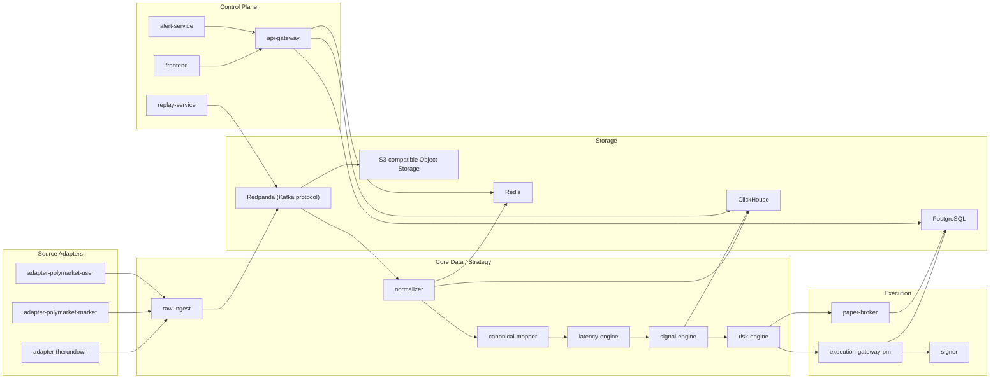
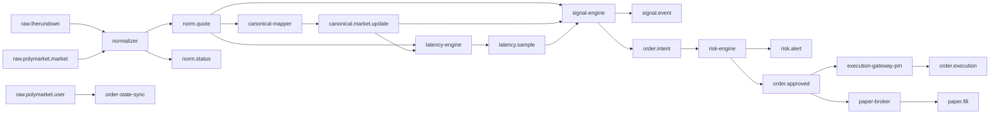
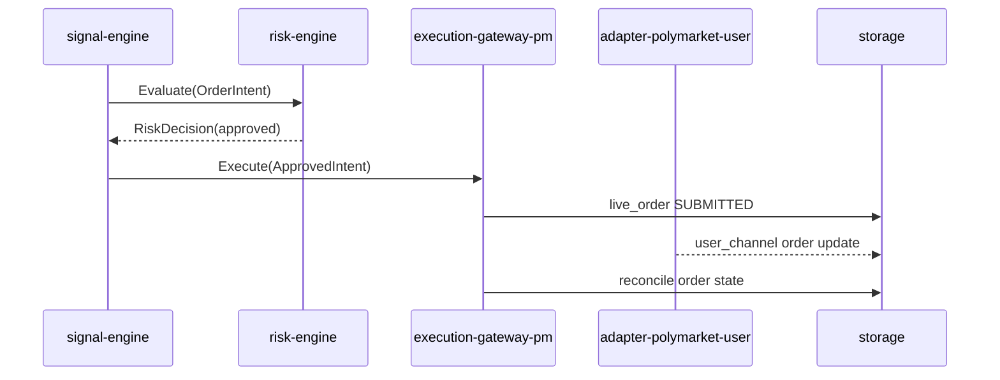
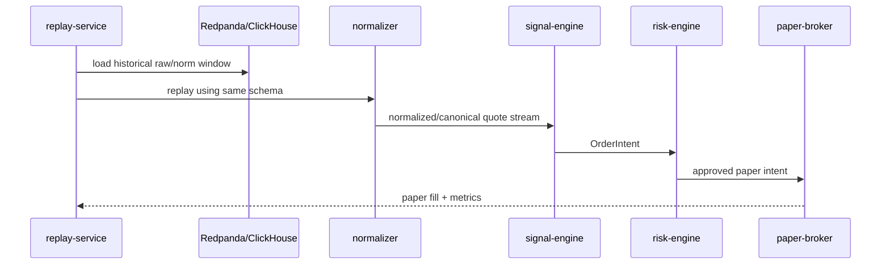
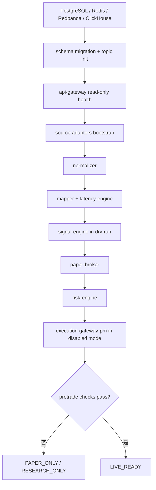

# Polymarket / TheRundown 延迟信号系统模块关系文档

核验日期：2026-05-14  
来源文档：`docs/deep-research-report.md`

## 0. 模块定版范围

当前版本只实现可被前序功能直接使用的模块。第二执行 venue、多外部赔率源、Kubernetes 部署和 legacy wallet 签名均不进入当前模块图。

| 模块类别 | 当前定版 |
|---|---|
| Source Adapter | `adapter-therundown`、`adapter-polymarket-market`、`adapter-polymarket-user` |
| Core | `normalizer`、`canonical-mapper`、`latency-engine`、`signal-engine`、`risk-engine` |
| Execution | `paper-broker`、`execution-gateway-pm`、`signer` |
| Control | `api-gateway`、`frontend`、`replay-service`、`alert-service` |
| Storage | Redpanda、PostgreSQL + TimescaleDB、ClickHouse、Redis、S3-compatible object storage |

## 1. 模块边界原则

模块拆分遵循四条原则：

1. TheRundown 永远属于数据源模块，不进入执行 venue 抽象。
2. Polymarket 的行情接入和下单执行分开部署，避免行情故障影响签名与订单安全。
3. 策略服务只生成可解释的 `OrderIntent`，不直接签名、不直接持有私钥。
4. Replay/Paper 与 Live 尽量复用同一套 normalizer、mapper、signal、risk 逻辑，减少回测与实盘偏差。

## 2. 模块总览



## 3. 模块职责

| 模块 | 输入 | 输出 | 状态依赖 | 不能做的事 |
|---|---|---|---|---|
| `adapter-therundown` | TheRundown REST/WS | `raw.therundown` | API key、tier、cursor | 下单、模拟盘口成交 |
| `adapter-polymarket-market` | Gamma/CLOB/market WS | `raw.polymarket.market` | asset ids、condition ids | 持有私钥、改策略 |
| `adapter-polymarket-user` | user WS、REST 查单 | `raw.polymarket.user`、order update | L2 creds | 发起新订单 |
| `raw-ingest` | adapter raw event | Redpanda topic、raw object | schema version | 解析业务语义 |
| `normalizer` | raw topic | `norm.quote`、ClickHouse、Redis | schema registry | 做交易判断 |
| `canonical-mapper` | normalized quote、mapping rules | canonical market update | PostgreSQL mapping | 低置信映射时强行交易 |
| `latency-engine` | normalized quote、heartbeat、server time | `latency.sample` | Chrony/NTP、source_state | 用单一时间戳做结论 |
| `signal-engine` | canonical quote、strategy config | `signal.event`、`order.intent` | Redis latest state、config | 绕过 risk engine |
| `risk-engine` | `OrderIntent`、账户/市场/系统状态 | approve/reject | Redis counters、PostgreSQL orders | 签名或直接调用 Polymarket |
| `execution-gateway-pm` | approved intent | live order、execution event | signer、geoblock、L2 creds | 接受未批准 intent |
| `signer` | typed order payload | signature | KMS/HSM/private key | 读取策略配置或行情 |
| `paper-broker` | approved intent、historical quote | paper fill、paper PnL | model params | 把 TheRundown 当成交 venue |
| `api-gateway` | HTTP/WS 前端请求 | 聚合响应 | JWT/TOTP、storage | 参与高频信号计算 |
| `replay-service` | 时间窗、参数版本、topic offsets | replay job/result | Redpanda、ClickHouse | 改写原始历史数据 |
| `alert-service` | health/risk/execution events | alerts | rules、runbook | 静默高危 live 异常 |
| `frontend` | API/WS | UI action | browser session | 保存 secret |

## 4. 依赖矩阵

| 模块 | Redpanda | Redis | PostgreSQL | ClickHouse | External API | Signer |
|---|---:|---:|---:|---:|---:|---:|
| `adapter-therundown` | 写 | 读写 health | 读 source config | 否 | TheRundown | 否 |
| `adapter-polymarket-market` | 写 | 读写 health | 读 market config | 否 | Polymarket | 否 |
| `adapter-polymarket-user` | 写 | 写 order hot state | 读写 order state | 否 | Polymarket | 否 |
| `normalizer` | 读写 | 写 latest quote | 读 mapping hint | 写 | 否 | 否 |
| `canonical-mapper` | 读写 | 写 mapping cache | 读写 mapping | 写 mapping events | 否 | 否 |
| `latency-engine` | 读写 | 写 latency cache | 写 source_state | 写 | Polymarket time / heartbeat | 否 |
| `signal-engine` | 读写 | 读 latest quote | 读 strategy config | 写 signals | 否 | 否 |
| `risk-engine` | 读写 | 读写 counters | 读写 risk/order | 写 alerts | geoblock probe 状态 | 否 |
| `execution-gateway-pm` | 写 | 读写 order hot state | 读写 live_order | 写 execution audit | Polymarket CLOB | 是 |
| `paper-broker` | 读写 | 读 latest/replay 状态 | 读写 paper_order | 写 paper metrics | 否 | 否 |
| `api-gateway` | 不直接依赖 | 读状态 | 读写控制面 | 读查询 | 否 | 否 |
| `replay-service` | 读 | 写 replay cache | 读写 replay_job | 读历史 | 否 | 否 |

## 5. 事件关系

### 5.1 Topic 关系



### 5.2 核心事件所有权

| 事件 | 生产者 | 消费者 | 备注 |
|---|---|---|---|
| `RawMessage` | adapters | normalizer、replay、debug | 原始消息不可变 |
| `NormalizedQuote` | normalizer | mapper、latency、signal、ClickHouse | 必须带 quality flags |
| `CanonicalMarketUpdate` | mapper | signal、frontend、replay | 低置信映射不得交易 |
| `LatencySample` | latency-engine | signal、frontend、alert | 分 source/market 计算 |
| `SignalEvent` | signal-engine | risk、frontend、ClickHouse | 包含 reject/accept 候选 |
| `OrderIntent` | signal-engine | risk-engine、paper/live | 未经 risk 批准不可执行 |
| `RiskDecision` | risk-engine | execution、paper、audit | approve/reject 都要落审计 |
| `ExecutionReport` | execution-gateway/user-adapter | order state、frontend、audit | 以 venue_order_id 幂等 |
| `AuditEvent` | 所有模块 | audit DB、alert | 必须带 trace_id |

## 6. 关键调用关系

### 6.1 策略到执行



### 6.2 回放到纸面撮合



## 7. 模块 API 边界

### 7.1 `SourceAdapter`

```rust
pub trait SourceAdapter {
    fn name(&self) -> &'static str;
    fn capabilities(&self) -> AdapterCapabilities;
    async fn bootstrap_snapshot(&self) -> Result<BootstrapResult, AdapterError>;
    async fn poll_delta(&self, cursor: Option<String>) -> Result<DeltaBatch, AdapterError>;
    async fn stream(&self, subscription: Subscription) -> Result<(), AdapterError>;
    async fn healthcheck(&self) -> HealthResult;
}
```

### 7.2 `ExecutionVenueAdapter`

当前只实现 Polymarket。第二执行 venue 仅保留文档边界，不在当前代码任务中实现。

```rust
pub trait ExecutionVenueAdapter {
    fn venue(&self) -> Venue;
    async fn pretrade_check(&self, intent: &ApprovedIntent) -> Result<PretradeCheck, ExecutionError>;
    async fn submit_order(&self, intent: ApprovedIntent) -> Result<OrderAck, ExecutionError>;
    async fn cancel_order(&self, order_id: VenueOrderId) -> Result<CancelAck, ExecutionError>;
    async fn get_order(&self, order_id: VenueOrderId) -> Result<OrderState, ExecutionError>;
    async fn heartbeat(&self) -> Result<HeartbeatAck, ExecutionError>;
}
```

### 7.3 `RiskPolicy`

```rust
pub trait RiskPolicy {
    fn policy_name(&self) -> &'static str;
    async fn evaluate(&self, ctx: &RiskContext, intent: &OrderIntent) -> RiskPolicyResult;
}
```

P0 风控策略：

| Policy | 拒绝原因 |
|---|---|
| `KillSwitchPolicy` | `KILL_SWITCH_ACTIVE` |
| `GeoblockPolicy` | `GEO_BLOCKED` |
| `FreshnessPolicy` | `SOURCE_STALE`、`PM_STALE` |
| `MappingConfidencePolicy` | `MAP_CONF_LOW` |
| `ExposurePolicy` | `MARKET_EXPOSURE_LIMIT`、`DAILY_LOSS_LIMIT` |
| `OrderRatePolicy` | `ORDER_RATE_LIMIT` |
| `MinEdgePolicy` | `EDGE_TOO_SMALL` |
| `DepthPolicy` | `DEPTH_TOO_SMALL` |

## 8. 模块启动顺序



## 9. 变更影响规则

| 变更类型 | 必须联动的模块 | 必须跑的验证 |
|---|---|---|
| TheRundown schema 变化 | adapter、normalizer、data docs | adapter unit + replay regression |
| Polymarket WS schema 变化 | adapter、normalizer、frontend market view | adapter unit + WS integration |
| Mapping 规则变化 | mapper、signal、paper | historical replay + mapping diff |
| 风控策略变化 | risk、api、frontend | policy tests + dry-run replay |
| 执行网关变化 | execution、signer、audit | mocked CLOB integration + small live checklist |
| 数据库 schema 变化 | api、services、replay | migration up/down + query smoke |

## 10. 参考来源

- [Polymarket WebSocket Overview](https://docs.polymarket.com/market-data/websocket/overview)
- [Polymarket Market Channel](https://docs.polymarket.com/api-reference/wss/market)
- [Polymarket User Channel](https://docs.polymarket.com/api-reference/wss/user)
- [Polymarket Authentication](https://docs.polymarket.com/api-reference/authentication)
- [TheRundown WebSocket Streaming](https://docs.therundown.io/guides/websocket-streaming)
- [TheRundown V1 to V2 Migration Guide](https://docs.therundown.io/guides/v1-to-v2-migration)
