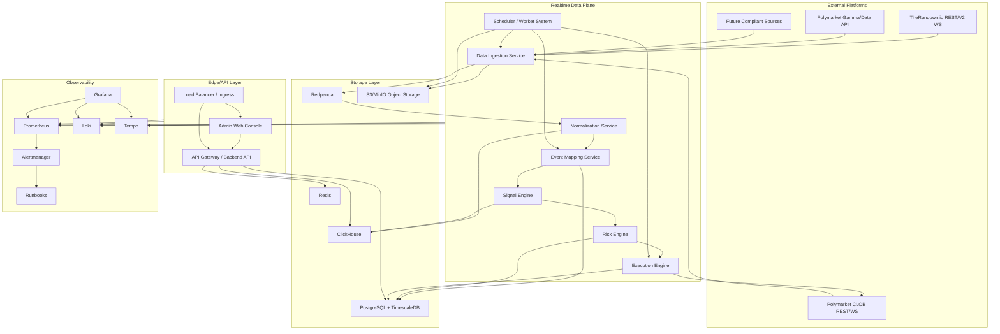
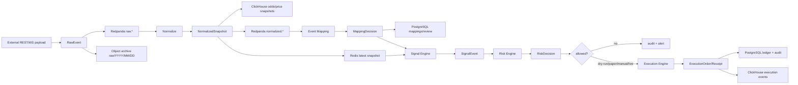
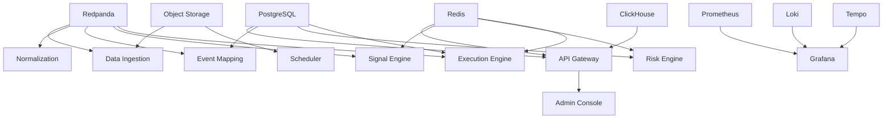
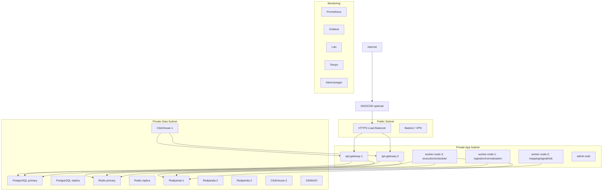
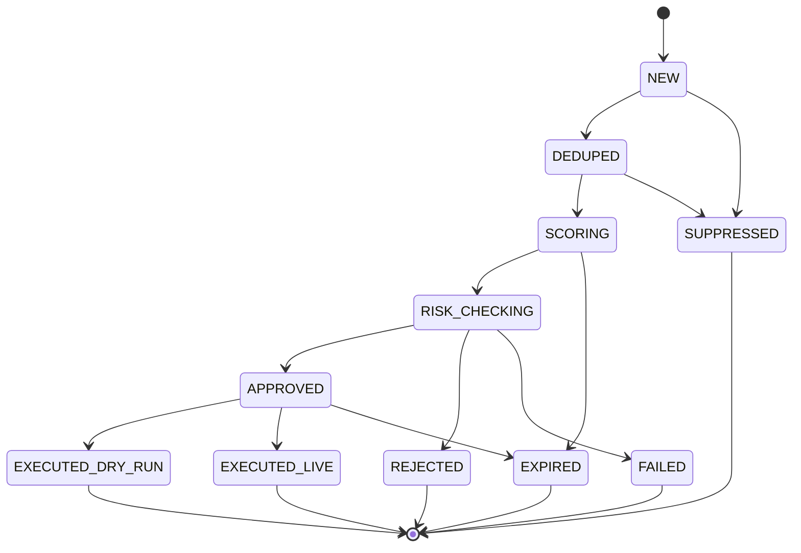
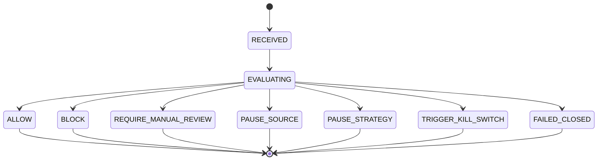
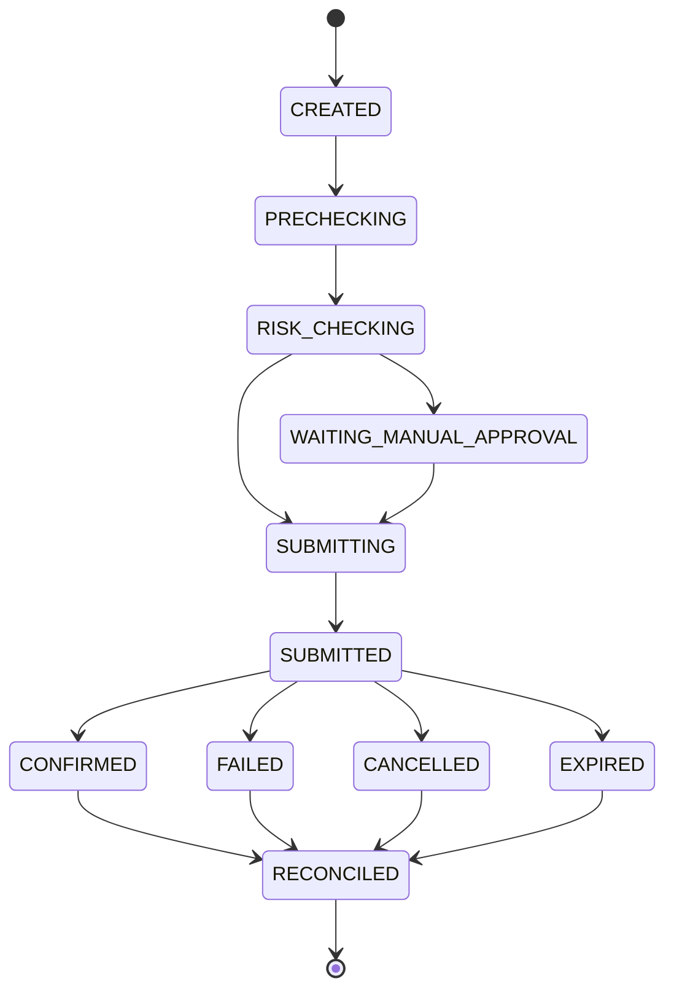

# quantSys Production-Ready 工程开发规格

版本：2026-05-14  
适用范围：后端服务、实时数据管道、风控、执行辅助、管理后台、部署、运维、测试与验收  
权威性：本文件是 quantSys 当前生产级工程实现的主规格。`docs/deep-research-report.md` 仅作研究输入和溯源。

## 0. 合规与安全边界

quantSys 是实时数据分析、信号发现、风险控制与执行辅助系统，不承诺收益，不描述为无风险收益系统，不设计任何规避平台限制的行为。

硬性约束：

1. 所有 Polymarket、TheRundown.io 及其他外部平台交互必须遵守服务条款、API 文档、认证规则、限频规则、地理限制、KYC/AML 要求和适用法律法规。
2. 系统不得实现绕过 KYC、绕过地理限制、绕过限频、伪造身份、反爬规避、账号规避、市场操纵、刷量、诱导成交或其他违规逻辑。
3. 所有执行动作必须经过 Risk Engine；Risk Engine 不可用时，Execution Engine 默认拒绝执行。
4. 所有关键操作必须写 audit log，包括配置修改、数据源启停、映射审核、信号确认、风控决策、执行请求、执行回执、kill switch 操作和恢复操作。
5. 自动化执行必须具备 kill switch、风控阈值、数据新鲜度校验、人工接管机制、执行幂等、回滚与 reconcile 流程。
6. TheRundown 是外部数据源，不是执行 venue。Polymarket CLOB 是当前唯一 live execution venue；没有官方 API 或明确授权的平台只能进入 dry-run、paper trading 或 manual confirmation。
7. Polymarket 新 API 用户使用 deposit wallet / `POLY_1271` 路径；CLOB 交易端点使用 L2 `POLY_*` headers；market/user WebSocket 按官方心跳要求维护连接。
8. TheRundown REST 服务端请求使用 `X-TheRundown-Key` header；WebSocket 使用 query `key`；V2 WS heartbeat 每 15 秒，60 秒无 heartbeat 视为 stale。

官方核验来源：

- [Polymarket API Introduction](https://docs.polymarket.com/api-reference/introduction)
- [Polymarket Authentication](https://docs.polymarket.com/api-reference/authentication)
- [Polymarket Rate Limits](https://docs.polymarket.com/api-reference/rate-limits)
- [Polymarket WebSocket Overview](https://docs.polymarket.com/market-data/websocket/overview)
- [Polymarket Geographic Restrictions](https://docs.polymarket.com/api-reference/geoblock)
- [TheRundown Authentication](https://docs.therundown.io/authentication)
- [TheRundown Rate Limits](https://docs.therundown.io/rate-limits)
- [TheRundown WebSocket Streaming](https://docs.therundown.io/guides/websocket-streaming)

---

# 1. 《现有文档诊断报告》

## 1.1 当前文档工程缺口

| 类别 | 已有内容 | 工程缺口 | 生产影响 | 本规格处理 |
|---|---|---|---|---|
| 模块规格 | 已拆出 adapter、normalizer、mapper、signal、risk、execution、frontend | 缺少每个服务的 worker 模型、输入输出契约、失败处理、扩展方式 | 开发时会出现职责漂移和接口不一致 | 第 3 章定义服务职责、输入、输出、依赖、失败处理和扩展方式 |
| 流程规格 | 有端到端流程图 | 缺少异步任务、backpressure、retry、DLQ、reconcile 流程 | worker 崩溃或数据源异常时无法恢复 | 第 5、10、11 章定义队列、重试、DLQ、reconcile |
| API 规格 | 有 REST/WS 路径清单 | 缺少完整 request、response、error、rate limit、logs、metrics、test cases | 前后端和自动化测试无法直接落地 | 第 7 章定义 API 契约 |
| 数据库模型 | 有部分 PostgreSQL 和 ClickHouse DDL | 缺少平台事件/市场、outcome、mapping review、risk_decision、execution_receipt、worker_heartbeat、alert、user/role、system_config 等表 | 审计、权限、风控和运维不可闭环 | 第 6 章定义完整核心表与 DDL |
| 状态机 | 有系统模式和订单状态草案 | 缺少 Signal、Risk、Execution、Source、Mapping Review、Worker 状态机 | 状态迁移无法测试和恢复 | 第 8、9、10 章定义状态机 |
| 异步任务 | 只描述 replay、adapter | 缺少 scheduler、worker heartbeat、source probe、archive、retention、reconcile、alert evaluation、mapping recompute | 长期运行缺少维护任务 | 第 3、5、11、12 章定义任务 |
| 异常处理 | 有错误分类 | 缺少 per-source circuit breaker、retry jitter、DLQ replay、manual intervention、fail-closed 风控 | 异常会扩散到执行链路 | 第 5、9、10、11 章定义异常处理 |
| 性能指标 | 有 1k/10k/100k 粗估 | 缺少 P50/P95/P99、worker 并发、DB TPS、queue lag、API P95、告警延迟 | 无法压测和验收 | 第 2、5、12 章定义指标 |
| 部署细节 | 有 Docker Compose 与双节点口径 | 缺少单机、多机、Kubernetes、server sizing、secrets、firewall、backup | 无法直接部署到真实服务器 | 第 4 章定义部署 |
| 监控指标 | 有指标列表 | 缺少 dashboard、alert rule、runbook、日志字段、trace 链路 | 故障定位慢，无法值守 | 第 11 章定义 observability |
| 风控审计 | 有风控原则 | 缺少规则表、决策表、决策状态机、fail-closed、测试用例、压测 | 执行动作可能绕过风控 | 第 9 章定义 Risk Engine |

## 1.2 当前文档生产风险

| 风险 | 触发条件 | 影响 | 必须控制 |
|---|---|---|---|
| 数据采集延迟 | WebSocket stale、REST delayed tier、网络抖动 | 信号基于过期数据 | heartbeat stale detection、source_age_ms、source pause、告警 |
| 外部 API 限频 | 高频 polling、重连风暴、批量 discovery | 429、数据缺口、封禁风险 | per-source token bucket、Retry-After、指数退避+jitter |
| 数据源不可用 | 上游维护、DNS/TLS/网络故障 | pipeline 空转或误判 | circuit breaker、health state、fallback snapshot、RESEARCH/PAPER 降级 |
| 事件匹配错误 | 队名别名、home/away 反转、period 不一致 | 错误 signal | mapping confidence、review queue、manual approval |
| 信号误触发 | stale quote、off-board sentinel、盘口线不一致 | 错误执行辅助 | quality_flags、dedup、cooldown、risk check |
| 执行重复 | worker retry、网络超时、ack 丢失 | 重复订单或重复 paper fill | idempotency_key、unique constraint、execution reconcile |
| 队列堆积 | 上游突增、consumer crash、DB 慢写 | 延迟升高、内存增长 | consumer lag alert、backpressure、pause source |
| 数据库写入瓶颈 | 单行写、索引过多、长事务 | 写入延迟、队列堆积 | batch insert、hypertable、ClickHouse 批写、partition |
| 内存泄漏 | 长连接缓存、未清理 WS buffer | worker OOM | RSS metrics、bounded channel、restart policy |
| worker 崩溃 | panic、schema unknown、外部 payload 异常 | 消费中断 | supervisor、DLQ、heartbeat、idempotent resume |
| 单点故障 | 单节点 DB/Redis/queue | 服务不可用 | multi-node profile、backup/restore、readiness gates |
| 日志爆炸 | 每条高频 quote 打完整 payload | 磁盘耗尽 | structured sampling、payload archive、log level guard |
| kill switch 缺失 | 异常执行无法快速停机 | 风险扩大 | Redis + DB kill switch，传播延迟 < 1s |
| 审计日志缺失 | 人工修改或执行无记录 | 不可追责 | append-only audit、WORM archive、trace_id |

## 1.3 当前文档性能缺口

| 项 | 当前状态 | 生产默认目标 |
|---|---|---|
| 采集频率 | 未按源细分 | WS 实时；REST bootstrap 5-15 min；delta poll 1-5s 且服从限频 |
| 端到端延迟 | 仅粗略 | P50 <= 150ms，P95 <= 500ms，P99 <= 1200ms，按 source 到 signal 输出 |
| 单机 QPS/TPS | 未明确 | Small: 1k msg/s；Medium: 10k msg/s；HF: 50k msg/s |
| DB 写入量 | 有粗估 | ClickHouse 批写 5k-50k rows/batch；PostgreSQL 事务写 <= 2k TPS |
| 队列吞吐 | 未细分 | Redpanda P0 10MB/s，P1 100MB/s，HF 500MB/s |
| 实时 backpressure | 未完整 | queue lag、DB latency、worker RSS 触发 source throttle |
| horizontal scaling | 未完整 | adapter per source/league shard；normalizer/signal consumer groups |
| 缓存策略 | 有 Redis key 草案 | TTL、内存上限、eviction、dedup、risk config cache 明确化 |
| 冷热分层 | 有框架 | raw archive 365d、CH quote 90d、signal 180d、execution 365d |
| 压测方案 | 缺命令与验收 | k6、custom producer、vegeta、chaos、soak 72h |

## 1.4 当前文档部署缺口

| 类别 | 缺口 | 生产默认 |
|---|---|---|
| 本地开发 | 缺完整服务依赖和 seed | Docker Compose 启 Redpanda、PostgreSQL、ClickHouse、Redis、MinIO、Grafana |
| 测试环境 | 未定义 | staging 与 production 拓扑一致，使用 mock external + replay dataset |
| 生产环境 | 只有双节点描述 | 单机、多机、Kubernetes 三种可部署 profile |
| 环境变量 | 未列全 | 按服务列出 env、secret、config、feature flag |
| secrets 管理 | 只写原则 | SOPS/Vault/KMS；K8s Secret 使用 external-secrets |
| 服务依赖 | 未写 readiness | service dependency graph + readiness probes |
| migration | 有草案 | PostgreSQL sqlx/refinery，ClickHouse additive migration |
| 备份恢复 | 有原则 | RPO/RTO、pgBackRest、CH backup、MinIO replication |
| 日志监控 | 有栈 | JSON log schema、Prometheus rules、Grafana dashboards |
| CI/CD | 有流水线概念 | lint/test/contract/replay/load/security/image/deploy gates |

---

# 2. 《Production-Ready 系统目标》

## 2.1 功能目标

| 目标 | 生产规格 |
|---|---|
| 多数据源接入 | SourceAdapter trait 统一 TheRundown、Polymarket、future source；每个 source 有 health、rate limit、circuit breaker、credential scope |
| 实时数据采集 | WebSocket 优先，REST bootstrap/delta 补洞；所有 raw event 进入 Redpanda 与 object archive |
| 数据标准化 | Raw payload 转换为 canonical event、market、outcome、odds、price、quality flags |
| 事件映射 | 跨平台 event/market/outcome 映射，支持 fuzzy matching、confidence、人工审核 |
| 盘口/概率差异分析 | American odds、decimal price、Polymarket probability 统一为 executable probability |
| 信号计算 | 延迟、价格变化、赔率变化、跨平台差异、映射异常、市场状态、风控异常信号 |
| 风控决策 | 所有执行前必须经过 Risk Engine；Risk Engine fail-closed |
| 执行辅助 | dry-run、paper trading、manual confirmation、合规 live execution |
| 管理后台 | source、mapping、signal、risk、execution、audit、alert、system health |
| 监控告警 | metrics、logs、traces、alerts、dashboards、runbooks |
| 数据回放 | raw/norm/signal replay，按 strategy version 复现结果 |
| 历史分析 | ClickHouse 支持 quote、latency、signal、execution 分析 |
| 审计追踪 | trace_id 串联 raw -> normalized -> signal -> risk -> execution |

## 2.2 非功能目标

| 目标 | 生产规格 |
|---|---|
| 高可用 | 服务无状态化，consumer group 扩展；DB/Redis/queue 按部署档位做备份或 HA |
| 低延迟 | 数据面避免同步 HTTP 链路，使用 bounded queue、batch write、Redis hot cache |
| 可扩展 | source、strategy、risk policy、execution mode 插件化 |
| 可观测 | 每个服务暴露 `/metrics`、JSON logs、OpenTelemetry trace |
| 可恢复 | checkpoint、offset、idempotency、DLQ、replay、backup/restore |
| 可压测 | 所有关键链路有 load/stress/soak/chaos 测试 |
| 可审计 | append-only audit log，关键字段不可变 |
| 可配置 | system_configs、risk_rules、strategy_configs 版本化 |
| 可灰度发布 | feature flag、readiness gate、rolling update、rollback |
| 可横向扩展 | adapter shard、consumer group、stateless API replicas |

## 2.3 性能目标

| 指标 | Small Production | Medium Production | High-Frequency Production |
|---|---:|---:|---:|
| 数据采集频率 | WS 实时；REST delta 5s | WS 实时；REST delta 1-2s | WS 实时；REST delta 1s，按限频动态降级 |
| 单数据源请求超时 | connect 1s / request 3s | connect 800ms / request 2s | connect 500ms / request 1.5s |
| normalization latency | P95 <= 40ms | P95 <= 25ms | P95 <= 15ms |
| event mapping latency | P95 <= 80ms | P95 <= 50ms | P95 <= 30ms |
| signal compute latency | P95 <= 50ms | P95 <= 30ms | P95 <= 20ms |
| risk decision latency | P95 <= 20ms | P95 <= 10ms | P95 <= 5ms |
| source -> signal E2E | P50 150ms / P95 500ms / P99 1200ms | P50 80ms / P95 250ms / P99 750ms | P50 40ms / P95 120ms / P99 350ms |
| PostgreSQL write TPS | 500 TPS | 2k TPS | 5k TPS |
| ClickHouse ingest | 10k rows/s | 100k rows/s | 500k rows/s |
| queue throughput | 10 MB/s | 100 MB/s | 500 MB/s |
| worker 并发 | 2-4 per service | 4-16 per service | 16-64 per service |
| API 响应时间 | P95 <= 250ms | P95 <= 150ms | P95 <= 100ms |
| Dashboard 刷新 | global 1Hz，market 5Hz | global 1Hz，market 10Hz | global 2Hz，market 20Hz |
| 告警触发延迟 | <= 30s | <= 15s | <= 5s |
| kill switch 生效 | <= 1s | <= 500ms | <= 250ms |

## 2.4 容量目标与估算模型

变量：

```text
E = active_events_per_day
M = markets_per_event
O = outcomes_per_market
S = snapshots_per_market_per_day
R = avg_raw_payload_bytes
N = avg_normalized_row_bytes
Q = quality/latency rows multiplier
```

默认生产估算：

| 档位 | E | M | O | S | normalized rows/day | raw rows/day |
|---|---:|---:|---:|---:|---:|---:|
| Small | 300 | 3 | 2 | 2,880 | 5.18M | 2.59M |
| Medium | 1,500 | 8 | 2 | 8,640 | 207.36M | 103.68M |
| High-Frequency | 5,000 | 20 | 2 | 86,400 | 17.28B | 8.64B |

存储估算，默认 `R=900B`、`N=320B`、ClickHouse 压缩 4:1、object archive gzip/parquet 压缩 3:1：

| 档位 | CH/day | raw archive/day | 30d CH | 90d CH | 180d raw |
|---|---:|---:|---:|---:|---:|
| Small | 0.41 GB | 0.78 GB | 12.4 GB | 37 GB | 140 GB |
| Medium | 16.6 GB | 31.1 GB | 498 GB | 1.49 TB | 5.6 TB |
| High-Frequency | 1.38 TB | 2.59 TB | 41 TB | 124 TB | 466 TB |

分区与容量策略：

| 组件 | 策略 |
|---|---|
| PostgreSQL / TimescaleDB | hypertable 按 `created_at` / `observed_at` 1 day chunk；订单和审计按月 range partition |
| ClickHouse | MergeTree 按 `toDate(observed_at)` partition，ORDER BY `(canonical_market_id, observed_at, source_id)` |
| Redis | hot latest snapshot + dedup + rate limit；Small 4GB，Medium 16GB，HF 64GB |
| Redpanda | raw/norm 14d，signal 30d，execution/risk 90d；积压容量 >= 2h 峰值吞吐 |
| Object Storage | raw archive 365d，启用 lifecycle 到 cold tier |

---

# 3. 《生产级总体架构设计》

## 3.1 Mermaid 系统架构图



## 3.2 Mermaid 数据流图



## 3.3 Mermaid 服务依赖图



## 3.4 Mermaid 部署拓扑图



## 3.5 服务职责、输入、输出、依赖、失败处理、扩展方式

| 服务 | 职责 | 输入 | 输出 | 依赖 | 失败处理 | 扩展方式 |
|---|---|---|---|---|---|---|
| API Gateway / Backend API | 前端接口、权限、管理后台、read model 聚合 | HTTP/WS/SSE admin requests | JSON response、WS/SSE event | PG、CH、Redis、OIDC/JWT | 只读降级；写操作失败返回 typed error；不执行高频任务 | stateless replicas + LB |
| Data Ingestion Service | 外部 REST/WS 接入、限频、重试、source health | External payload、scheduler jobs | `raw.*` topic、raw archive、source_state | Redpanda、Object Storage、Redis、external APIs | circuit breaker、DLQ、pause source、alert | per-source shard、worker pool |
| Normalization Service | raw -> canonical snapshot、quality flags、odds conversion | `raw.*` topic | `normalized.*` topic、CH rows、Redis latest | Redpanda、CH、Redis | schema unknown -> DLQ；batch retry；poison message quarantine | consumer group partitions |
| Event Mapping Service | event/market/outcome 映射、fuzzy matching、review task | normalized snapshots、platform metadata | mapping decisions、review tasks | PG、Redis、Redpanda | low confidence -> review queue，不生成 executable signal | shard by sport/league |
| Signal Engine | 实时信号计算、dedup、cooldown、state machine | normalized stream、mapping、latest cache | signal_events、signal_states | Redis、Redpanda、CH、PG | backlog high -> drop low-priority analysis signals，不 drop risk signals | partition by canonical_market_id |
| Risk Engine | 执行前风控、kill switch、熔断、limits | signal/execution request | risk_decision | PG、Redis、metrics state | fail-closed；不可用时 BLOCK | stateless replicas，Redis atomic counters |
| Execution Engine | dry-run/paper/manual/live execution、幂等、回执、reconcile | approved risk decision | execution_order、receipt、audit | PG、Redis、Redpanda、external venue | retry bounded；unknown state -> reconcile；risk unavailable -> reject | shard by venue/account |
| Scheduler / Worker System | 定时任务、重试、retention、recompute、backfill | cron、delayed jobs、retry queues | jobs、worker heartbeat | PG、Redis、Redpanda | lease timeout -> requeue；max retry -> DLQ | multiple schedulers with advisory lock |
| Admin Web Console | 操作台和监控 | API/WS/SSE | UI actions | API Gateway | API error state，危险操作二次确认 | CDN/static replicas |
| Observability Stack | metrics/logs/traces/alerts/runbooks | service telemetry | dashboards、alerts | Prometheus、Loki、Tempo、Grafana | alertmanager HA；remote write | scale by retention and scrape count |
| Storage Layer | transactional, analytical, queue, hot cache, archive | service writes | query/event/cache/archive | disks/network/backups | backup/restore, replica, retention | vertical + partition + replicas |

---

# 4. 《服务器部署方案》

## 4.0 部署方式定版

quantSys 必须同时支持两条可直接上线的部署路径：

| 部署路径 | 运行方式 | 适用场景 | 必交付物 | 上线地位 |
|---|---|---|---|---|
| 真实云服务器原生部署 | Ubuntu LTS + systemd + Nginx/Caddy + 原生 Rust binaries；数据服务可用云托管或独立 VM | 稳定生产、便于细粒度运维、希望减少容器运行层复杂度 | `deploy/cloud-vm/`、systemd unit、Nginx/Caddy 配置、备份脚本、回滚脚本 | production blocking |
| Docker / Docker Compose 部署 | Docker Engine + Compose v2；每个服务独立 container、独立 volume、统一 network | 本地联调、早期生产、快速交付、可复制环境 | `deploy/docker-compose/`、`.env.example`、compose profiles、healthcheck、volume/backup 脚本 | production blocking |
| Kubernetes 部署 | K8s Deployments/StatefulSets/HPA/Ingress/ExternalSecrets | 高频、多团队、多环境、需要 HPA 和标准化平台运维 | `deploy/k8s/` manifests 或 Helm chart | non-blocking improvement，除非选定 K8s 为首发平台 |

生产首发必须在同一版本里通过以下两套验收：

1. 云服务器原生部署：所有核心服务以 systemd 托管，重启、日志、健康检查、备份和回滚脚本可执行。
2. Docker Compose 部署：同一套镜像可在单台云服务器上启动完整系统，volume 持久化、healthcheck、restart policy、资源限制和备份脚本可执行。
3. 两种部署方式共享同一套配置 schema、数据库 migration、topic 初始化、metrics、audit log、runbook 和安全边界。

## 4.1 真实云服务器原生部署方案

适用：长期 production、低到高流量均可、需要明确 OS 级运维边界、希望把关键服务作为 systemd unit 管理。

推荐硬件：

| 资源 | Small Production 云服务器默认 |
|---|---|
| CPU | 16 vCPU，AMD EPYC / Intel Xeon |
| RAM | 64 GB |
| Disk | 2 TB NVMe，独立数据盘挂载到 `/data`；对象归档使用云对象存储 |
| Network | 1 Gbps，固定公网 IP，私网 VPC，安全组只开放必要端口 |
| OS | Ubuntu 24.04 LTS |
| Runtime | systemd + journald/vector + Nginx/Caddy + pgbouncer；Rust 服务发布为版本化 binary |

原生部署目录：

```text
/opt/quantsys/
  releases/
    2026.05.14-001/
      api-gateway
      ingestion-service
      normalization-service
      mapping-service
      signal-engine
      risk-engine
      execution-engine
      scheduler
  current -> /opt/quantsys/releases/2026.05.14-001
  scripts/
    migrate.sh
    topic-init.sh
    backup-postgres.sh
    backup-clickhouse.sh
    rollback.sh
/etc/quantsys/
  quantsys.toml
  services/*.env
  secrets/            # root only，或由 Vault Agent 渲染
/var/log/quantsys/
/data/quantsys/
  postgres/
  clickhouse/
  redpanda/
  redis/
```

systemd unit 必须包含：

| Unit | 启动顺序 | Restart | 资源限制 | 健康检查 |
|---|---|---|---|---|
| `quantsys-api-gateway.service` | after network + db + queue | always, 5s | CPUQuota/MemoryMax | `/health/ready` |
| `quantsys-ingestion@.service` | after queue + redis | always, 5s | per source worker limit | worker heartbeat |
| `quantsys-normalization.service` | after queue + clickhouse | always, 5s | batch memory cap | consumer lag |
| `quantsys-mapping.service` | after postgres + redis | always, 5s | CPU/memory cap | `/health/ready` |
| `quantsys-signal-engine.service` | after queue + redis | always, 5s | CPU/memory cap | signal queue lag |
| `quantsys-risk-engine.service` | after postgres + redis | always, 3s | strict MemoryMax | fail-closed readiness |
| `quantsys-execution-engine.service` | after risk + postgres | always, 5s | secret mount isolated | execution heartbeat |
| `quantsys-scheduler.service` | after postgres + queue | always, 10s | task concurrency cap | due task lag |

云服务依赖策略：

| 依赖 | 首选 | 自托管替代 | 生产约束 |
|---|---|---|---|
| PostgreSQL/TimescaleDB | 云数据库或独立 DB VM | systemd PostgreSQL 16 + TimescaleDB | PITR、daily backup、私网访问 |
| Redis | 云 Redis 或独立 Redis VM | systemd Redis 7 | risk/kill-switch 实例与普通 cache 可分离 |
| Queue | 独立 Redpanda VM/集群 | systemd Redpanda | 生产不与 ClickHouse 共用高 IO 数据盘 |
| ClickHouse | 独立 analytics VM | systemd ClickHouse | merge backlog 告警必须启用 |
| Object Storage | 云对象存储 | MinIO VM | raw archive 与 backup bucket 分离 |

原生部署发布流程：

1. CI 产出版本化 binary、SBOM、checksum。
2. 上传到 `/opt/quantsys/releases/<version>`。
3. 执行 `migrate.sh`，migration 必须向后兼容。
4. 执行 `topic-init.sh`，topic 初始化必须幂等。
5. 切换 `current` symlink。
6. 按 `risk -> execution -> api -> workers` 顺序 rolling restart；workers 先 drain 再停。
7. 验证 `/health/ready`、Prometheus target、队列 lag、worker heartbeat、audit log 写入。
8. 失败时执行 `rollback.sh <previous_version>`，数据库只允许兼容回滚，不允许破坏性 downgrade。

## 4.2 Docker / Docker Compose 单机生产部署方案

适用：早期 production、低到中等流量、单用户运维、严格备份恢复。

推荐硬件：

| 资源 | Small Production 单机默认 |
|---|---|
| CPU | 16 vCPU，AMD EPYC / Intel Xeon |
| RAM | 64 GB |
| Disk | 2 TB NVMe，独立数据盘；对象归档可挂 S3 |
| Network | 1 Gbps，低丢包，固定公网 IP，私网安全组 |
| OS | Ubuntu 24.04 LTS |
| Runtime | Docker Engine + Compose v2 + systemd |

Compose profile：

| Profile | 服务范围 | 用途 |
|---|---|---|
| `local` | 全量服务 + fixture/mock external API | 开发联调 |
| `prod-single` | 全量真实服务 + 本机 stateful dependencies | 单机生产 |
| `prod-app` | API/Admin/Workers，不含数据库/队列 | 多机应用节点 |
| `prod-data` | PostgreSQL/ClickHouse/Redis/Redpanda/MinIO | 多机数据节点或测试数据栈 |
| `observability` | Prometheus/Grafana/Loki/Tempo/Alertmanager | 监控节点 |

Docker Compose 服务划分：

```text
edge:
  - nginx / caddy
  - api-gateway
  - admin-web
data-plane:
  - ingestion-service
  - normalization-service
  - mapping-service
  - signal-engine
  - risk-engine
  - execution-engine
  - scheduler
storage:
  - redpanda
  - postgres + timescaledb
  - clickhouse
  - redis
  - minio
observability:
  - prometheus
  - grafana
  - loki
  - tempo
  - alertmanager
```

同机规则：

| 类型 | 同机策略 |
|---|---|
| API/Admin | 可与 workers 同机，但资源限制独立 |
| Data workers | 可同机，必须设置 CPU/memory limit 和 restart policy |
| PostgreSQL/ClickHouse/Redpanda | 单机只能早期生产使用，必须独立 volume 和 nightly backup |
| Execution Engine | 可同机，但 secret mount、network egress、audit log 权限必须隔离 |

单机瓶颈与上限：

| 瓶颈 | 触发阈值 | 扩容动作 |
|---|---|---|
| ClickHouse 写入 | P95 insert > 200ms 或 merge backlog 持续增长 | 独立 ClickHouse 节点 |
| Redpanda 磁盘 IO | disk util > 70% 15min | 独立 queue 节点或缩短 retention |
| PostgreSQL 锁等待 | lock wait > 500ms | 拆 read replica，优化事务 |
| Redis 内存 | used_memory > 75% | 增大内存或分离 Redis 节点 |
| Worker CPU | sustained > 70% | 增加 worker 节点 |

## 4.3 多机生产部署方案

| 节点类型 | 数量 | 服务 | 扩展方式 |
|---|---:|---|---|
| Load Balancer | 1-2 | nginx/caddy/cloud LB | active/passive |
| API 节点 | 2+ | api-gateway、admin-web | stateless horizontal replicas |
| Worker 节点 | 2-8 | ingestion、normalization、mapping、signal、risk、execution、scheduler | consumer group + shard |
| Database 节点 | 2 | PostgreSQL primary/replica | read replica、failover |
| Redis 节点 | 2-3 | Redis primary/replica/sentinel | sentinel or managed redis |
| Queue 节点 | 3 | Redpanda cluster | partition + replication factor 3 |
| ClickHouse 节点 | 2+ | analytics storage | replicated tables |
| Monitoring 节点 | 1-2 | Prometheus/Grafana/Loki/Tempo | remote write + retention |
| Object Storage | managed S3 或 4+ MinIO | raw archive/backups | bucket lifecycle |

水平扩展：

1. Ingestion 按 `source_id + sport_id` shard。
2. Normalization 按 raw topic partition consumer group 扩展。
3. Mapping 按 `sport_id + event_date` shard。
4. Signal 按 `canonical_market_id` partition，保证同一市场顺序。
5. Risk stateless 扩展，Redis/PG 提供共享状态。
6. Execution 按 `venue + account_id` shard，避免同账户并发执行冲突。

## 4.4 Kubernetes 部署方案

Kubernetes 适用：多环境、多人协作、需要 HPA、rolling update、资源隔离、标准化运维的 production profile。

命名空间：

```yaml
apiVersion: v1
kind: Namespace
metadata:
  name: quantsys-prod
  labels:
    app.kubernetes.io/part-of: quantsys
```

资源规范：

| 资源 | 规格 |
|---|---|
| Deployment | `api-gateway`、`admin-web`、`ingestion-service`、`normalization-service`、`mapping-service`、`signal-engine`、`risk-engine`、`execution-engine`、`scheduler` |
| StatefulSet | Redpanda、PostgreSQL、ClickHouse、Redis 只在自托管 K8s profile 使用；managed service profile 不部署这些 StatefulSet |
| Service | ClusterIP for internal；LoadBalancer/Ingress for API |
| Ingress | HTTPS only，OIDC/Auth proxy optional |
| ConfigMap | non-secret config、feature flags、retention defaults |
| Secret | external-secrets 从 Vault/KMS 同步，不手写明文 |
| HPA | API by RPS/CPU；workers by queue lag/custom metrics |
| PVC | PostgreSQL、ClickHouse、Redpanda、Redis，使用 fast SSD StorageClass |
| Liveness | process health，不依赖外部 API |
| Readiness | dependency-ready + schema-ready + source optional |
| Rolling update | `maxUnavailable: 0` for API/Risk/Execution，workers drain before stop |
| Rollback | image tag immutable，migration backward-compatible |

Deployment 模板：

```yaml
apiVersion: apps/v1
kind: Deployment
metadata:
  name: signal-engine
  namespace: quantsys-prod
spec:
  replicas: 3
  strategy:
    type: RollingUpdate
    rollingUpdate:
      maxUnavailable: 0
      maxSurge: 1
  selector:
    matchLabels:
      app: signal-engine
  template:
    metadata:
      labels:
        app: signal-engine
    spec:
      terminationGracePeriodSeconds: 60
      containers:
        - name: signal-engine
          image: registry.example.com/quantsys/signal-engine:2026.05.14
          ports:
            - containerPort: 8080
          envFrom:
            - configMapRef:
                name: quantsys-config
            - secretRef:
                name: quantsys-secrets
          readinessProbe:
            httpGet:
              path: /health/ready
              port: 8080
            periodSeconds: 5
          livenessProbe:
            httpGet:
              path: /health/live
              port: 8080
            periodSeconds: 10
          resources:
            requests:
              cpu: "500m"
              memory: "512Mi"
            limits:
              cpu: "2"
              memory: "2Gi"
```

HPA 模板：

```yaml
apiVersion: autoscaling/v2
kind: HorizontalPodAutoscaler
metadata:
  name: signal-engine
  namespace: quantsys-prod
spec:
  scaleTargetRef:
    apiVersion: apps/v1
    kind: Deployment
    name: signal-engine
  minReplicas: 3
  maxReplicas: 20
  metrics:
    - type: Pods
      pods:
        metric:
          name: redpanda_consumer_lag
        target:
          type: AverageValue
          averageValue: "10000"
    - type: Resource
      resource:
        name: cpu
        target:
          type: Utilization
          averageUtilization: 65
```

## 4.5 推荐服务器配置

| 档位 | 适用场景 | CPU | RAM | Disk | Network | Worker 数量 | 预计承载 | 预计瓶颈 |
|---|---|---:|---:|---|---|---:|---|---|
| Small production | 早期生产、少量体育/市场 | 16 vCPU | 64 GB | 2 TB NVMe | 1 Gbps | 8-16 | 1k msg/s，10k API req/min | 单机磁盘 IO、ClickHouse merge |
| Medium production | 多体育、多市场、长期运行 | 3 app nodes x 16 vCPU；3 data nodes x 24 vCPU | app 64 GB；data 128 GB | data 4-8 TB NVMe | 10 Gbps private | 32-96 | 10k msg/s，100k API req/min | Redpanda partition、PG write |
| High-frequency production | 高频采集、多源、多策略 | 6+ app nodes x 32 vCPU；6+ data nodes x 48 vCPU | app 128 GB；data 256 GB | 20+ TB NVMe + S3 | 10-25 Gbps | 128-512 | 50k msg/s sustained，burst 100k msg/s | CH storage、queue retention、source limits |

PostgreSQL 配置：

| 档位 | shared_buffers | effective_cache_size | wal_compression | max_connections | partition/chunk |
|---|---:|---:|---|---:|---|
| Small | 16GB | 48GB | on | 200 | daily |
| Medium | 32GB | 96GB | on | 500 + pgbouncer | daily |
| High-frequency | 64GB | 192GB | on | 1000 + pgbouncer | daily/hourly for hot hypertables |

Redis 配置：

| 档位 | maxmemory | eviction | persistence |
|---|---:|---|---|
| Small | 8GB | allkeys-lru for non-critical cache; noeviction for risk DB index | AOF everysec |
| Medium | 32GB | split cache/risk instances | AOF everysec + replica |
| High-frequency | 128GB | cluster or dedicated instances | AOF + managed backups |

Queue 配置：

| 档位 | Redpanda nodes | replication | partitions |
|---|---:|---:|---:|
| Small | 1 | 1 | raw 12 / norm 12 / signal 6 |
| Medium | 3 | 3 | raw 96 / norm 96 / signal 48 |
| High-frequency | 5+ | 3 | raw 384 / norm 384 / signal 192 |

## 4.6 部署安全

| 控制项 | 生产规格 |
|---|---|
| HTTPS | TLS 1.2+，HSTS，自动证书轮换 |
| firewall | 只开放 443/SSH bastion；数据库、Redis、Redpanda、ClickHouse 仅私网 |
| private network | app/data/monitoring subnet 分离 |
| secrets management | SOPS/Vault/KMS；K8s 用 external-secrets；不在 env dump 中输出 secret |
| database access | per-service DB role，最小权限，pg_hba 私网限制 |
| SSH hardening | no password login，MFA/VPN/bastion，auditd，fail2ban |
| backup encryption | pgBackRest/CH/Object backup 使用 KMS 加密 |
| audit log protection | append-only 表 + object archive WORM policy |
| egress control | allowlist TheRundown、Polymarket、monitoring endpoints |
| admin auth | JWT + TOTP/WebAuthn；危险操作二次确认 |

---

# 5. 《性能架构设计》

## 5.1 数据采集性能

| 机制 | 生产规格 |
|---|---|
| 高频 polling | 仅用于 bootstrap/delta 补洞；per-source token bucket；REST delta 1-5s 动态调整 |
| WebSocket | 平台支持时优先；TheRundown heartbeat 15s，60s stale；Polymarket market/user channel 每 10s PING |
| 请求限频 | Redis token bucket + local leaky bucket；读取 `Retry-After`；禁止规避限频 |
| connection pooling | reqwest/hyper pool，per-host max idle 32，timeout 分 connect/request/read |
| timeout | connect 500-1000ms，request 1.5-3s，WS stale 60s |
| retry with jitter | exponential backoff 1s -> 30s，jitter 0-1000ms，max retry 5 后 circuit open |
| circuit breaker | closed/open/half-open；source error rate > 20% 或 429 burst 触发 |
| per-source worker pool | source/league/sport shard；bounded channel，禁止 unbounded buffer |
| backpressure | queue lag、DB write latency、worker RSS、source error rate 触发 throttle/pause |
| stale detection | source_age_ms、last_heartbeat_at、provider_ts drift、out_of_order flag |

## 5.2 实时数据管道

| Queue | Topic | Partition key | Producer | Consumer | Retention | DLQ |
|---|---|---|---|---|---|---|
| raw event | `raw.{source}` | `source_event_id` | ingestion | normalization | 14d | `dlq.raw` |
| normalized event | `normalized.snapshot` | `canonical_market_id` | normalization | mapping/signal | 14d | `dlq.normalized` |
| mapping event | `mapping.decision` | `canonical_event_id` | mapping | signal/admin | 30d | `dlq.mapping` |
| signal queue | `signal.event` | `canonical_market_id` | signal | risk/api | 30d | `dlq.signal` |
| risk decision | `risk.decision` | `signal_id` | risk | execution/api | 90d | `dlq.risk` |
| execution queue | `execution.request` | `venue_account_id` | risk/manual | execution | 90d | `dlq.execution` |
| retry queue | `retry.{service}` | original key | services | scheduler | 7d | service DLQ |
| delayed queue | `delayed.job` | job_type | scheduler | workers | 30d | `dlq.job` |

语义：Redpanda 至少一次投递；所有 consumer 使用 idempotency key、unique constraint、version check 保证结果正确。Exactly-once 不作为系统假设。

## 5.3 数据库写入优化

| 领域 | 生产规格 |
|---|---|
| batch insert | ClickHouse 5k-50k rows/batch 或 100ms flush；PostgreSQL 100-500 rows/batch for non-critical |
| upsert | PostgreSQL 只对 metadata/mapping/latest summary 使用 `ON CONFLICT`；高频 snapshot append-only |
| 分区表 | audit/order monthly partition；Timescale hypertable daily chunks |
| hypertable | odds_snapshots、price_snapshots、worker_heartbeats、data_quality_reports |
| 索引设计 | 高频表只保留 time + market/source 查询索引；避免 payload GIN 全表索引 |
| 热冷拆分 | hot state Redis；recent analytics ClickHouse；transactional state PostgreSQL；raw S3 |
| raw archive | payload 不完整落普通日志，写 object storage，DB 只存 `raw_ref` |
| retention | PostgreSQL audit/execution 365d+；CH quote 90d；raw archive 365d |
| query optimization | admin API 读 materialized view/read model；禁止扫 raw snapshot 大表 |
| materialized view | per-minute market summary、source health summary、signal stats |
| read replica | API 长查询和 audit export 走 replica |

## 5.4 Redis 使用策略

| 用途 | Key | TTL | 说明 |
|---|---|---:|---|
| latest snapshot | `latest:snapshot:{canonical_market_id}:{source_id}` | 5m | signal hot read |
| event mapping cache | `mapping:event:{platform}:{platform_event_id}` | 24h | mapper fast path |
| risk config cache | `risk:config:{strategy_id}` | 60s | config version embedded |
| signal dedup cache | `dedup:signal:{fingerprint}` | 5m-1h | cooldown |
| distributed lock | `lock:{job_type}:{key}` | 30s | scheduler lease |
| rate limiter | `rl:{source}:{window}` | window+60s | token bucket |
| kill switch | `system:kill_switch` | no TTL | read every execution |
| idempotency | `idem:{scope}:{key}` | 7d | execution/order dedup |
| worker heartbeat | `worker:{id}:heartbeat` | 60s | liveness |

内存策略：cache Redis 使用 `allkeys-lru`；risk/kill/idempotency Redis 使用 `noeviction`，内存到 80% 触发告警，90% 触发 source pause。

## 5.5 队列系统设计

| 系统 | 优点 | 缺点 | quantSys 结论 |
|---|---|---|---|
| Kafka/Redpanda | 高吞吐、partition、consumer group、retention、replay | 运维复杂度较 Redis Stream 高 | Redpanda 为生产默认 |
| NATS JetStream | 低延迟、轻量 | 长期 replay/大吞吐生态较 Kafka 弱 | 可用于控制面事件，非默认 |
| RabbitMQ | routing 灵活 | 高频时序数据和 replay 不占优 | 不作为主数据管道 |
| Redis Stream | 简单、低延迟 | 大规模 retention、磁盘和 replay 不占优 | 仅用于小型 delayed job 备选 |

Topic 设计：见 5.2。顺序要求：同一 `canonical_market_id` 的 normalized/signal 保持 partition 内顺序；execution 按 `venue_account_id` 保持顺序。

积压处理：

1. lag > 100k messages 或 lag_age > 30s：告警。
2. lag_age > 120s：source throttle，暂停低优先级 signals。
3. lag_age > 300s：进入 degraded，禁止 live execution。
4. DLQ rate > 1%：暂停对应 source，生成 mapping/schema incident。

## 5.6 API 性能

| 机制 | 生产规格 |
|---|---|
| pagination | cursor pagination 默认；page size 最大 500 |
| filtering | 所有列表必须支持 time range、source、status、sport、market_type |
| sorting | 只允许索引字段排序 |
| caching | Redis 10-60s cache for dashboard summary |
| read model | API 不扫 raw tables；使用 summary tables/materialized views |
| dashboard precompute | per-minute source, queue, signal, risk, execution stats |
| API P95 | read <= 150ms；write <= 250ms；export async job |

## 5.7 前端性能

| 机制 | 生产规格 |
|---|---|
| Dashboard 刷新 | global 1Hz，detail 5-20Hz；使用 WS/SSE 增量推送 |
| 大列表 | cursor pagination + virtual table |
| 图表 | server-side downsample；1s/5s/1m resolution |
| 状态 | loading/error/empty/stale 明确区分 |
| 错误 | 展示 trace_id、error_code、runbook link |
| 避免扫表 | 前端只请求 API read model |

## 5.8 压测方案

| 测试 | 命令 | 验收 |
|---|---|---|
| 数据采集压测 | `cargo run -p loadgen -- ingestion --rate 10000 --duration 30m` | ingestion P95 < 50ms，error < 0.1% |
| 队列吞吐 | `rpk topic produce raw.loadtest --rate 100MB/s` | consumer lag 稳定，broker CPU < 70% |
| DB 写入 | `cargo run -p loadgen -- clickhouse --rows 1000000` | CH sustained 100k rows/s |
| Signal Engine | `cargo run -p loadgen -- signal --markets 10000 --rate 10000` | signal P95 < 30ms |
| Risk Engine | `vegeta attack -rate 2000 -duration 10m -targets risk.targets` | risk P95 < 10ms，0 bypass |
| API | `k6 run tests/load/api.js` | API P95 < 150ms |
| Frontend Dashboard | `k6 browser run tests/load/dashboard.js` | UI update lag < 500ms |
| chaos test | `toxiproxy-cli toxic add ... latency` | stale detection 和降级生效 |
| soak test | `make soak-test DURATION=72h` | 72h 无崩溃、无内存持续增长、lag 可控 |

---

# 6. 《数据库与数据模型设计》

## 6.1 核心表总览

每张表的字段、主键、约束、索引、分区、retention、读写模式和典型查询如下。

| 表 | 字段摘要 | 主键/外键/唯一约束 | 索引 | 分区/Retention | 读写模式 | 典型查询 |
|---|---|---|---|---|---|---|
| `data_sources` | id, code, type, status, auth_ref, rate_limit, health, timestamps | PK id, UQ code | status,type | no partition / forever | low write, frequent read | list sources by status |
| `raw_snapshots` | id, source_id, provider_ids, observed_at, raw_ref, hash, payload_meta | PK id, FK source, UQ source+hash | source+observed_at, hash | hypertable daily / 30d DB, 365d object | append | fetch raw by trace/hash |
| `canonical_events` | id, sport, league, participants, start_time, status, version | PK id | sport+start_time, status | no partition / forever | upsert | find active events |
| `canonical_markets` | id, event_id, market_type, period, line, status | PK id, FK event, UQ event+type+period+line | event,status | no partition / forever | upsert | list markets for event |
| `canonical_outcomes` | id, market_id, outcome_key, side, label | PK id, FK market, UQ market+outcome_key | market | no partition / forever | upsert | outcomes for market |
| `platform_events` | id, source_id, provider_event_id, raw_name, start_time, status | PK id, UQ source+provider_event_id | source+start_time | monthly / 365d | upsert | map provider event |
| `platform_markets` | id, platform_event_id, provider_market_id, type, line, status | PK id, FK platform_event, UQ source+provider_market_id | platform_event,type | monthly / 365d | upsert | map provider market |
| `event_mappings` | id, platform_event_id, canonical_event_id, confidence, status | PK id, FK both, UQ platform_event | status,confidence | no partition / forever | upsert/review | pending mappings |
| `mapping_review_tasks` | id, mapping_id, reason, status, assignee, decision | PK id, FK mapping | status,created_at | monthly / 365d | workflow | review queue |
| `odds_snapshots` | time, source_id, platform_market_id, outcome, odds, prob, flags | composite key source+market+outcome+time | market+time | hypertable daily / 90d | append batch | latest odds/history |
| `price_snapshots` | time, source_id, canonical_market_id, outcome, bid, ask, depth | composite key source+market+outcome+time | market+time | hypertable daily / 90d | append batch | latest price/history |
| `signal_events` | id, type, market_id, score, confidence, status, trace_id | PK id | market+created_at, status | monthly / 180d | append/update state | signal list/detail |
| `signal_states` | signal_id, state, version, reason, timestamps | PK signal_id, FK signal | state,updated_at | monthly / 180d | state transition | active signals |
| `risk_rules` | id, code, scope, enabled, config, version | PK id, UQ code+version | enabled,scope | no partition / forever | versioned config | active rules |
| `risk_decisions` | id, signal_id, decision, rule_results, latency_ms, trace_id | PK id, FK signal | decision,created_at | monthly / 365d | append | audit risk |
| `execution_orders` | id, signal_id, mode, status, idem_key, request, created_by | PK id, UQ idem_key | status,created_at | monthly / 365d | state transition | execution list |
| `execution_receipts` | id, order_id, provider_receipt_id, status, payload | PK id, FK order, UQ provider_receipt | order,status | monthly / 365d | append | reconcile |
| `audit_logs` | id, actor, action, entity, trace_id, payload, created_at | PK id | trace_id, actor, entity | monthly / 2y | append-only | trace audit |
| `system_alerts` | id, severity, code, status, entity, first_seen, last_seen | PK id | status,severity,last_seen | monthly / 365d | upsert/update | active alerts |
| `worker_heartbeats` | time, worker_id, service, status, lag, rss, version | composite service+worker+time | service+time | hypertable daily / 30d | append | worker health |
| `data_quality_reports` | time, source, market, stale_count, dlq_count, score | composite source+market+time | source+time | hypertable daily / 180d | aggregate append | data quality |
| `user_accounts` | id, email, status, mfa_enabled, created_at | PK id, UQ email | status | no partition / forever | low write | auth |
| `user_roles` | user_id, role, scope | PK user+role+scope, FK user | role | no partition / forever | low write | authz |
| `system_configs` | key, value, version, updated_by, updated_at | PK key+version | key,updated_at | no partition / forever | versioned config | config read |

## 6.2 时间序列设计

| 表 | 分区 | 时间索引 | 最近快照优化 | 历史走势优化 | 归档 | 压缩 |
|---|---|---|---|---|---|---|
| `odds_snapshots` | Timescale daily hypertable | `(platform_market_id, observed_at DESC)` | Redis latest + continuous aggregate | downsample continuous aggregate 1m/5m | 90d 后 object parquet | Timescale compression after 7d |
| `price_snapshots` | Timescale daily hypertable | `(canonical_market_id, observed_at DESC)` | Redis latest | 1m/5m aggregate | 90d 后 object parquet | compression after 7d |
| `worker_heartbeats` | Timescale daily hypertable | `(service, observed_at DESC)` | Redis worker heartbeat | 5m aggregate | 30d purge | compression after 1d |
| `data_quality_reports` | Timescale daily hypertable | `(source_id, observed_at DESC)` | Redis quality score | daily rollup | 180d archive | compression after 7d |
| ClickHouse `normalized_quote` | daily MergeTree | `(canonical_market_id, observed_at, source_id)` | Redis latest | materialized view 1s/1m | 90d TTL | ZSTD |

## 6.3 一致性设计

| 机制 | 生产规格 |
|---|---|
| 幂等键 | `source_id + provider_event_id + provider_market_id + provider_ts + payload_hash`；execution 使用 client-generated UUID |
| 去重 | Redis short TTL fast path + PostgreSQL/ClickHouse unique or replacing key |
| 事件版本 | `schema_version`、`config_version`、`strategy_version` 写入每个 signal/risk/execution |
| 乐观锁 | state tables 使用 `version`，transition where `version = old_version` |
| 事务边界 | Risk decision + audit 同事务；Execution order create + audit 同事务；external call 后 receipt 独立事务 |
| outbox pattern | PostgreSQL 写状态后写 `outbox_events`，relay 发布 Redpanda |
| exactly-once | 不作为假设；用 at-least-once + idempotency + state transition guard |

## 6.4 SQL DDL 草案

```sql
CREATE EXTENSION IF NOT EXISTS "uuid-ossp";
CREATE EXTENSION IF NOT EXISTS timescaledb;

CREATE SCHEMA IF NOT EXISTS core;
CREATE SCHEMA IF NOT EXISTS ingest;
CREATE SCHEMA IF NOT EXISTS market;
CREATE SCHEMA IF NOT EXISTS signal;
CREATE SCHEMA IF NOT EXISTS risk;
CREATE SCHEMA IF NOT EXISTS execution;
CREATE SCHEMA IF NOT EXISTS audit;
CREATE SCHEMA IF NOT EXISTS ops;
CREATE SCHEMA IF NOT EXISTS auth;

CREATE TABLE core.data_sources (
  id UUID PRIMARY KEY DEFAULT uuid_generate_v4(),
  code TEXT NOT NULL UNIQUE,
  display_name TEXT NOT NULL,
  source_type TEXT NOT NULL CHECK (source_type IN ('odds','market','execution','reference')),
  status TEXT NOT NULL CHECK (status IN ('ACTIVE','PAUSED','DEGRADED','DISABLED')),
  auth_ref TEXT,
  rate_limit_config JSONB NOT NULL DEFAULT '{}'::jsonb,
  health JSONB NOT NULL DEFAULT '{}'::jsonb,
  created_at TIMESTAMPTZ NOT NULL DEFAULT now(),
  updated_at TIMESTAMPTZ NOT NULL DEFAULT now()
);

CREATE TABLE ingest.raw_snapshots (
  id UUID NOT NULL DEFAULT uuid_generate_v4(),
  source_id UUID NOT NULL REFERENCES core.data_sources(id),
  provider_event_id TEXT,
  provider_market_id TEXT,
  provider_outcome_id TEXT,
  observed_at TIMESTAMPTZ NOT NULL,
  received_at TIMESTAMPTZ NOT NULL DEFAULT now(),
  raw_ref TEXT NOT NULL,
  payload_hash TEXT NOT NULL,
  payload_meta JSONB NOT NULL DEFAULT '{}'::jsonb,
  trace_id UUID NOT NULL,
  PRIMARY KEY (id, observed_at),
  UNIQUE (source_id, payload_hash, observed_at)
);
SELECT create_hypertable('ingest.raw_snapshots', 'observed_at', if_not_exists => TRUE);
CREATE INDEX idx_raw_source_time ON ingest.raw_snapshots (source_id, observed_at DESC);
CREATE INDEX idx_raw_hash ON ingest.raw_snapshots (payload_hash);

CREATE TABLE market.canonical_events (
  id UUID PRIMARY KEY DEFAULT uuid_generate_v4(),
  sport TEXT NOT NULL,
  league TEXT NOT NULL,
  start_time TIMESTAMPTZ NOT NULL,
  home_participant TEXT,
  away_participant TEXT,
  event_name TEXT NOT NULL,
  status TEXT NOT NULL CHECK (status IN ('SCHEDULED','LIVE','FINAL','CANCELLED','UNKNOWN')),
  version INT NOT NULL DEFAULT 1,
  created_at TIMESTAMPTZ NOT NULL DEFAULT now(),
  updated_at TIMESTAMPTZ NOT NULL DEFAULT now()
);
CREATE INDEX idx_canonical_events_sport_time ON market.canonical_events (sport, league, start_time);
CREATE INDEX idx_canonical_events_status ON market.canonical_events (status);

CREATE TABLE market.canonical_markets (
  id UUID PRIMARY KEY DEFAULT uuid_generate_v4(),
  canonical_event_id UUID NOT NULL REFERENCES market.canonical_events(id),
  market_type TEXT NOT NULL,
  period TEXT NOT NULL DEFAULT 'full_game',
  line_value NUMERIC(18,8),
  status TEXT NOT NULL CHECK (status IN ('OPEN','SUSPENDED','CLOSED','UNKNOWN')),
  created_at TIMESTAMPTZ NOT NULL DEFAULT now(),
  updated_at TIMESTAMPTZ NOT NULL DEFAULT now(),
  UNIQUE (canonical_event_id, market_type, period, line_value)
);
CREATE INDEX idx_canonical_markets_event ON market.canonical_markets (canonical_event_id);

CREATE TABLE market.canonical_outcomes (
  id UUID PRIMARY KEY DEFAULT uuid_generate_v4(),
  canonical_market_id UUID NOT NULL REFERENCES market.canonical_markets(id),
  outcome_key TEXT NOT NULL,
  side TEXT NOT NULL,
  label TEXT NOT NULL,
  created_at TIMESTAMPTZ NOT NULL DEFAULT now(),
  UNIQUE (canonical_market_id, outcome_key)
);

CREATE TABLE market.platform_events (
  id UUID PRIMARY KEY DEFAULT uuid_generate_v4(),
  source_id UUID NOT NULL REFERENCES core.data_sources(id),
  provider_event_id TEXT NOT NULL,
  raw_name TEXT NOT NULL,
  start_time TIMESTAMPTZ,
  status TEXT NOT NULL DEFAULT 'UNKNOWN',
  payload JSONB NOT NULL DEFAULT '{}'::jsonb,
  created_at TIMESTAMPTZ NOT NULL DEFAULT now(),
  updated_at TIMESTAMPTZ NOT NULL DEFAULT now(),
  UNIQUE (source_id, provider_event_id)
);
CREATE INDEX idx_platform_events_source_time ON market.platform_events (source_id, start_time);

CREATE TABLE market.platform_markets (
  id UUID PRIMARY KEY DEFAULT uuid_generate_v4(),
  platform_event_id UUID NOT NULL REFERENCES market.platform_events(id),
  provider_market_id TEXT NOT NULL,
  market_type TEXT NOT NULL,
  period TEXT NOT NULL DEFAULT 'unknown',
  line_value NUMERIC(18,8),
  status TEXT NOT NULL DEFAULT 'UNKNOWN',
  payload JSONB NOT NULL DEFAULT '{}'::jsonb,
  created_at TIMESTAMPTZ NOT NULL DEFAULT now(),
  updated_at TIMESTAMPTZ NOT NULL DEFAULT now(),
  UNIQUE (platform_event_id, provider_market_id, market_type, period, line_value)
);

CREATE TABLE market.event_mappings (
  id UUID PRIMARY KEY DEFAULT uuid_generate_v4(),
  platform_event_id UUID NOT NULL REFERENCES market.platform_events(id),
  canonical_event_id UUID NOT NULL REFERENCES market.canonical_events(id),
  confidence NUMERIC(6,4) NOT NULL,
  status TEXT NOT NULL CHECK (status IN ('PENDING','APPROVED','REJECTED','AUTO_APPROVED')),
  features JSONB NOT NULL DEFAULT '{}'::jsonb,
  version INT NOT NULL DEFAULT 1,
  reviewed_by UUID,
  reviewed_at TIMESTAMPTZ,
  created_at TIMESTAMPTZ NOT NULL DEFAULT now(),
  UNIQUE (platform_event_id)
);
CREATE INDEX idx_event_mappings_status_conf ON market.event_mappings (status, confidence DESC);

CREATE TABLE market.mapping_review_tasks (
  id UUID PRIMARY KEY DEFAULT uuid_generate_v4(),
  mapping_id UUID NOT NULL REFERENCES market.event_mappings(id),
  reason TEXT NOT NULL,
  status TEXT NOT NULL CHECK (status IN ('OPEN','APPROVED','REJECTED','CLOSED')),
  assignee UUID,
  decision_payload JSONB,
  created_at TIMESTAMPTZ NOT NULL DEFAULT now(),
  updated_at TIMESTAMPTZ NOT NULL DEFAULT now()
);
CREATE INDEX idx_mapping_review_status ON market.mapping_review_tasks (status, created_at DESC);

CREATE TABLE market.odds_snapshots (
  observed_at TIMESTAMPTZ NOT NULL,
  source_id UUID NOT NULL REFERENCES core.data_sources(id),
  platform_market_id UUID NOT NULL REFERENCES market.platform_markets(id),
  provider_outcome_id TEXT NOT NULL,
  odds_format TEXT NOT NULL,
  odds_raw TEXT NOT NULL,
  implied_probability NUMERIC(18,8),
  no_vig_probability NUMERIC(18,8),
  quality_flags TEXT[] NOT NULL DEFAULT '{}',
  raw_snapshot_id UUID,
  trace_id UUID NOT NULL,
  PRIMARY KEY (source_id, platform_market_id, provider_outcome_id, observed_at)
);
SELECT create_hypertable('market.odds_snapshots', 'observed_at', if_not_exists => TRUE);
CREATE INDEX idx_odds_market_time ON market.odds_snapshots (platform_market_id, observed_at DESC);

CREATE TABLE market.price_snapshots (
  observed_at TIMESTAMPTZ NOT NULL,
  source_id UUID NOT NULL REFERENCES core.data_sources(id),
  canonical_market_id UUID NOT NULL REFERENCES market.canonical_markets(id),
  canonical_outcome_id UUID REFERENCES market.canonical_outcomes(id),
  best_bid NUMERIC(18,8),
  best_ask NUMERIC(18,8),
  mid_price NUMERIC(18,8),
  depth NUMERIC(18,8),
  quality_flags TEXT[] NOT NULL DEFAULT '{}',
  raw_snapshot_id UUID,
  trace_id UUID NOT NULL,
  PRIMARY KEY (source_id, canonical_market_id, canonical_outcome_id, observed_at)
);
SELECT create_hypertable('market.price_snapshots', 'observed_at', if_not_exists => TRUE);
CREATE INDEX idx_price_market_time ON market.price_snapshots (canonical_market_id, observed_at DESC);

CREATE TABLE signal.signal_events (
  id UUID PRIMARY KEY DEFAULT uuid_generate_v4(),
  signal_type TEXT NOT NULL,
  canonical_market_id UUID REFERENCES market.canonical_markets(id),
  score NUMERIC(18,8) NOT NULL,
  confidence NUMERIC(6,4) NOT NULL,
  risk_adjusted_score NUMERIC(18,8),
  status TEXT NOT NULL,
  dedup_key TEXT NOT NULL,
  payload JSONB NOT NULL,
  trace_id UUID NOT NULL,
  created_at TIMESTAMPTZ NOT NULL DEFAULT now(),
  UNIQUE (dedup_key)
);
CREATE INDEX idx_signal_market_time ON signal.signal_events (canonical_market_id, created_at DESC);
CREATE INDEX idx_signal_status ON signal.signal_events (status, created_at DESC);

CREATE TABLE signal.signal_states (
  signal_id UUID PRIMARY KEY REFERENCES signal.signal_events(id),
  state TEXT NOT NULL,
  version INT NOT NULL DEFAULT 1,
  reason TEXT,
  updated_at TIMESTAMPTZ NOT NULL DEFAULT now()
);
CREATE INDEX idx_signal_states_state ON signal.signal_states (state, updated_at DESC);

CREATE TABLE risk.risk_rules (
  id UUID PRIMARY KEY DEFAULT uuid_generate_v4(),
  code TEXT NOT NULL,
  scope TEXT NOT NULL,
  enabled BOOLEAN NOT NULL DEFAULT true,
  config JSONB NOT NULL,
  version INT NOT NULL DEFAULT 1,
  created_at TIMESTAMPTZ NOT NULL DEFAULT now(),
  UNIQUE (code, version)
);

CREATE TABLE risk.risk_decisions (
  id UUID PRIMARY KEY DEFAULT uuid_generate_v4(),
  signal_id UUID REFERENCES signal.signal_events(id),
  decision TEXT NOT NULL CHECK (decision IN ('ALLOW','BLOCK','REQUIRE_MANUAL_REVIEW','PAUSE_SOURCE','PAUSE_STRATEGY','TRIGGER_KILL_SWITCH')),
  rule_results JSONB NOT NULL,
  latency_ms NUMERIC(12,3) NOT NULL,
  trace_id UUID NOT NULL,
  created_at TIMESTAMPTZ NOT NULL DEFAULT now()
);
CREATE INDEX idx_risk_decisions_signal ON risk.risk_decisions (signal_id, created_at DESC);
CREATE INDEX idx_risk_decisions_decision ON risk.risk_decisions (decision, created_at DESC);

CREATE TABLE execution.execution_orders (
  id UUID PRIMARY KEY DEFAULT uuid_generate_v4(),
  signal_id UUID REFERENCES signal.signal_events(id),
  risk_decision_id UUID NOT NULL REFERENCES risk.risk_decisions(id),
  mode TEXT NOT NULL CHECK (mode IN ('DRY_RUN','PAPER','MANUAL','LIVE')),
  status TEXT NOT NULL,
  idempotency_key TEXT NOT NULL UNIQUE,
  request_payload JSONB NOT NULL,
  created_by UUID,
  created_at TIMESTAMPTZ NOT NULL DEFAULT now(),
  updated_at TIMESTAMPTZ NOT NULL DEFAULT now()
);
CREATE INDEX idx_execution_orders_status ON execution.execution_orders (status, created_at DESC);

CREATE TABLE execution.execution_receipts (
  id UUID PRIMARY KEY DEFAULT uuid_generate_v4(),
  execution_order_id UUID NOT NULL REFERENCES execution.execution_orders(id),
  provider_receipt_id TEXT,
  status TEXT NOT NULL,
  payload JSONB NOT NULL,
  received_at TIMESTAMPTZ NOT NULL DEFAULT now(),
  UNIQUE (provider_receipt_id)
);
CREATE INDEX idx_execution_receipts_order ON execution.execution_receipts (execution_order_id, received_at DESC);

CREATE TABLE audit.audit_logs (
  id UUID PRIMARY KEY DEFAULT uuid_generate_v4(),
  actor_type TEXT NOT NULL,
  actor_id UUID,
  action TEXT NOT NULL,
  entity_type TEXT NOT NULL,
  entity_id TEXT NOT NULL,
  trace_id UUID NOT NULL,
  payload JSONB NOT NULL,
  created_at TIMESTAMPTZ NOT NULL DEFAULT now()
) PARTITION BY RANGE (created_at);
CREATE INDEX idx_audit_logs_trace ON audit.audit_logs (trace_id);
CREATE INDEX idx_audit_logs_entity ON audit.audit_logs (entity_type, entity_id, created_at DESC);

CREATE TABLE ops.system_alerts (
  id UUID PRIMARY KEY DEFAULT uuid_generate_v4(),
  severity TEXT NOT NULL,
  code TEXT NOT NULL,
  status TEXT NOT NULL CHECK (status IN ('OPEN','ACKED','RESOLVED','SUPPRESSED')),
  entity_type TEXT,
  entity_id TEXT,
  first_seen_at TIMESTAMPTZ NOT NULL DEFAULT now(),
  last_seen_at TIMESTAMPTZ NOT NULL DEFAULT now(),
  payload JSONB NOT NULL DEFAULT '{}'::jsonb
);
CREATE INDEX idx_system_alerts_status ON ops.system_alerts (status, severity, last_seen_at DESC);

CREATE TABLE ops.worker_heartbeats (
  observed_at TIMESTAMPTZ NOT NULL,
  worker_id TEXT NOT NULL,
  service TEXT NOT NULL,
  status TEXT NOT NULL,
  queue_lag BIGINT,
  rss_bytes BIGINT,
  version TEXT,
  payload JSONB NOT NULL DEFAULT '{}'::jsonb,
  PRIMARY KEY (service, worker_id, observed_at)
);
SELECT create_hypertable('ops.worker_heartbeats', 'observed_at', if_not_exists => TRUE);

CREATE TABLE ops.data_quality_reports (
  observed_at TIMESTAMPTZ NOT NULL,
  source_id UUID NOT NULL REFERENCES core.data_sources(id),
  canonical_market_id UUID REFERENCES market.canonical_markets(id),
  stale_count BIGINT NOT NULL DEFAULT 0,
  dlq_count BIGINT NOT NULL DEFAULT 0,
  out_of_order_count BIGINT NOT NULL DEFAULT 0,
  quality_score NUMERIC(6,4) NOT NULL,
  PRIMARY KEY (source_id, canonical_market_id, observed_at)
);
SELECT create_hypertable('ops.data_quality_reports', 'observed_at', if_not_exists => TRUE);

CREATE TABLE auth.user_accounts (
  id UUID PRIMARY KEY DEFAULT uuid_generate_v4(),
  email TEXT NOT NULL UNIQUE,
  status TEXT NOT NULL CHECK (status IN ('ACTIVE','DISABLED','LOCKED')),
  mfa_enabled BOOLEAN NOT NULL DEFAULT false,
  created_at TIMESTAMPTZ NOT NULL DEFAULT now()
);

CREATE TABLE auth.user_roles (
  user_id UUID NOT NULL REFERENCES auth.user_accounts(id),
  role TEXT NOT NULL,
  scope TEXT NOT NULL DEFAULT '*',
  PRIMARY KEY (user_id, role, scope)
);

CREATE TABLE core.system_configs (
  key TEXT NOT NULL,
  version INT NOT NULL,
  value JSONB NOT NULL,
  updated_by UUID,
  updated_at TIMESTAMPTZ NOT NULL DEFAULT now(),
  PRIMARY KEY (key, version)
);
```

ClickHouse 草案：

```sql
CREATE TABLE normalized_quote
(
  observed_at DateTime64(3, 'UTC'),
  source_id UUID,
  canonical_market_id UUID,
  canonical_outcome_id Nullable(UUID),
  price Decimal(18,8),
  best_bid Nullable(Decimal(18,8)),
  best_ask Nullable(Decimal(18,8)),
  depth Nullable(Decimal(18,8)),
  source_age_ms Nullable(Float64),
  quality_flags Array(String),
  trace_id UUID
)
ENGINE = MergeTree
PARTITION BY toDate(observed_at)
ORDER BY (canonical_market_id, observed_at, source_id)
TTL observed_at + INTERVAL 90 DAY DELETE;

CREATE TABLE signal_analytics
(
  created_at DateTime64(3, 'UTC'),
  signal_id UUID,
  signal_type LowCardinality(String),
  canonical_market_id UUID,
  score Float64,
  confidence Float64,
  risk_adjusted_score Float64,
  status LowCardinality(String),
  latency_ms Float64,
  trace_id UUID
)
ENGINE = MergeTree
PARTITION BY toDate(created_at)
ORDER BY (canonical_market_id, created_at, signal_type)
TTL created_at + INTERVAL 180 DAY DELETE;
```

---

# 7. 《API Spec 草案》

## 7.1 API 分类

| 类别 | Base | Auth | 用途 |
|---|---|---|---|
| Public health | `/health/*`、`/metrics` | none 或 internal network | probes、Prometheus scrape |
| Admin API | `/api/v1/*` | JWT + RBAC + MFA for dangerous actions | 管理后台 |
| Worker Internal API | `/internal/v1/*` | mTLS service identity | 服务间控制、非高频数据流 |
| WebSocket/SSE | `/ws/*`、`/sse/*` | JWT | Dashboard 实时推送 |

通用规范：

```json
{
  "trace_id": "uuid",
  "data": {},
  "error": null,
  "ts": "2026-05-14T00:00:00Z"
}
```

错误规范：

```json
{
  "trace_id": "uuid",
  "data": null,
  "error": {
    "code": "RISK_BLOCKED",
    "message": "Risk decision blocked execution",
    "retryable": false,
    "details": {}
  },
  "ts": "2026-05-14T00:00:00Z"
}
```

认证授权：

| 操作 | Auth |
|---|---|
| read admin data | JWT + role |
| pause/resume source | JWT + role `operator` |
| mapping approve/reject | JWT + role `mapper` or `admin` |
| signal ack/suppress | JWT + role `operator` |
| dry-run execution | JWT + role `operator` |
| kill switch enable/disable | JWT + role `admin` + MFA + reason |

Pagination/filter/sort/rate limit：

| 项 | 规则 |
|---|---|
| pagination | cursor-based：`limit<=500`、`cursor` opaque |
| filtering | time range required for large tables；default last 24h |
| sorting | only indexed fields：`created_at`、`updated_at`、`status`、`severity` |
| idempotency | write endpoints accept `Idempotency-Key` header |
| API rate limit | per user 600 req/min read，60 req/min write，kill switch exempt but audited |

## 7.2 OpenAPI 草案

```yaml
openapi: 3.1.0
info:
  title: quantSys Admin API
  version: 1.0.0
servers:
  - url: https://api.quantsys.local
security:
  - bearerAuth: []
components:
  securitySchemes:
    bearerAuth:
      type: http
      scheme: bearer
      bearerFormat: JWT
  schemas:
    Error:
      type: object
      required: [code, message, retryable]
      properties:
        code: { type: string }
        message: { type: string }
        retryable: { type: boolean }
        details: { type: object }
    Envelope:
      type: object
      required: [trace_id, data, error, ts]
      properties:
        trace_id: { type: string, format: uuid }
        data: {}
        error:
          anyOf:
            - $ref: '#/components/schemas/Error'
            - type: "null"
        ts: { type: string, format: date-time }
```

## 7.3 错误码

| Code | HTTP | Retryable | 含义 |
|---|---:|---|---|
| `AUTH_REQUIRED` | 401 | no | 未认证 |
| `FORBIDDEN` | 403 | no | 权限不足 |
| `MFA_REQUIRED` | 403 | no | 危险操作缺少 MFA |
| `VALIDATION_ERROR` | 422 | no | 请求参数错误 |
| `NOT_FOUND` | 404 | no | 资源不存在 |
| `CONFLICT` | 409 | depends | 状态冲突或版本冲突 |
| `RATE_LIMITED` | 429 | yes | 本系统 API 限流 |
| `SOURCE_PAUSED` | 409 | no | 数据源暂停 |
| `SOURCE_STALE` | 409 | yes | 数据过期 |
| `MAPPING_REVIEW_REQUIRED` | 409 | no | 映射需要人工审核 |
| `SIGNAL_SUPPRESSED` | 409 | no | 信号被抑制 |
| `RISK_BLOCKED` | 409 | no | 风控阻断 |
| `KILL_SWITCH_ACTIVE` | 423 | no | kill switch 生效 |
| `EXECUTION_UNAVAILABLE` | 503 | yes | 执行服务不可用 |
| `EXTERNAL_API_ERROR` | 502 | yes | 外部 API 错误 |
| `EXTERNAL_RATE_LIMITED` | 502 | yes | 外部 API 限流 |

## 7.4 Endpoint 契约表

| Endpoint | Purpose | Auth | Request | Response | Errors | Rate Limit | Logs | Metrics | Test Cases |
|---|---|---|---|---|---|---|---|---|---|
| `GET /health/live` | liveness probe | none/internal | none | `{status:"ok"}` | 500 | unlimited | no audit | `health_live_total` | process alive returns 200 |
| `GET /health/ready` | dependency readiness | none/internal | none | deps status | 503 dependency down | unlimited | structured app log | `health_ready_status` | DB down returns 503 |
| `GET /metrics` | Prometheus scrape | internal | none | text/plain metrics | 500 | scrape interval | none | all metrics | Prometheus parses |
| `GET /api/v1/data-sources` | list sources | JWT operator | `status,type,cursor,limit` | source list | auth, validation | 600/min | access log | `api_request_total` | filter active |
| `POST /api/v1/data-sources/{id}/pause` | pause source | JWT operator + reason | `{reason}` + Idempotency-Key | source state | not_found, conflict | 30/min | audit `source.pause` | `source_pause_total` | pause active, pause already paused |
| `POST /api/v1/data-sources/{id}/resume` | resume source | JWT operator + reason | `{reason}` | source state | source unhealthy, conflict | 30/min | audit `source.resume` | `source_resume_total` | resume healthy only |
| `GET /api/v1/events` | list canonical events | JWT reader | sport, league, status, from, to, cursor | events | validation | 600/min | access | `api_events_query_ms` | time range required |
| `GET /api/v1/events/{id}` | event detail | JWT reader | path id | event + markets + mappings | not_found | 600/min | access | `api_event_detail_ms` | includes mappings |
| `GET /api/v1/markets` | list markets | JWT reader | event_id,status,type,cursor | market list | validation | 600/min | access | `api_markets_query_ms` | cursor pagination |
| `GET /api/v1/markets/{id}` | market detail | JWT reader | path id | market + latest snapshot | not_found | 600/min | access | `api_market_detail_ms` | latest cache miss falls back DB |
| `GET /api/v1/mappings` | mapping review list | JWT mapper | status, confidence_min, cursor | mappings | validation | 300/min | access | `api_mappings_query_ms` | pending review list |
| `POST /api/v1/mappings/{id}/approve` | approve mapping | JWT mapper/admin | `{reason, version}` | mapping state | conflict, not_found | 60/min | audit `mapping.approve` | `mapping_approve_total` | optimistic lock |
| `POST /api/v1/mappings/{id}/reject` | reject mapping | JWT mapper/admin | `{reason, version}` | mapping state | conflict, not_found | 60/min | audit `mapping.reject` | `mapping_reject_total` | reject closes task |
| `POST /api/v1/mappings/recompute` | recompute mappings | JWT admin | `{sport, from, to, dry_run}` | job id | validation | 10/min | audit `mapping.recompute` | `mapping_recompute_total` | dry_run no mutation |
| `GET /api/v1/signals` | list signals | JWT reader | status,type,market_id,from,to,cursor | signals | validation | 600/min | access | `api_signals_query_ms` | status filter |
| `GET /api/v1/signals/{id}` | signal detail | JWT reader | path id | signal + inputs + risk | not_found | 600/min | access | `api_signal_detail_ms` | includes trace refs |
| `POST /api/v1/signals/{id}/ack` | acknowledge signal | JWT operator | `{note}` | signal state | conflict | 120/min | audit `signal.ack` | `signal_ack_total` | idempotent ack |
| `POST /api/v1/signals/{id}/suppress` | suppress signal | JWT operator | `{reason, duration_seconds}` | signal state | conflict | 60/min | audit `signal.suppress` | `signal_suppress_total` | suppress blocks execution |
| `GET /api/v1/risk/decisions` | list risk decisions | JWT reader | decision,signal_id,from,to,cursor | decisions | validation | 300/min | access | `api_risk_query_ms` | filter blocked |
| `GET /api/v1/executions` | list executions | JWT reader | mode,status,from,to,cursor | executions | validation | 300/min | access | `api_execution_query_ms` | no secret payload |
| `POST /api/v1/executions/dry-run` | create dry-run execution | JWT operator | `{signal_id, parameters}` + Idempotency-Key | execution_order | risk_blocked, conflict | 60/min | audit `execution.dry_run` | `execution_dry_run_total` | risk required |
| `POST /api/v1/system/kill-switch/enable` | enable kill switch | JWT admin + MFA | `{reason}` | system state | MFA_REQUIRED | 20/min | audit `kill.enable` | `kill_switch_status` | propagation <1s |
| `POST /api/v1/system/kill-switch/disable` | disable kill switch | JWT admin + MFA | `{reason, incident_id}` | system state | conflict | 10/min | audit `kill.disable` | `kill_switch_status` | requires healthy checks |
| `GET /api/v1/audit-logs` | audit search | JWT auditor | actor,action,entity,trace_id,from,to,cursor | audit logs | validation | 120/min | access | `api_audit_query_ms` | trace search |
| `GET /api/v1/alerts` | alert list | JWT operator | status,severity,code,cursor | alerts | validation | 300/min | access | `api_alert_query_ms` | active alerts |
| `POST /api/v1/alerts/{id}/ack` | acknowledge alert | JWT operator | `{note}` | alert state | conflict | 60/min | audit `alert.ack` | `alert_ack_total` | ack open only |

## 7.5 WebSocket / SSE API

| Path | Purpose | Message | Rate |
|---|---|---|---|
| `/ws/system` | system health stream | `source_health`, `queue_lag`, `worker_status`, `kill_switch` | 1Hz |
| `/ws/markets/{id}` | market detail stream | `latest_snapshot`, `signal_update`, `mapping_update` | 5-20Hz |
| `/ws/signals` | signal stream | `signal_created`, `signal_state_changed` | event driven |
| `/ws/alerts` | alert stream | `alert_opened`, `alert_resolved` | event driven |
| `/sse/replay/{job_id}` | replay progress | `progress`, `metric`, `completed`, `failed` | 1Hz |

---

# 8. 《Signal Engine 设计》

## 8.1 信号类型

| Signal Type | 输入 | 输出目的 |
|---|---|---|
| `DATA_LATENCY` | source heartbeat、provider_ts、ingest_ts | 数据延迟告警和 source 降级 |
| `PRICE_CHANGE` | Polymarket price snapshots | 市场价格变化监控 |
| `ODDS_CHANGE` | TheRundown odds snapshots | 外部赔率变化监控 |
| `CROSS_PLATFORM_DIFF` | odds + price + mapping | 概率差异分析 |
| `MAPPING_ANOMALY` | mapping confidence、line/side mismatch | 人工审核 |
| `MARKET_STATE_CHANGE` | market status/resolution/suspension | 策略启停 |
| `RISK_ANOMALY` | risk metrics、queue lag、source stale | 风控告警 |

## 8.2 信号计算流程



计算步骤：

1. 输入：`normalized.snapshot`、mapping decision、Redis latest snapshots、strategy config。
2. 预处理：quality flag、source freshness、market status、mapping confidence。
3. 规则计算：latency delta、price delta、odds delta、probability diff、line/side consistency。
4. score：`raw_score = edge_bps * confidence * freshness_weight * depth_weight`。
5. confidence：mapping confidence、source health、sample count、volatility penalty。
6. risk-adjusted score：调用 Risk Engine 或使用 risk precheck cache 计算候选分。
7. 去重：`signal_type + canonical_market_id + side + rounded_edge_bucket + window`。
8. 冷却：per market/type cooldown 30s-5m，risk anomaly 不受普通 cooldown 限制。
9. 状态转移：只允许 state machine transition，带 optimistic version。
10. 输出：`signal.event` topic、PostgreSQL signal state、ClickHouse analytics。

## 8.3 性能要求

| 指标 | 目标 |
|---|---:|
| 单信号计算延迟 | P95 <= 30ms |
| 批量处理大小 | 100-1000 snapshots/batch |
| worker 并发 | Small 4，Medium 16，HF 64 |
| 队列积压阈值 | warning 30s lag，critical 120s lag |
| 重试策略 | transient error max 3；schema error -> DLQ |
| 超时策略 | risk precheck 50ms timeout；timeout -> REJECTED |

## 8.4 伪代码

```rust
async fn realtime_signal_worker(ctx: WorkerCtx) -> Result<()> {
    let mut consumer = ctx.redpanda.consumer("normalized.snapshot", "signal-engine");
    while let Some(batch) = consumer.next_batch(1000, Duration::from_millis(100)).await {
        let snapshots = decode_and_validate(batch)?;
        for snapshot in snapshots {
            let mapping = ctx.mapping_cache.get(snapshot.market_key).await;
            let latest = ctx.latest_cache.get(snapshot.canonical_market_id).await;
            let candidates = compute_candidates(snapshot, mapping, latest, &ctx.config).await;
            for candidate in candidates {
                if signal_dedup(&ctx, &candidate).await? {
                    continue;
                }
                let scored = signal_scoring(&ctx, candidate).await?;
                signal_state_transition(&ctx, scored.id, SignalState::Scoring, SignalState::RiskChecking).await?;
                ctx.redpanda.produce("signal.event", scored.key(), scored).await?;
            }
        }
        consumer.commit(batch.offsets()).await?;
    }
    Ok(())
}

async fn signal_dedup(ctx: &WorkerCtx, s: &SignalCandidate) -> Result<bool> {
    let key = format!("dedup:signal:{}", s.fingerprint());
    let inserted = ctx.redis.set_nx_ex(&key, "1", s.cooldown_ttl()).await?;
    Ok(!inserted)
}

async fn signal_scoring(ctx: &WorkerCtx, c: SignalCandidate) -> Result<SignalEvent> {
    let freshness = freshness_weight(c.source_age_ms);
    let mapping = c.mapping_confidence;
    let depth = depth_weight(c.depth);
    let raw_score = c.edge_bps * freshness * mapping * depth;
    let confidence = confidence_score(mapping, c.source_health, c.sample_count, c.volatility);
    Ok(SignalEvent::new(c, raw_score, confidence, raw_score * confidence))
}

async fn signal_state_transition(ctx: &WorkerCtx, id: Uuid, from: SignalState, to: SignalState) -> Result<()> {
    let updated = ctx.pg.execute(
        "UPDATE signal.signal_states SET state=$1, version=version+1, updated_at=now()
         WHERE signal_id=$2 AND state=$3",
        &[&to, &id, &from],
    ).await?;
    ensure!(updated == 1, "invalid signal state transition");
    Ok(())
}
```

---

# 9. 《Risk Engine 设计》

## 9.1 不可绕过原则

任何执行动作必须先经过 Risk Engine。Execution Engine 只接受 `risk_decision.decision = ALLOW` 且未过期的决策。Risk Engine 不可用、超时、配置版本缺失、Redis/PG 状态不可读时，系统默认 `BLOCK`。

## 9.2 风控规则

| Rule | 输入 | Decision |
|---|---|---|
| `DATA_FRESHNESS` | source_age_ms、provider_ts、heartbeat | stale -> BLOCK |
| `SOURCE_HEALTH` | source status、error_rate、circuit state | degraded -> PAUSE_SOURCE / BLOCK |
| `MAPPING_CONFIDENCE` | confidence、review status | low -> REQUIRE_MANUAL_REVIEW |
| `MARKET_STATUS` | open/suspended/closed | non-open -> BLOCK |
| `EVENT_RISK_LIMIT` | event exposure | exceeded -> BLOCK |
| `MARKET_RISK_LIMIT` | market exposure | exceeded -> BLOCK |
| `DAILY_RISK_LIMIT` | realized/unrealized PnL | exceeded -> TRIGGER_KILL_SWITCH |
| `CONSECUTIVE_FAILURES` | execution_fail_count | threshold -> PAUSE_STRATEGY |
| `API_ERROR_RATE` | external error rate | high -> PAUSE_SOURCE |
| `QUEUE_LAG` | lag_age | critical -> BLOCK live |
| `SYSTEM_LATENCY` | E2E P95/P99 | high -> BLOCK live |
| `KILL_SWITCH` | global state | active -> BLOCK |
| `MANUAL_REVIEW` | signal type/confidence | required -> REQUIRE_MANUAL_REVIEW |

## 9.3 风控决策

| Decision | 含义 | Execution 行为 |
|---|---|---|
| `ALLOW` | 可进入指定执行模式 | Execution 继续 precheck |
| `BLOCK` | 阻断 | 写 audit，不执行 |
| `REQUIRE_MANUAL_REVIEW` | 需要人工确认 | 创建 review task |
| `PAUSE_SOURCE` | 暂停数据源 | Scheduler 调用 pause source |
| `PAUSE_STRATEGY` | 暂停策略 | config version 更新 |
| `TRIGGER_KILL_SWITCH` | 全局停机 | Redis + DB kill switch，alert critical |

## 9.4 风控状态机



## 9.5 风控配置、日志、审计

配置表：`risk.risk_rules`，字段见第 6 章。每次配置变更写 `audit.audit_logs`，并生成新 `version`。Signal/Risk/Execution 均记录 `risk_rule_version`。

日志字段：

```json
{
  "level": "INFO",
  "event": "risk_decision",
  "trace_id": "uuid",
  "signal_id": "uuid",
  "risk_decision_id": "uuid",
  "decision": "BLOCK",
  "blocking_rule": "DATA_FRESHNESS",
  "latency_ms": 4.2,
  "config_version": 12
}
```

## 9.6 风控测试与压测

| 测试 | 输入 | 预期 |
|---|---|---|
| stale data | source_age_ms > threshold | BLOCK |
| low mapping confidence | confidence 0.7 | REQUIRE_MANUAL_REVIEW |
| kill switch | Redis active | BLOCK < 250ms |
| risk service down | Execution calls risk | fail closed |
| queue lag critical | lag_age 300s | BLOCK live |
| daily loss exceeded | loss > limit | TRIGGER_KILL_SWITCH |
| performance | 2k req/s for 10m | P95 < 10ms，0 bypass |

---

# 10. 《Execution Engine 设计》

## 10.1 执行模式

| Mode | 生产规格 |
|---|---|
| `DRY_RUN` | 不产生 ledger fill；只验证 signal/risk/precheck/request shape |
| `PAPER` | 使用 paper trading ledger，模拟 fill、fee、slippage |
| `MANUAL` | 创建人工确认任务；人工确认后仍需重新 Risk Engine 决策 |
| `LIVE` | 仅在平台官方 API、账户授权、geoblock、KYC/合规条件满足时启用 |

## 10.2 执行前检查

| Check | Fail behavior |
|---|---|
| signal state is `APPROVED` | reject |
| risk decision is `ALLOW` and not expired | reject |
| data freshness still valid | reject and mark expired |
| mapping confidence still valid | manual review |
| market status open | reject |
| kill switch inactive | reject |
| idempotency key unused | return existing order if duplicate |
| user permission valid | reject |
| external venue credentials valid | reject |

## 10.3 执行状态机



## 10.4 幂等、回执、失败重试

| 机制 | 生产规格 |
|---|---|
| idempotency key | `mode + signal_id + risk_decision_id + request_hash` |
| DB unique | `execution_orders.idempotency_key` unique |
| external submit retry | only if request status unknown and idempotency confirms no prior terminal state |
| receipt | every external response saved in `execution_receipts` |
| retry | network timeout max 2；4xx no retry；429 obey Retry-After；5xx bounded retry |
| reconcile | periodic worker queries official API when supported，compares DB state |
| audit | create/precheck/risk/submit/receipt/reconcile every step |

## 10.5 dry-run simulator 与 paper ledger

Dry-run:

1. Validate signal/risk/precheck.
2. Build execution request.
3. Do not call external venue.
4. Persist `execution_orders` with mode `DRY_RUN`, status `CONFIRMED`.

Paper:

1. Read latest/historical price snapshot.
2. Apply latency injection, slippage, fee, partial fill model.
3. Write paper fill ledger.
4. Produce PnL and quality report.

Reconcile worker：

```rust
async fn reconcile_worker(ctx: Ctx) -> Result<()> {
    let orders = ctx.pg.open_or_unknown_execution_orders().await?;
    for order in orders {
        if order.mode == Mode::Live {
            let venue_state = ctx.venue.get_order(order.external_id()).await;
            ctx.pg.append_receipt(order.id, venue_state.receipt()).await?;
            ctx.pg.transition_execution_state(order.id, venue_state.to_state()).await?;
        } else {
            ctx.pg.transition_execution_state(order.id, ExecutionState::Reconciled).await?;
        }
    }
    Ok(())
}
```

---

# 11. 《Observability 设计》

## 11.1 Metrics

| Metric | Type | Labels | Alert |
|---|---|---|---|
| `ingestion_latency_ms` | histogram | source, channel | P95 > 500ms |
| `source_error_rate` | gauge | source, error_code | > 5% 5m |
| `source_timeout_count` | counter | source | increase > 50/5m |
| `snapshots_per_second` | gauge | source | sudden drop > 80% |
| `normalization_latency_ms` | histogram | source | P95 > 40ms |
| `mapping_success_rate` | gauge | sport, source | < 95% |
| `mapping_confidence_avg` | gauge | sport, source | < 0.9 |
| `signal_generated_total` | counter | type, status | anomaly by baseline |
| `signal_latency_ms` | histogram | type | P95 > 50ms |
| `risk_decision_latency_ms` | histogram | decision | P95 > 20ms |
| `risk_block_total` | counter | rule | sudden spike |
| `execution_attempt_total` | counter | mode, venue | audit check |
| `execution_fail_total` | counter | mode, reason | fail rate > 2% |
| `queue_lag` | gauge | topic, group | lag_age > 120s |
| `db_write_latency_ms` | histogram | db, table | P95 > 200ms |
| `api_p95_latency_ms` | gauge | route | > target |
| `worker_heartbeat_age` | gauge | worker, service | > 30s |
| `kill_switch_status` | gauge | scope | active -> critical alert |

## 11.2 Logs

所有服务输出 structured JSON logs：

```json
{
  "ts": "2026-05-14T00:00:00.000Z",
  "level": "INFO",
  "service": "signal-engine",
  "version": "2026.05.14",
  "trace_id": "uuid",
  "event_id": "uuid",
  "market_id": "uuid",
  "signal_id": "uuid",
  "risk_decision_id": "uuid",
  "execution_id": "uuid",
  "user_id": "uuid",
  "source": "therundown",
  "latency_ms": 12.4,
  "error_code": null,
  "message": "signal scored"
}
```

日志策略：

1. 高频 payload 不进日志；写 object archive，日志只写 `raw_ref`。
2. INFO 日志采样，WARN/ERROR 不采样。
3. secret scrubber 强制移除 token、key、secret、passphrase、private key。
4. 审计日志不依赖普通应用日志，单独写 append-only audit store。

## 11.3 Tracing

Trace 链路：

```text
ingestion.receive
  -> redpanda.produce.raw
  -> normalization.decode
  -> normalization.persist
  -> mapping.resolve
  -> signal.compute
  -> risk.evaluate
  -> execution.precheck
  -> execution.submit_or_simulate
  -> execution.receipt
```

采样：

| 类型 | 采样 |
|---|---|
| error trace | 100% |
| execution trace | 100% |
| risk block trace | 100% |
| normal high-frequency trace | 1-5% |
| replay trace | job scoped |

## 11.4 Alerts

| Alert | Condition | Severity | Runbook |
|---|---|---|---|
| 数据源不可用 | `source_heartbeat_age > 60s` | critical | `runbooks/source-unavailable.md` |
| 数据延迟过高 | `source_age_ms_p95 > threshold` | warning/critical | `runbooks/source-latency.md` |
| API 错误率过高 | 5xx > 2% 5m | warning | `runbooks/api-errors.md` |
| 队列积压 | lag_age > 120s | critical | `runbooks/queue-lag.md` |
| worker 掉线 | heartbeat_age > 30s | critical | `runbooks/worker-down.md` |
| DB 写入慢 | write P95 > 200ms | warning | `runbooks/db-write-slow.md` |
| 风控异常 | risk service error > 0 | critical | `runbooks/risk-fail-closed.md` |
| 执行失败率过高 | execution fail > 2% 5m | critical | `runbooks/execution-failures.md` |
| kill switch 触发 | `kill_switch_status=1` | critical | `runbooks/kill-switch.md` |

## 11.5 Grafana Dashboard

| Dashboard | Panels |
|---|---|
| 系统总览 | source health、queue lag、API P95、worker heartbeats、kill switch |
| 数据源状态 | WS heartbeat、REST latency、429/5xx、snapshots/sec、stale count |
| 队列状态 | topic throughput、consumer lag、DLQ rate、retry rate |
| 数据库状态 | PG locks/TPS/WAL、CH insert/merge、Redis memory/ops |
| Signal Engine | signal count、latency、dedup rate、score distribution |
| Risk Engine | decision latency、block by rule、kill switch、risk config version |
| Execution Engine | attempts、failures、receipt latency、reconcile drift |
| 业务指标 | mapping success、confidence、paper PnL、hit rate、data quality |

## 11.6 Runbook

| 场景 | 操作 |
|---|---|
| 外部 API 不可用 | 查看 source dashboard -> 确认官方状态/限频 -> pause source -> 等待 half-open probe -> resume |
| 队列积压 | 确认 consumer down/DB slow/source burst -> 扩 worker -> 暂停低优先级 source -> 观察 lag_age |
| 数据库写入慢 | 查看 locks/WAL/IO/CH merge -> 降 batch 或扩容 -> pause source if critical |
| worker 崩溃 | 查看 logs/trace/DLQ -> 确认 poison message -> quarantine -> redeploy |
| 映射错误 | suppress signal -> create review task -> correct mapping -> replay affected window |
| kill switch 触发 | 确认触发规则 -> 停止 execution -> reconcile orders -> incident review -> admin MFA disable |

---

# 12. 《测试、压测与验收方案》

## 12.1 测试矩阵

| 测试类型 | 目标 | 输入数据 | 步骤 | 预期结果 | 自动化 | CI 集成 |
|---|---|---|---|---|---|---|
| 单元测试 | 函数和策略正确性 | odds fixtures、risk configs | `cargo test --workspace` | 100% pass | cargo test | PR required |
| 集成测试 | 服务与依赖联动 | docker compose dependencies | `make integration-test` | raw->norm->signal 可通 | testcontainers | PR required |
| contract test | 外部 payload schema | Polymarket/TheRundown fixtures | parse fixtures | schema compatible | snapshot tests | PR required |
| mock external API | 限频/超时/错误 | mock server | inject 429/5xx/timeout | retry/circuit/DLQ 正确 | wiremock | PR required |
| replay test | 历史可复现 | replay dataset | run replay twice | outputs identical | replay runner | nightly |
| backtest/simulation | paper ledger correctness | historical snapshots | run paper strategy | PnL deterministic | Python/Rust runner | nightly |
| signal correctness | 信号规则正确 | labeled cases | compute signals | expected states | golden tests | PR required |
| risk rule test | fail-closed | rule cases | call risk engine | expected decision | table tests | PR required |
| execution dry-run | 执行前检查 | approved/rejected risk | dry-run submit | no external call | mock venue | PR required |
| API e2e | API contract | seeded DB | HTTP tests | schema and errors | k6/newman | PR required |
| frontend e2e | UI flow | seeded API | Playwright | dashboard and dangerous actions | Playwright | PR required |
| load test | 额定吞吐 | synthetic events | 30m load | P95 within target | loadgen/k6 | release gate |
| stress test | 找上限 | increasing rate | ramp until degraded | graceful degradation | loadgen | release candidate |
| soak test | 长稳运行 | production-like rate | 72h | no leak/crash | soak harness | release gate |
| chaos test | 故障恢复 | toxiproxy, kill workers | inject failures | alerts and recovery | chaos scripts | staging |
| failover test | 主备恢复 | DB/Redis/queue fail | fail primary | RTO/RPO within target | infra scripts | monthly |
| security test | secret/auth | scanners + tests | scan and authz tests | no high findings | gitleaks/trivy/zap | PR/release |

## 12.2 生产验收标准

| 标准 | 阈值 |
|---|---|
| 连续运行 | staging 72 小时无崩溃、无 RSS 单调增长 |
| API P95 | read <= 150ms，write <= 250ms |
| Signal E2E P95 | <= 500ms Small，<= 250ms Medium |
| queue lag | normal < 30s，never > 120s during rated load |
| DB write | PG write P95 < 50ms；CH insert P95 < 200ms |
| source abnormal | 单 source 异常不导致全系统崩溃 |
| kill switch | 生效 < 1s，所有 execution 拒绝 |
| Risk unavailable | execution 默认拒绝，audit 记录 |
| audit coverage | 关键操作 100% 有 audit log |
| replay determinism | 同数据同 config 输出 hash 一致 |
| security | no critical/high secret/auth findings |

---

# 13. 《开发任务拆分表》

| Task ID | 标题 | 背景 | 输入 | 输出 | 涉及模块 | 涉及文件 | 实现步骤 | 验收标准 | 测试要求 | 性能要求 | 日志要求 | 监控要求 | 依赖 | 优先级 | 复杂度 |
|---|---|---|---|---|---|---|---|---|---|---|---|---|---|---|---|
| T01 | 项目基础设施 | 建立 production workspace | 本规格 | Rust workspace、frontend、scripts | all | `Cargo.toml`, `services/*`, `libs/*`, `frontend/*` | 创建 workspace；统一 lint/test；基础 README | `cargo test` 空跑通过 | unit smoke | build < 5min | build logs | CI status | none | P0 | M |
| T02 | 生产级配置系统 | 服务配置统一 | env/schema | config loader、validation | config | `libs/config` | 定义 config schema；env override；secret ref | invalid config fail fast | unit | load < 10ms | config version log | config_reload_total | T01 | P0 | M |
| T03 | 数据库 migration | 建表和版本管理 | DDL | migrations | storage | `migrations/postgres`, `migrations/clickhouse` | 实现 DDL；migration runner；rollback docs | fresh DB migrate pass | integration | migrate < 2min | migration audit | db_migration_status | T01 | P0 | L |
| T04 | 数据源 API Client | 官方 API 封装 | API docs | typed clients | ingestion | `libs/source-clients` | TheRundown client；Polymarket public client；timeouts | fixture parse pass | contract | req overhead low | external call log | source_request_latency | T02 | P0 | L |
| T05 | 高频采集 worker | raw 数据接入 | clients | raw events | ingestion | `services/ingestion-service` | WS connect；REST bootstrap；rate limit；circuit | raw topic writes | integration/mock | 1k msg/s | source logs | snapshots_per_second | T03,T04 | P0 | XL |
| T06 | 数据标准化管道 | raw 到 canonical snapshot | raw events | normalized events | normalization | `services/normalization-service` | decoder；quality flags；batch write | fixtures convert | contract/unit | P95 < 40ms | normalization log | normalization_latency_ms | T05 | P0 | XL |
| T07 | 事件映射服务 | 跨平台映射 | normalized + metadata | mappings/review | mapping | `services/mapping-service` | fuzzy matching；confidence；review task | mapping tests pass | unit/integration | P95 < 80ms | mapping decision logs | mapping_success_rate | T06 | P0 | XL |
| T08 | Signal Engine | 实时信号 | normalized + mappings | signals | signal | `services/signal-engine` | rules；dedup；score；state machine | golden tests pass | signal correctness | P95 < 50ms | signal logs | signal_latency_ms | T07 | P0 | XL |
| T09 | Risk Engine | fail-closed 风控 | signal | risk decisions | risk | `services/risk-engine` | rules；kill switch；limits；audit | no bypass | risk tests | P95 < 20ms | decision logs | risk_decision_latency_ms | T08 | P0 | XL |
| T10 | Execution dry-run/paper | 安全执行辅助 | risk allow | dry-run/paper ledger | execution | `services/execution-engine` | state machine；idempotency；paper fill | no external call in dry-run | execution tests | P95 < 50ms | execution audit | execution_attempt_total | T09 | P0 | XL |
| T11 | 管理后台 API | 前端 read/write | DB/read model | REST/WS API | api | `services/api-gateway` | endpoints；auth；pagination；errors | OpenAPI tests pass | e2e | read P95 < 150ms | access/audit | api_p95_latency_ms | T10 | P1 | XL |
| T12 | 管理后台前端 | 生产操作台 | API | UI | frontend | `frontend` | dashboard；mapping；signals；risk；audit | Playwright pass | e2e | render < 2s | client error logs | frontend_web_vitals | T11 | P1 | XL |
| T13 | 权限系统 | 管理操作安全 | users/roles | JWT/RBAC/MFA | api/auth | `libs/auth`, `services/api-gateway` | role model；MFA gate；session | dangerous actions require MFA | security/e2e | auth P95 < 50ms | auth audit | auth_fail_total | T11 | P1 | L |
| T14 | 审计日志 | 可追责 | all ops | append-only audit | audit | `libs/audit` | audit writer；WORM export | 100% critical ops audited | integration | write P95 < 50ms | audit log | audit_write_total | T03 | P0 | L |
| T15 | Metrics | 可观测 | services | Prom metrics | observability | `libs/telemetry` | metric registry；histograms | scrape ok | integration | overhead < 2% | n/a | all metrics | T01 | P0 | M |
| T16 | Logging | structured logs | services | JSON logs | observability | `libs/logging` | trace fields；secret scrubber | no secret leaks | unit/security | overhead < 2% | JSON | log_error_total | T01 | P0 | M |
| T17 | Tracing | 链路追踪 | services | OTel spans | observability | `libs/tracing` | trace propagation；sampling | trace raw->signal | integration | overhead < 5% | trace id in logs | trace_export_errors | T16 | P1 | M |
| T18 | Alerting | 值守 | metrics | alerts/runbooks | observability | `infra/prometheus`, `docs/runbooks` | rules；Alertmanager；runbook links | alert tests pass | promtool | alert latency target | alert audit | alert_open_total | T15 | P1 | L |
| T19 | 云服务器原生部署 | 真实云服务器可直接上线 | binaries/config | systemd stack | devops | `deploy/cloud-vm`, `/etc/systemd/system/quantsys-*` | server prep；systemd unit；nginx/caddy；backup/rollback；journald/vector | 单台云服务器原生部署通过 | smoke/failover/security | restart < 30s；rollback < 5min | journald JSON + deploy audit | systemd_unit_state、node metrics | T03,T15 | P0 | L |
| T19-D | Docker Compose | 本地/单机容器部署 | services/images | compose stack | devops | `deploy/docker-compose`, `.env.example` | profiles；dependencies；volumes；healthchecks；resource limits | one command up，云服务器 Compose 部署通过 | smoke/failover/security | startup < 5min | container logs | compose health | T03,T15 | P0 | L |
| T20 | Kubernetes manifests | K8s production profile | services | manifests | devops | `infra/k8s` | ns/deploy/svc/ingress/hpa/pvc/probes | kubeconform pass | integration | rolling update no downtime | pod logs | kube metrics | T19,T19-D | P2 | XL |
| T21 | CI/CD | release gates | repo | pipelines | devops | `.github/workflows` | lint/test/contract/replay/security/image | required checks | CI | pipeline < 20min | CI logs | build metrics | T01 | P0 | L |
| T22 | Load testing | 性能验收 | loadgen | reports | testing | `tests/load` | generators；k6 scripts | targets met | load | see §5 | test logs | load metrics | T08,T11 | P1 | L |
| T23 | Chaos testing | 故障恢复 | toxiproxy/scripts | chaos reports | testing/devops | `tests/chaos` | inject API/DB/queue failures | no unsafe execution | chaos | recovery targets | incident logs | chaos metrics | T19,T19-D | P1 | L |
| T24 | Runbook | 运维手册 | alerts | runbooks | docs/ops | `docs/runbooks` | incident steps；rollback；restore | on-call usable | tabletop | n/a | runbook updates | runbook coverage | T18 | P1 | M |
| T25 | Production deployment guide | 上线指南 | infra | deployment guide | devops/docs | `docs/deployment-production.md` | cloud-vm 与 Docker 两条路径；secrets；backup；release | 两种部署路径 staging deploy pass | failover/security | RTO/RPO targets | deploy audit | deploy metrics | T19,T19-D,T21,T24 | P1 | L |

---

# 14. 《生产上线 Checklist》

## 14.1 合规与权限

- [ ] 外部平台 API 使用方式已由负责人确认，符合服务条款。
- [ ] Polymarket geoblock 检查接入，失败时 live execution 禁用。
- [ ] TheRundown 订阅层级、WebSocket access、数据延迟 header 已纳入 source state。
- [ ] 所有危险操作要求 JWT + RBAC + MFA。
- [ ] secret 不进入日志、DB payload、前端、fixture、CI output。

## 14.2 数据与服务

- [ ] Redpanda topics、partition、retention、DLQ 创建完成。
- [ ] PostgreSQL/TimescaleDB migration 完成。
- [ ] ClickHouse DDL 和 TTL 完成。
- [ ] Redis keyspace、maxmemory、eviction、AOF 完成。
- [ ] Object archive bucket、lifecycle、encryption 完成。
- [ ] Backup restore 演练通过。

## 14.3 风控与执行

- [ ] Risk Engine fail-closed 测试通过。
- [ ] kill switch 生效时间小于 1 秒。
- [ ] Execution dry-run 和 paper ledger 通过。
- [ ] Live execution 仅在 ALLOW risk decision 下可运行。
- [ ] Reconcile worker 可修复 unknown/submitted state。

## 14.4 可观测性

- [ ] Prometheus scrape 正常。
- [ ] Grafana dashboards 已导入。
- [ ] Loki/Tempo trace-log linkage 可用。
- [ ] Alertmanager 路由到值守渠道。
- [ ] Runbook link 出现在 alert annotation。

## 14.5 测试与压测

- [ ] Unit / integration / contract / API e2e / frontend e2e 全绿。
- [ ] Replay determinism 通过。
- [ ] Load target 通过。
- [ ] Soak 72h 通过。
- [ ] Chaos/failover 通过。
- [ ] Security scan 无 critical/high。

## 14.6 发布

- [ ] 镜像 tag immutable。
- [ ] 云服务器原生部署路径已在 staging 云服务器演练通过。
- [ ] Docker Compose 部署路径已在 staging 云服务器演练通过。
- [ ] 两种部署路径使用同一套 config schema、migration、topic 初始化和 secrets 管理规范。
- [ ] migration backward-compatible。
- [ ] rollback command 已演练。
- [ ] release notes 包含 config/schema changes。
- [ ] 上线窗口、负责人、回滚负责人明确。

---

# 15. 《TBD / Questions》

| 项 | 推荐默认方案 | 风险说明 | 不确定性影响 | 是否阻塞上线 |
|---|---|---|---|---|
| 真实服务器地域 | 选择合规允许且到外部 API 延迟低的 region | 地理限制或延迟过高会禁用 live | 影响 source latency 和 geoblock | production blocking issue |
| TheRundown 套餐 | 使用 real-time + WebSocket access 套餐 | delayed tier 不能作为 live 主信号 | 影响 live signal eligibility | production blocking issue |
| Polymarket 账户与 API 权限 | deposit wallet / `POLY_1271` + L2 creds | 凭证不可用则 live 禁用 | 影响 Execution Engine live mode | production blocking issue |
| 资金规模和风险限额 | 默认 dev limits：order <= 10 USDC，daily loss <= 50 USDC | 限额过小影响测试覆盖，过大影响风险 | 影响 risk config | production blocking issue for live |
| 目标 sports/league 列表 | P0 full-game moneyline，先 NBA/NFL 等高流动性事件 | 低流动性市场信号噪声高 | 影响 mapping 和 capacity | non-blocking improvement for paper |
| Kubernetes 是否作为首发 | Docker Compose + systemd 为 small/medium 首发；K8s manifest 同步维护 | K8s 增加运维复杂度 | 影响部署方式，不影响服务设计 | non-blocking improvement |
| 第二执行 venue | 不进入当前 live scope | 合规/API/风控需要单独审查 | 影响扩展，不影响当前上线 | non-blocking improvement |
